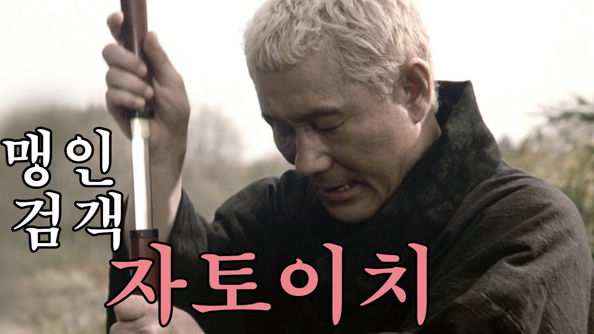
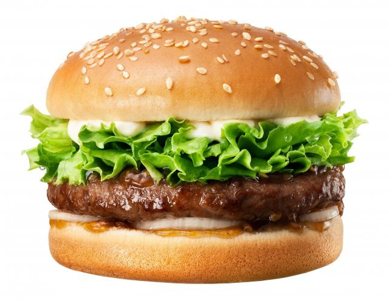
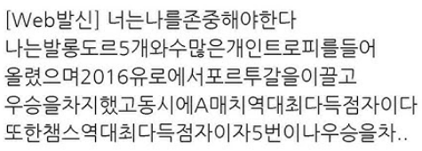
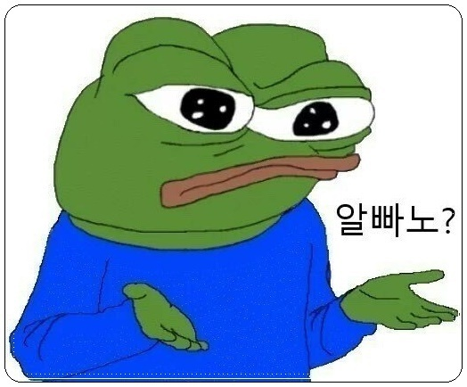
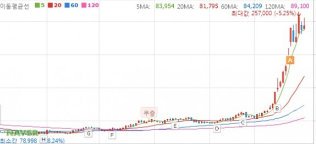
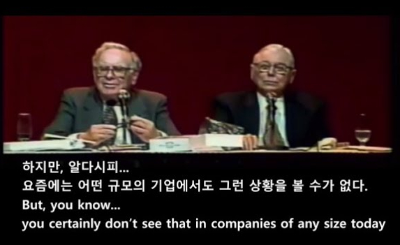
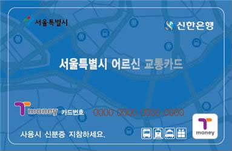

# 설레발
**Date:** 6시간 전
**Category:** 다이어리
**Original URL:** https://blog.naver.com/xpfkwh56/224301065514
---

1. 인공지능은 크게 분류하면 2개로 구분 됨

​

하나는 멀티모달, 하나는 옴니모달 임

모달 = 감각 이라고 이해하면 빠름

​

멀티모달 = 감각이 여럿 있다

옴니모달 = 감각이 하나다

​

예를 들어보겠음

​

X 라는 **'생물'** 이 있다고 가정하겠음

​

​

얘는 눈이 없음

​

대신 귀가 있어서 **'기본적으로'**

정보를 소리로만 인지할 수 있음

​

그럼 옴니모달 임

​

반대로 시각, 촉각, 후각, 미각, 감각

오감으로 외부의 정보를 수집한다면,

​

**'멀티'** 모달 임

​

2. **'점'** 을 연결해보겠음

​

사람 몸값이 100만원 이면

눈이 90만원이란 말이 있음

​

실제로 시각은 **매우매우 많은** 정보를 제공함

​

이 글을 읽고 있는 **'인간'**​ 이라면

대부분 시각적 문제는 **전혀** 없을 것이고,

​

언어 구사에도 일상 정도에 쓰기에는

특별한 문제를 겪고 있지 않을 확률 높음

​

지금 바라보고 있는 모니터 대신,

방에 있는 아무 공간이나 구경한 다음

​

그걸 **'언어'** 로 바꿔보셈

​

> **?글자가 존나 많이 필요하다**
>
> 말할 수 없는 것에 대해서는 침묵을 지켜야 한다 - 비트겐슈타인

​

**감각적으로** 보는 것은 **'0.000001초'** 임

​

근데 그걸 **'언어화'** 하려고 하면,

그리고 더 **'정확하게'** 하려고 하면 할수록

​

천문학적인 언어가 필요함을 실감할 수 있음

​

​

상하로 빵이 있고, 빵 사이에는 위에서부터

마요네즈, 레터스, 고기패티, 양파가 보인다

양파와 하단에 있는 빵 사이에는 소스가 얇게 있다

​

제일 위에 있는 빵에는 깨가 있는데, 깨의 갯수는

윗줄부터 a, b, c ,, 제일 밑에 5개 있고,

참깨의 간격과 색깔은 어쩌고 저쩌고,

​

마요네즈가 전체 이미지에서 차지하는 비중은,

양상추의 비중은, 그리고 양상추가 밖으로 삐져나온

각도와 제각각 불규칙하게 있는 정도는, 수분감은,

​

고기 패티는 튀김보다는

구워진 것처럼 보이는데, 등등

**​**

**'직관적으로 내가 아는 것'** 을

전부 **'언어로'** 표현할 수가 없음

​

이게 가능한 것이 우리의 **'뇌'** 임

​

**'인간이기만 하면'** 이걸 할 수 있음

​

전력 효율은? 다소 차이는 있지만 약 20w

3050 같은 보급형 글카의 1/5 정도고,

​

**'신이 만들었다'** 라고 말할 수 밖에 없는

​

수냉식 처리구조를 갖고 있기 때문에,

발열이나 효율 측면에서 **완벽**에 가까움

​

소비자가 쓸 수 있는 최상의 gpu 5090 은

연산 **'누르자마자'** 500-600w 로 시작하고,

​

**'머리'** 를 쓰라고 시키면 **80도** 에서 시작함

​

3. 시각 정보 처리는 겁나 어렵다,

겁나 부정확하다, 까지만 알면 충분함

​

그리고 **'부정확하다는 것'** 과

**'할 수 없다'** 라는 것도 엄밀히 다름

​

심지어, 지금 모니터에 있는 글자를 보겠음

​

이 글자의 폰트는? 자간은? 크기는?

색깔은? 색상은? **'진짜'** 검정인가?

​

직선이라면 **'진짜'** 직선인가?

​

몇 mm인가? 몇 cm인가?

몰라도 **'읽을 순'** 있음

​

모르는 것이 많을수록

틀릴 **'확률'** 이 늘겠지만 말임

​

**\* mm 의 개념과 정의를 모르고,**

**측정할 수 있는 도구가 없으면 불가**

​

만약 내가 코딩을 해야 된다면

저 많은 모델 중 뭘 써야 **'가장'** 좋을까?

​

클로드 아니면 지피티 쓰시면 됨

​

그럼 그 둘의 차이에 대해 보겠음

​

인공지능 발전은 **'어이없게'** 빠르기 때문에,

​

지금은 프론티어 모델도

대개 멀티 모달을 장착 중인데

​

옴니라고 해서, 진짜 **'1개만'** 있는 것이 아님

​

X, 그러니까 맹인검객 자토이치 는

시각이 없는 대신 다른 4가지 감각을

극단적으로 향상해서 모든 것을 **'느낌'**

​

소리의 공명, 방향성, 바람의 세기 등으로

시각을 **'대체'** 해서 **'투기적으로'** 추론함

​

**\*** **Speculative Decoding**

​

마찬가지로 감각을 **'갖고 있을 때'**,

그 감각을 **'어떻게 쓰냐?'** 도 매우 중요함

​

신이 인간을 빚을 때,

자신의 형상을 따랐다고 함

​

우리가 **'젤나가'** 라면

​

인공지능 또한, 공학자와 개발자들이

만들었기 때문에 가장 처음으로 숙달한

기술이 **'코딩'** 과 **'개발'** 이었음

​

지피티는 실력은 최정점이지만,

커뮤니케이션 능력이 쓰레기인 개발자 임

​

클라이언트가 어떤 **'의도'** 로 명세를 주면,

의도에 대해서 지레짐작 같은 것을 하지 않음

​

대신 시켜주면 **최대한 완벽히** 하려고 함

​

클로드는 실력은 **'최상급'** 이지만,

커뮤니케이션 능력이 훨씬 좋은 **'인싸'** 임

​

사람들 간의 아사모사한 미묘한 시그널을

해독해서 **'대충 이런 말이구나?'** 를 이해함

​

강남 봉은사로 인근에 있는 양복 잘 빼입고,

​

금융인 행세하는 말 잘 하는 **'컨설턴트'** 가

클로드의 DNA 에 더 가까움

​

일단 클로드 이 새끼는 거북목이 아님

체크 남방도 없음

​

고객이 무언가 해달라고 했을 때,

​

지피티는 에휴 병신 니가 해달라니 해줌

근데 그렇게 한다고 안 됨

니가 직접 보고 깨달아라 ㅇㅇ

​

**\* 코딩력 몰빵**

**​**

클로드는 고객님이 바라시는 것이

이거 같음, 아님? 그럼 다시 해드릴게요

​

라는 **'아주 큰'** 차이를 보이기 때문에

​

쓰기가 훨씬 편할 것임

​

즉, 같은 LLM, 같은 유즈 케이스 간에도

​

**'상황마다, 또는 해보기 전까지는'**

알 수 없는 차이가 명백하게 존재함

​

**4. 중간 요약**

**​**

1) 옴니모달 = 감각 1개

2) 멀티모달 = 감각 **'2개 이상'**

​

3) 멀티모달이 더 우월함? 노

4) 옴니모달이라고 다 깊이있음? 노

​

**5) 쓰기 나름, 하기 나름**

​

6) 둘 중 제일 **'비싼 기술'** 이 뭐임?

**극단적으로 깎았으면** 다 비쌈

​

단, 멀티모달이 체급이 더 높아서

기본적으로 시각 처리 기능이 있으면

들어가는 투자 자원이 더 높은 편임

​

한글 배우기 vs 영어 배우기

영어 배우기 vs 불란서말 배우기

불란서말 배우기 vs 라틴어 배우기

​

약간 이런 느낌이라고 보면 됨

​

라틴어가 더 어려운 것도 맞지만,

일단 배우려면 **돈이 많이 드는** 느낌

​

**5. 시각화 기술에서 가장 비싼 기술?**

​

본질적으로 최고 비싼 기술은,

**산업 대체율** 이 높은 기술임

​

AI 나오기 전에, 많은 좋소 오우나들은

개발자에 대해서 **'애증'** 을 갖고 있었음

​

좋소 사장 = 지금 만든 서비스 좋은데요!

왼쪽으로 조금만 옮겨주실 수 없을까요?

​

​

개발자 = 님아 지금 님이 해달라는 것은

콘크리트로 만든 건물을 1cm 옮기란 것임

​

디자이너도 마찬가지임

​

좋소 사장 = 화~ 하게 가능한가요?

샤~ 하게 가능한가요? 깔끔하게 심플하게

​

디자이너 = **'???모라고요???'**

​

50살 아줌마가 자기 자식들한테

수모 당하면서 스마트폰 만지듯이,

​

똑같은 일이 산업 현장에서 **'빈번하게'**

생겼는데, 인공지능으로 **'지금은'**,

​

**'상당한 부분'**이 대체된 상태임

​

아들, 딸한테 타자 좀 대신 쳐달라고 하면

어디 뭐 귀찮아서 죽겠다는 듯한

태도도 잔뜩 띠꺼워서 할 맛 떨어졌는데

​

이제 **'말'** 로 하면, 타자를 대신 쳐주니

그런 것과 똑같음

​

기술력 아직 멀었는데? 오타 쏟아지는데?

​

​

6. 산업 대체율이 높은 기술은

그럼 도대체 어떻게 알 수 있을까?

​

**'시장에 속한 사람 말고는 모름'**

​

> 우리가 말할 수 있는 것은 '어떻게' 사실 또는 실재가 있는가에 관한 것뿐이다. 사실 또는 실재가 '무엇인가' 에 관해서는 말할 수 없다.
>
> 논리철학논고 - 비트겐슈타인

​

내가 예전에 장사를 했을 때, 있던 일임

​

내가 돈을 막 벌기 시작했을 무렵은,

​

코로나 비대면 이랍시고 배달 기사들의

몸 값이**'천정부지'**로 뛰고 있던 시대 임

​

자세한 이야기를 하면 길어지니까,

여하튼 나는 서울/경기 수도권까지

​

최소한의 비용으로,

소화물을 배송하는 미션이 있었음

​

서울 동쪽에서 서쪽 끝,

북쪽에서 남쪽 끝으로 보내려면

​

당시 비용으로 통상 2만원 쯤이었는데

코로나 시즌에는 이게 5만원 7만원 함

​

​

**'차라리 몰랐으면 됨'**

​

근데 나는 이미 가격을 봐버렸고

저걸 **도저히 지불할 수 없었음**

​

저평가 주식을 찾아내야 했음

​

​

나는 20대 초반, 사회복지

활동에 투신했던 적 있음

​

독거노인, 소외아동, 미혼모,

치매를 앓는 사람들 등등

​

**어? 이거?**

**​**

당시에 들었던 이야기가 생각났음

​

혼자 사는 할아버지 셨는데,

​

용돈 겸 집에 있기 적적하면 평소에

**심부름** 같은 것을 다니신다고 했음

​

​

가격은 **'기회비용'** 과 **'원가율'** 로 결정됨

​

1) 기회비용 = 내가 그 일을

하지 않아도 벌 수 있는 돈

​

2) 원가율 = 해내기 위한 기초 가격

​

시니어 그룹은 일자리가 없기 때문에,

노동 공급이 수요량 보다 더 높음

​

어르신 교통카드는 이동에 필요한

가격이 오직 **'시간'** 만 발생하므로,

​

유류비, 감가상각 같은 이슈가 없음

​

[](#)

​

**시니어 배송, 노인 배송, 시니어 취업,**

**70대 취업 같은 키워드를 찾기 시작함**

​

단가는? 2만원 **'이하'**

​

질문이 간단해졌음

​

첫 질문, 당신이 이걸 하지

않을 이유에 대한 해소

​

두번째 질문, 당신이 하겠다고

**'마음만 먹어도'**

떠밀어 줄 수 있는 시스템

​

우리는 경쟁사보다 훨씬

저렴하게 배송할 수 있었고,

​

**'따라하고 싶다고**

**따라할 수도 없었음'**

​

**왜 why?**

​

그들은 **'노인'** 을 모르니까

​

표면적 기술은 흉내낼 수 있지만,

20대 초반 내내 수십, 수백명의 노인들을

​

경험하고, 지내보면서

갖게 된 내 **'도메인'** 은

​

그들이 나처럼 **'재미있지 않는 한'**

당연히 절대 모방할 수 없었음

​

실버 계층을 대상으로, 업무를 설명할 때

업무를 설명해주는 사람과 지시 요청 하는

사람은 반드시 1명으로 **일원화** 를 해야 됨

​

그 이유를 모르겠다면?

그건 **본인의 의자** 가 아님

​

<1호기 이슈로 다음에 계속>