# 인공지능의 메타 변화와 터보퀀트 기술
**Date:** 6시간 전
**Category:** 다이어리
**Original URL:** https://blog.naver.com/xpfkwh56/224295224969
---

1. 인공지능 사용자는 크게 둘로 갈린다

​

**1) 라이트 유저**

​

지피티, 제미나이, 클로드 같은 모델을

결제해서, 웹에서 사용하는 사람들이다

​

범용적인 목적으로 사용하고 있거나,

그닥 불편이 없다면 특별한 문제는 없다

​

**2) 파워 유저**

​

소위, **'로컬'** 이라고 부르는 모델을

사용하고 있는 사람들을 이렇게 부른다

​

2. 라이트 유저들이 사용하는 모델은,

​

세계에서 제일 큰 회사에서 여러 개발자가

가장 사용하기 좋게 가공한 형태로 풀린다

​

즉, 대기업의 상품이고 공산품에 가깝다

​

파워 유저들이 사용하는 모델은

거의 **'자기들이 자급자족한'** 모델이다

​

유니클로 에서 파는 옷을 입을 것이냐?

​

아니면 내가 **'직접'** 만들었거나

내 **'요구'** 에 맞는 모델을 입을 것이냐?

​

같은 차이라고 보면 설명이 빠르다

​

내가 직접 옷을 만들어다가 입으려면

원단은 물론 재봉 기술도 알아야 하고,

​

**\* 하기 나름 이겠지만**

​

내가 집에서 만든 옷은 규제가 없으니,

나를 보호할 제도도 **'자급자족'** 해야 된다

​

3. 인공지능 장르에서 1년 이라는 시간은

다른 업계의 10년, 경우에 따라서는

100년, 1000년의 시간적 가치를 갖는다

​

[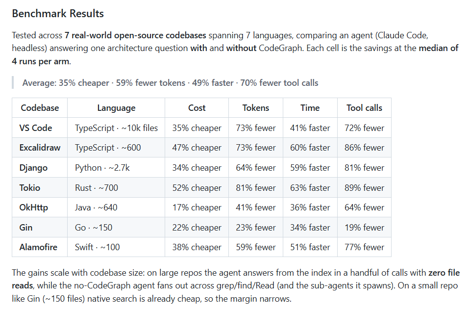](#)

https://github.com/colbymchenry/codegraph

​

오늘 릴리즈 된 기술을 하나 보자

​

저건 AI 코딩 에이전트가 코드 베이스를

더 효율적으로 탐색하도록 돕는 도구로,

​

클로드 코드 같은 AI 에이전트가

코드 베이스를 이해하려면 원래

grep, glob, read 같은 명령어로

파일을 일일이 뒤져야 하는데,

​

15년차 소프트웨어 개발자라고

자신을 소개하는 이 사람이 만든 것을 쓰면,

그 문제를 미리 저렴하게 해결할 수 있다

​

프로젝트를 사전에 pre-index 해서

코드 구조를 그래프로 만든 후,

​

만들어진 그래프를 에이전트가

즉시 조회하는 시스템 구조 다

​

**비용도 줄여주고, 토큰도 줄여주고,**

**시간도 줄여주며, 툴 콜링도 더 적다**

​

**\* 물론 자가 벤치는 믿을 수 없음**

​

그럼 이 기술이, **'이 사람 고유'** 일까?

​

<https://github.com/abhigyanpatwari/GitNexus>

[**GitHub - abhigyanpatwari/GitNexus: GitNexus: The Zero-Server Code Intelligence Engine - GitNexus is a client-side knowledge graph creator that runs entirely in your browser. Drop in a GitHub repo or ZIP file, and get an interactive knowledge graph wit a built in Graph RAG Agent. Perfect for code exploration**

GitNexus: The Zero-Server Code Intelligence Engine - GitNexus is a client-side knowledge graph creator that runs entirely in your browser. Drop in a GitHub repo or ZIP file, and get an intera...

github.com](https://github.com/abhigyanpatwari/GitNexus)

​

**인도** 에서 컴퓨터 공학을

공부하는 학생이자 AI 엔지니어

​

라고 자신을 소개하는

Abhigyan Patwari 가

만든 것을 이어서 보자

​

본질적으로 제시하는 기능은 같지만

GitNexus 는 Graph RAG 에이전트를 내장해,

시각적 탐색 인터페이스까지 제공한다

​

CodeGraph 는 가벼운 대신, 깊이가 더 얕은데,

​

GitNexus 의 경우, MCP 도구 + 에이전트 스킬 +

grep/glob/bash 호출을 지식 그래프 컨텍스트로

자동 보강하는 PreToolUse 훅이 있다

​

LadybugDB 라는 그래프 지향 DB를 쓰고

Cypher 쿼리를 지원하므로,

​

SQL 보다 코드 관계를

더 다루기에도 용이할 것이다.

​

이런 AST 도구의 경우,

트레이드 오프 관계가 아주 명확한데,

​

zero-config 도구들은 쉽고 빠르게

쓸 수 있지만 제한적이고,

​

기능이 많고 복잡한 도구들은

어렵고 무겁고 비싸지만,

​

용도에 따라서는 **'이렇게 라도'**

있으면 감사한 경우들이 많이 있다

​

작은 식물 하나를 심는 정도라면

모종삽 만으로도 충분하겠지만,

​

집을 지으려면 포크레인이 있어야 하듯,

​

각 **'용도'** 와 **'기능'** 에 따라

실상 **'무한한'** 도구들이 존재한다

​

뉴스는 말할 것도 없이

​

모델, 논문, 도구, 라이브러리,

데이터셋 등을 다 합치면

​

셀 수도 없는 거의 무한에

가까운 자료들이 쏟아지고,

​

arXiv 기준, AI 카테고리에서

머신러닝 **한 분야만** 해도

​

하루에 100편이 넘는 논문이

업데이트 되는 일도 빈번하다

​

이걸 다 **'읽는다는 것'** 은 **불가능** 하고,

​

오픈소스 생태계든, 기밀 연구집단이든,

​

0.1%, 0.01%가 될까 말까 한 사람들이

떠올리고, 만들고, 사용한 아이디어들이

​

세상에 나오고, 거기서 채산성과 산업성,

실용 가능성, 적절한 난이도 등이 결합 되면

​

비로소 이제 **'이런 기술이 있어요'**

라면서 사람들의 손으로 전달이 된다

​

**4. 로컬 AI 어떻게 해요?**

​

어떻게 해요, 가 아니고 **'매일'** 해야 된다

​

실제 내가 매일 읽고, 쓰게 아니더라도

마음 한 켠에 **나는 매일 해야 되는 사람** 이다

​

라는 **'자각'** 정도가 있어야 이걸 할 수 있다

​

내가 주로 사용하는 기술은 기술대로 닦고,

잘 모르는 것은 건너건너 구경이라도 하면

​

**'대체로 이런 흐름이구나'**

​

요즘 사람들이 이런 분야에 있어서,

관심을 갖고 개발을 하고 있구나

​

나아가,

​

**'어떤 부분에 문제가 있어서, 그 병목을**

**해결하기 위한 것들이 이래이래 나왔는데**

**​**

**거기에는 이런 장애 요소들이 존재 했어서,**

**뭐만 딱 해결 되면 그게 풀릴 수 있었는데**

**​**

**저런저런 것들 때문에 그게 막힌 상태고,**

**앞으로 어떤 어떤 것들을 만들어 내가지고**

**이렇게 저렇게 해보겠다고 하는 중 이구나'**

​

같은 **'감각'** 을 익히는 것이 가능해진다

​

**\* 이래서 다른 사람이 뭘 하고 있는지,**

**알기도, 이해하기도 어렵고 내가 당장**

**쓰고 있는 것 아니면 조언도 거의 못 함**

**​**

5. 월급이 부족한 사람은 부업을 찾고,

생활비가 빡빡한 사람은 절약을 찾는다

​

배달비가 올라가면 올라갈수록,

​

그 가격에 부담을 느끼는 사람들은

직접 방문해서 가져오기를 원하고

​

외식비가 비싸면 비싸질수록,

​

식재료 원가는 많아야 30% 언더니

집에서 해먹겠다는 마음을 먹는

사람의 숫자가 더욱 많아지게 된다

​

**'월세'** 가 아주 아주 비싸다면

건물주가 부러울 일이기도 하겠지만,

​

그와 동시에, 월세를 **'내는'** 사람 입장에선

이 금액을 어떻게 하면 줄일 수 있을까?

​

라는 **'당연한'** 고민을 하게 되기 마련이다

​

비싸지고, 많이 찾으니까 앞으로도 계속

그렇게 굴러간다는 기대가 **'타당'** 하다면,

​

1-2년 바짝 벌고, 신세가 망가지는

창업자들은 세상에 존재하면 안 된다

​

토큰 사용량이 많아지니까, 토큰 팔이들은

더 많은 돈을 벌 수 있겠다는 것도 맞겠지만

​

**'적어도'** 내가 봤던 업계의 분위기에서는,

​

**'작업을 완수하기 위해 필요한 수량 만큼'**

정확히 쓰고 싶어하는 사람의 숫자가 많지

​

무지성으로 1억 토큰, 10억 토큰씩 긁으며

돈 썼다고 즐거워 하는 사람은 못 본 것 같다

​

스켈핑 하면서, 세금/수수료 많이 낸 다음에

​

자기가 대단히 성공적인 거래를 했다고

좋아하는 바보가 **어디있긴 한가** 도 싶다

​

[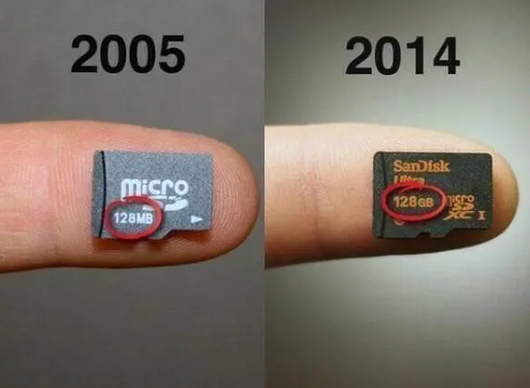](#)

​

**6. 무어의 법칙**

​

05년 SD 카드는 128MB 였지만

14년 동일한 크기의 SD 카드는

​

128GB 로 **1,000배** 만큼이나

성능이 급격하게 올라가게 된다

​

2년 주기로,

반도체 하드웨어 성능이

2배씩 증가하는 것을

​

무어의 법칙 이라고 하는데,

​

2천년대 이후로 시대가 접어들면서

이제는 기술적 한계에

도달했다는 의견들이 나왔다

​

미세 공정으로 올라가면 올라갈수록,

물리적 한계에 직면하게 되었고

​

설령 그 문제를 해결한다고 해도

판매로 기대할 수 있는 수익보다

​

제조 비용이 더 높아지기 때문에,

다른 방법을 모색해야만 했다

​

반도체, 특히나 메모리는

신제품이 등장하면 가격이

**매우 크게** 하락하기 때문에,

​

반도체 공급자들은 생산성이 높은

최첨단 모델을 개발할 수 있고,

​

생산품들을 **'판매할 판로'** 가 있는

극소수의 사업자만 살아남을 수 있다

​

경쟁에 뒤쳐지면 대부분

제 자리로 **돌아올 수 없고**,

​

낮은 기술력으로 연명을 해봤자

공장을 굴리기도 버거운 일이 많다

​

**\* 그래서 여태 반도체**

**회사들이 전부 다 망한 것**

​

[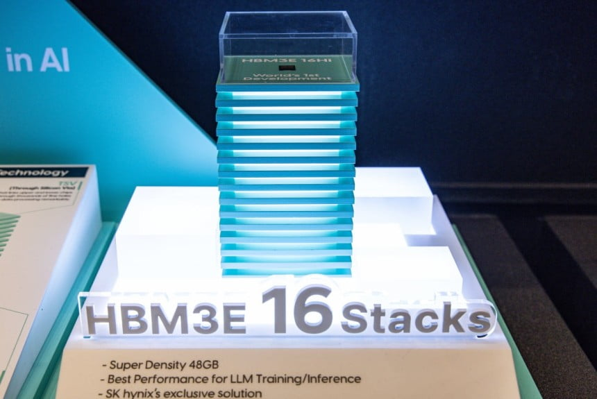](#)

​

하이닉스에서 만든 HBM 의 경우,

**'적층'** 구조를 갖고 쌓아서 해결 했다

​

여하튼, **'방법'** 을 찾아낸 쪽인데

​

[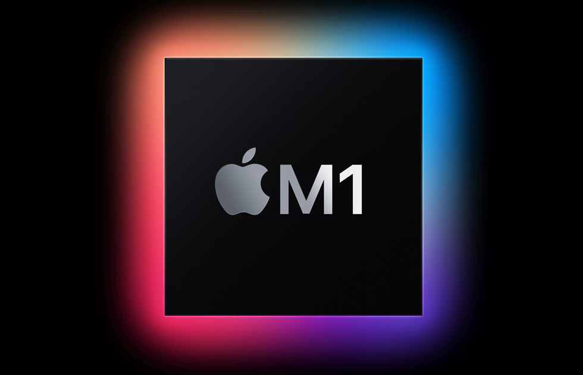](#)

​

애플의 경우, 유사한 문제를

**아키텍처 최적화** 로 풀어내는

방법을 찾아서 해결하게 된다

​

똑같은 문제도, **'다르게'**

풀 수 있다고 본 것이다

​

[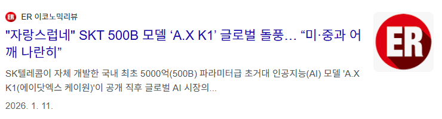](#)

?

​

7. 최소한 26년 중순 무렵을 기준할 때,

​

인공지능 **'모델'** 에서의 경쟁력은

누가 더 큰 모델을 만드는 것 인지는

​

**'그다지'** 쓸모 있는 성과가 아니다

​

그보다는 동일한 모델 성능을 유지하면서

또는, 더 좋은 모델 퍼포먼스를 보이면서

​

**'더 낮은 비용'** ​으로 서비스를 제공하느냐

라는 것이 유의미한 해자로 취급받는 중이다

​

그래서, 대표적으로 양자화 라던가

증류 같은 기술이 주목 받은 것이고

​

AI 따거식 최적화가

**'어케 했음?'** 이 된 것이다

​

[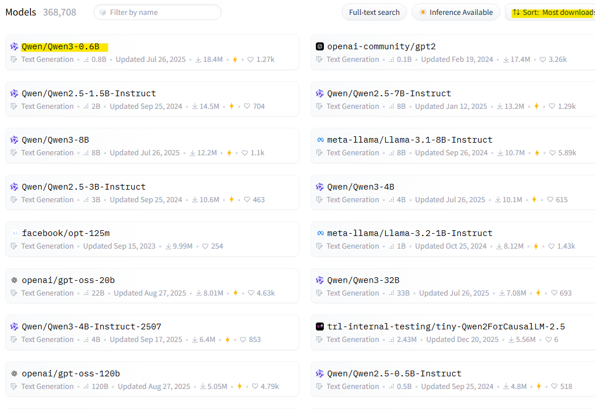](#)

​

인공지능 모델, 그 중에서

LLM 모델을 구동하기 위해선

두 가지 용량이 있어야 된다

​

하나는 모델 자체를 **서빙하는** 용량,

​

또 하나는 그 모델을 실제로 **'사용'**

하기 위해 필요한 용량이 그렇다

​

이미지에 0.6B, 4B, 이렇게 써있는데

​

편의상 **1B = VRAM 1GB** 먹는다 치자

​

[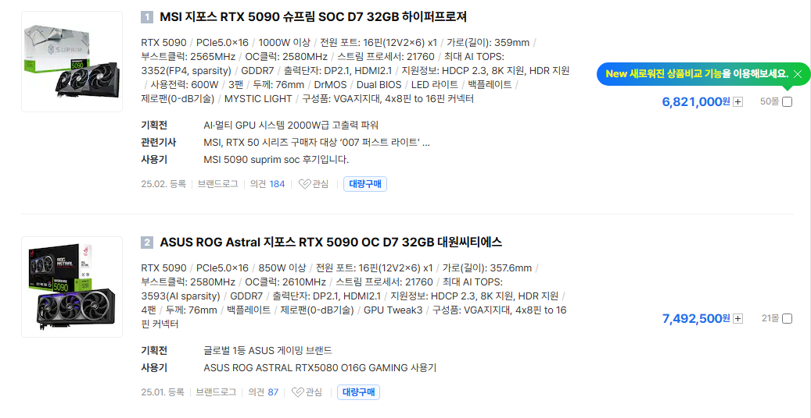](#)

​

오늘 기준, 32GB VRAM 이 있는

5090 GPU 가 7백만원 정도 인데

​

VRAM 용량을 기준으로,

GPU 가격을 찾아보게 되면

​

[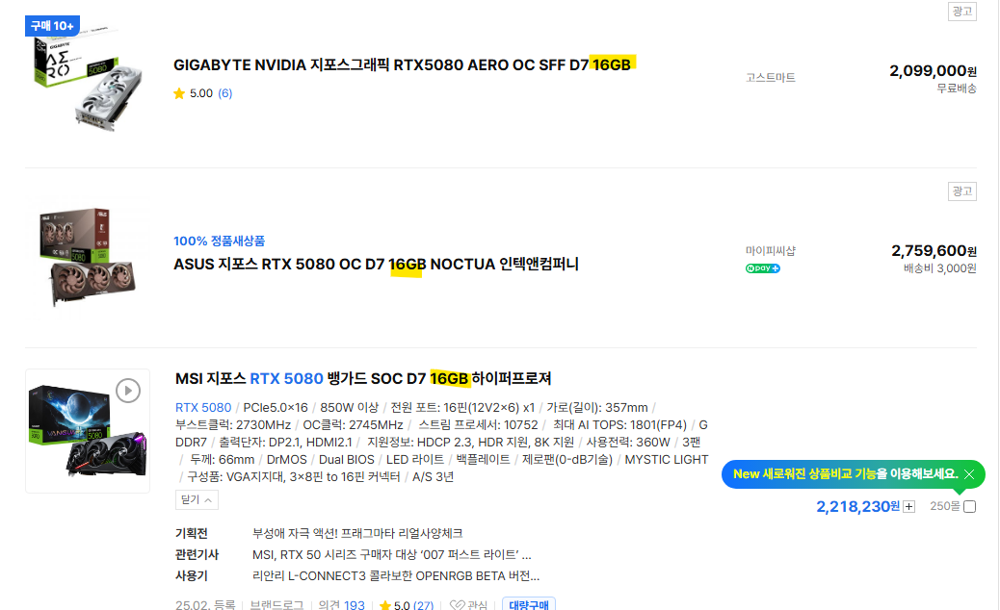](#)

​

VRAM 1GB, 1GB 의 가치가

비싸단 것은 쉽게 확인 된다

​

**\* 그 차이만 있는 것은 아니지만**

​

위에서 제시한 가정에 따라서

VRAM 32GB 면,

32B 모델을 돌릴 수 있을 것 같다

​

근데 32GB 를 전부 모델에 올리면,

​

**차 값으로 돈을 다 써버려서**

**정작 기름을 못 넣는 것과**

**완전 똑같은 상황이 나온다**

**​**

LLM 이 사용자와 대화를 할 때,

입력 받은 메시지를 **'인지하는'** 공간을

Context Window 라고 부른다

​

최대 2시간 통화를 할 수 있다,

4시간 통화를 할 수 있다 라는 식으로

​

컨텍스트 윈도우(ctx) 의 한도가

모델마다 또는 환경에 따라 정해지고,

​

통화를 하면서 대화 내용을 받아적든,

녹음하는 메모리를 차지하는 공간의

저장 할당량을 **kv 캐시** 라고 부른다

​

입력된 토큰의 의미론적 특징을

추출한 키값은 **K**ey **Cache** 에 저장되고,

​

모델이 다음 단어를 예측하고 생성할 때

필요한 값은 **V**alue **Cache** 에 저장된다

​

둘은 분리해서 적용할 수도 있고,

**각각 분리해** 양자화 를 할 수도 있다

​

그럼 문맥 길이가 총 4k 라고 가정하고, 4k 마다

1.25gb 의 kv 캐시 메모리를 소요한다고 치자

​

1 토큰이면 영어 기준 0.75 단어 정도니까,

​

4k 토큰이 ctx 에 들어가면

대략 A4 용지 4-6장 정도 분량의

대화를 원활히 처리할 수 있을 것이다

​

많은 것 같지만, LLM 모델 특성상

몇 번 대화 하다보면 순식간에 동난다

​

128k ctx 설정을 하면,

적당한 책 한권 분량이 나오는데

4k 에서 128k 로 32배 증가했으니,

​

약 40gb 정도의 kv 캐시

메모리가 필요하게 된다

​

만약 1개의 단일 LLM 모델만 쓰는 것이 아니고,

​

2개 이상의 모델을 동시에 굴려야 된다면 어떨까?

40, 80, 120GB 씩 VRAM 용량이 필요하게 된다

​

VRAM 80GB 짜리 H100 GPU 가

오늘 기준으로, **4-5천 만원 정도** 한다

​

**물론 H100 만 있다고 될 문제도 아니다**

​

고사양 GPU 로 갈수록, 발열/전력/환경,

소프트웨어 구성 난이도가 **훨씬** 높아진다

​

모델 빼고, 책 2권만 GPU 에 담으면

꽉 차서 **아무것도 할 수가 없단 소리** 다

​

**\* 공개하지 않아 추정치지만,**

**프론티어 모델 하드캡이 세션당**

**100K 정도 할당된다고 추정됨**

​

8. 여기서 **양자화의 마술** 이 들어간다

​

[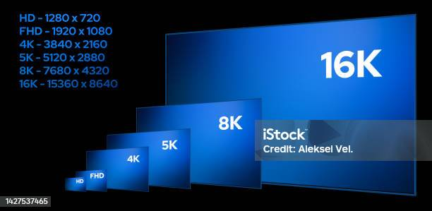](#)

​

인간의 눈으로 읽을 수 있는

해상도 차이의 현실적 범위는

통상 8K 정도라고 알려져 있다

​

근데 현미경 들고 볼 생각이 아니면,

2K, 4K 정도만 해도 분간이 어렵다

​

유튜브 같은 경우는, 자체 압축 코덱과

더불어 1080p 화질 정도만 찍어주면

​

보기에 불편이 **'거의'** 없는 편인데,

​

양자화는 이와 같이 **'필요 이상'** 의

정확성을 양보하는 최적화 기술이다

​

8 bit 양자화를 하면 1/2

4 bit 양자화를 하면 1/4 만큼만

​

KV 캐시 메모리를 써도 된다

​

대신, 양자화를 더 강하게 걸수록

모델 자체의 품질이 하락하게 되는데

​

4 bit 가 대부분 맥시멈 에다가,

성능 차이가 **'크게'** 발생하는 편이고

​

그나마도 일부 특수한 양자화 방식이

아니면 현실적으론 **사용가치가 없었다**

​

터보퀀트 는 3.5 bit 양자화를 하는데,

​

정밀도 손실은 무려 **0-1% 전후**

속도는 **최대 8배 증가하는** 기술이다

​

오버헤드에 따라 차이는 있겠지만

메모리를 **'6배'** 나 덜 써도 되는데,

​

보통 로컬은 fp8 모델 정도를 쓰니까,

​

개인 사용자 기준 ctx 를 2배 이상

더 확보하는 것이 가능하게 되고,

​

프론티어 사업자들의 경우는,

**'동일한 GPU'** 를 갖고도

​

기존보다 **'6배'** 더 효율 좋게

쓸 수 있게 되는 일이 생긴다

​

구글은 내부적으로 제미나이 모델의

KV 캐시에 터보퀀트 기술을

접목해 사용하고 있다고 하고,

​

**\* 카더라**

**​**

그 말이 사실이라면, 동일한 비용으로

사용자에게 제공하는 할당 자원을

**'매우'** 효율적으로 쓰고 있단 뜻이 된다

​

실제로, GPT 나 클로드 같은 모델 대비

제미나이의 **'무료'** 사용량은 자비로운데

​

양자화 기술 영향이 없지는 않을 것이다

​

그럼 당연히 궁금해지는 지점이 생긴다,

3.5 bit 이하는 **불가능** 할까?

​

같은 비용을 써서, 자사 발표 기준

약 6배 정도 까지 더 줄일 수 있다는데

​

이거보다 **'더'** 줄이는 방법은 없을까?

​

[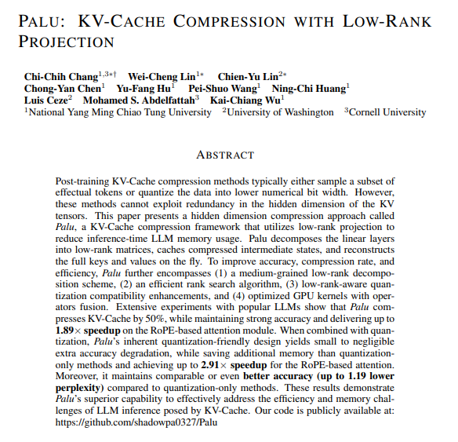](#)

https://arxiv.org/pdf/2407.21118

​

저랭크 압축과 양자화를 결합해

KV 캐시를 91.25% 이상 압축하면서

Perplexity 를 유지하는 것이 가능하다

​

**\* 11.4배**

​

[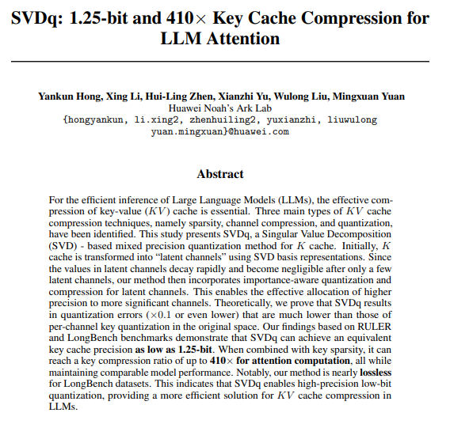](#)

https://arxiv.org/pdf/2502.15304

​

RULER 와 LongBench 벤치마크에서

1.25비트 수준의 키 캐시 정밀도를 달성했고,

​

키 희소성과 결합하면 (이론상)

최대 **410배** 압축에 도달한다

​

[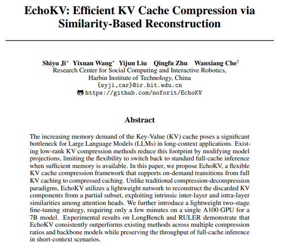](#)

https://arxiv.org/pdf/2603.22910

​

결국 이거는 KV 캐시를 줄였다가

다시 푸는 방식이 문제 아니냐?

​

전체 중, 일부만 저장한 다음에

저장 안 한 나머지는 버리지 말고

일부를 보고 다시 만들어 재구성을 하자

​

이렇게 하면, 표준 추론과 압축 추론 사이를

필요에 따라 오가는 유연한 처리가 가능하다

​

라는 것들도 현재 **'활발히'** 연구되고 있다

​

**왜 why?**

​

**이 기술이 있으면 돈을 덜 써도 되고,**

**같은 돈을 들고 더 많이 벌기 때문이다**

​

9. 단순한 수치적인 개선도 그렇고,

다른 방식의 아이디어들도 많이 나오고

​

**'하나 하나'** 확인할 수 없을 정도로

**매우 빠르게** 발전하고 있기 때문에,

​

뭐가 어디에서 얻어걸릴 줄은 알 수 없지만

​

확실한 것은 **'하드웨어'** 진입 장벽 만큼은

과거와 비견할 수 없을 정도로 감소하고 있음

​

컴퓨팅 자원 수요가 늘어난다, 어쩐다

이야기 **가려들으시는 것** 을 권장 드림

​

**10. 결론**

​

1) 데이터 센터를 많이 짓는다고 합니다

관련주, 수혜주는 어떤 것이 있을까요?

​

**'고물상'** 알아보는 쪽이 낫다고 봅니다

​

개인적으로는 문재인 정권 시절,

태양광 같은 느낌으로 보고 있어요

​

2) 우리 반도체는 **미래의 석유** 라던데?

​

빅테크가 쿠팡에서 아줌마들 장보듯이,

SNS 광고보고 희한한 물건 사듯 안 삽니다

​

수요가 적고, 비싸면 **'대안'** 을 찾아버려요

​

언제나 **'상식'** 을 지키면

**'상식적인'** 답이 나옵니다