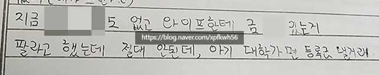

# 장가를 잘 가셨네
**Date:** 6시간 전
**Category:** 다이어리
**Original URL:** https://blog.naver.com/xpfkwh56/224267079829
---

​

1. 신랑 지인 중에,

사장님/회장님 소리 듣고 사시다가

​

불미스런 일에 엮여서

징역 살고 계신 분 있음

​

**\* 혹시 남자가 재/재조합, 지방 이권**

**이런 것에 관심 보이면 조심하세요 ,,**

**총칼만 없지 깜짝 하면 죽는 전쟁터임**

**​**

2. 내용은 많이 복잡한데,

과거 우리 신랑이 애매했을 시절

​

많은 은혜를 받은 적이 있다고

이런저런 도움을 보은해야 된다

​

라길래, **'ㅇㅇ'** 하고 여느 일처럼

귀찮은 일을 대행해서 처리 중임

​

**\*** **A Lannister always pays his debts**

​

3. 변호사 값이랑 추징 비용,

그리고 남자가 징역 들어가면서

​

올 스돕된 경제환경 내에서

그 사이 모아놓은 돈을 많이 썼고,

​

남자분은 조만간 출소를 하면

다시 **'재기'** 하기를 원하는 상황

​

**\* 2장 정도 있으면 길어야 1년 안에**

**예전처럼 복구할 수 있다고 생각하심**

**​**

**자세히는 모르겠지만 내 생각에는**

**얼토당토 않은 말 같진 않기는 했다**

**​**

4. 그 과정에서, 편지 내용을 보면

​

와이프에게 집에 있는 꽤 많이 모아놓은

금을 현금화 해서 사업 비용으로 쓰자고

​

제안 했다는데, **'그건 절대 안 된다고'**

강하게 거부하여 못 쓰고 계신다고 함

​

**\* 신랑 징역 들어가자마자 바로**

**긴축 재정으로 돌리고, 애기 맡기고**

**생활 전선 간 것도 예사롭진 않았음**

​

금 홀딩 판단도 여자분이 하신 것임

​

**\* 외국인이라 국내 실정을 잘 몰라서,**

**예전에 같이 종로 가서 구입 했었음**

**발품 잘 팔면 쫌 싸게 살 수 있습니다**

**​**

5. 우리 아들이 나중에 사업을 할런지,

딴 일을 할런지는 모르겠지만

​

결혼을 하면 며느리로 저런 녀자를

데려왔으면 좋겠다는 생각을 했음

​

통상, 사업남들은 퍼포먼스가 화려하고

뭣보다 만나는, 같이 사는 여자 입장에서

​

남자가 뭐 하겠다고 하면 거기에 대고

겐세이 놓기도 어렵고, 숟가락 대는 것도

참으로 **부담스러울 때가** 많은 것이 맞다

​

6. 심지어, 결국 그 돈을 벌어낸 **'주체'** 가

남자이기 때문에 **쟤가 벌어온 돈** 인데

​

하고 싶다면 하게 놔두는 것이 맞지,

내가 반대를 하거나, 거기에 대고 뭔가

말할 수 있는 자격이 있을까? 라고

​

생각하기 쉬운데, 내가 아는 선에서는

**'그러다 인생이 복잡해지게 되는 것'** 임

​

7. 설령 하늘이 내린 기회가 주어져서

​

엔비디아 평단을 3달러에

살 수 있는 기회가 있어도,

​

처자식 살 수 있는 집 한 채,

애 대학 보내고 공부 시킬 돈,

​

정도는 **'이유불문'**

지켜야 되는 것이다

​

저건 **내 돈이고, 쓸 수 있는 돈** 이지만

**내 돈이 아니고 쓸 수 없는 돈** 이므로

​

8. 우리 아들이 나중에 장가를 간다면,

딴 남자들이 겪은 결혼 기출을 알려줄 듯

​

너 말이라면 끔뻑 죽고, 말 잘 듣고

고분고분하고 그런 여자랑 살기는

​

당장 잠깐은 **'재밌을지'** 몰라도

​

결혼에 있어 너는 니 아내이자,

니 자식의 엄마를 고르는 작업이

동반 된다는 것을 잊어선 안 된다

​

**\* 부부 사이에 자격이 있는가 라는**

**질문 자체가 잘못된 질문, 옳은 질문은**

**이 결정의 결과를 누가 떠안는가 임**

**​**

혼자 사는 남자보다 같이 사는 남자가

통상, 더 안정적인 삶을 사는 이유는

​

그 삶에 **'게이트 키퍼'** 가

있기 때문임을 기억해야 된다