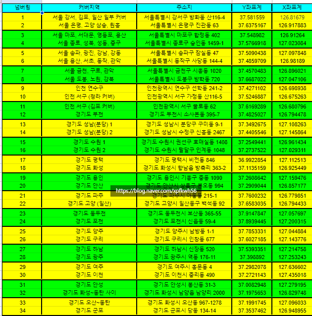
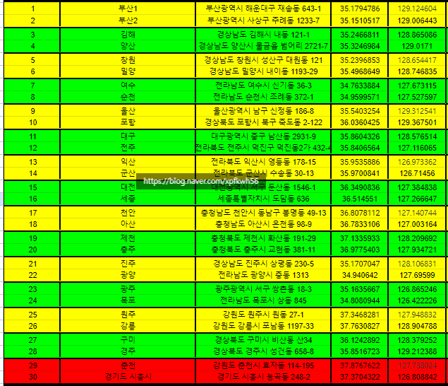
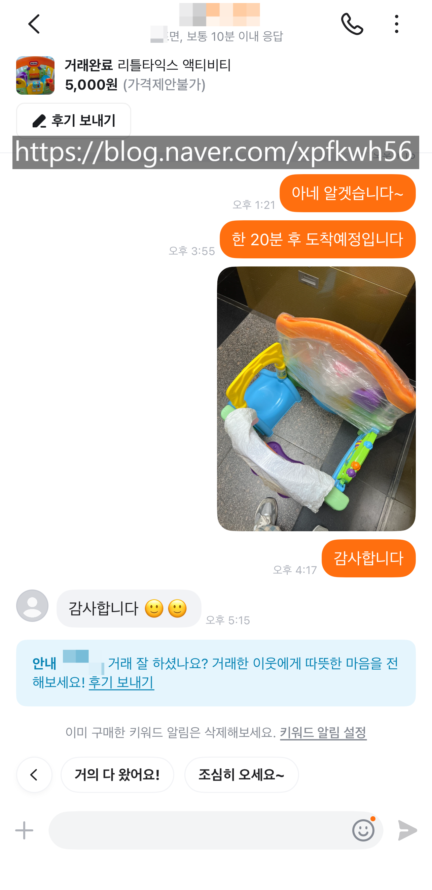

# 구질구질과 합리성의 어딘가
**Date:** 7시간 전
**Category:** 다이어리
**Original URL:** https://blog.naver.com/xpfkwh56/224266996118
---

<https://youtu.be/QURNZQOxHD4?si=DUtJvrBrL4eM4j8s>

​

1. 맘카페를 보면 각종 국민템들이 많음

​

특히 나오는 것이 장난감 계열인데,

국민 문짝이나, 리틀타익스 같은 경우

​

인지도가 높고, 광고가 잘 이뤄져서

타 상품 대비 수요가 높게 형성된 상태임

​

**\* 앞으로는 어떻게 될지 모릅니다**

​

롤렉스가 최고의 시계는 아니지만,

**'상품성'** 만 놓고 보면 압도적인 만큼

​

이런 제품들은 거래를 하기 꽤 수월함

​

2. 내 경우, 교구나 육아템 같은 것을 보면

**'저걸? 굳이?'** 라는 생각을 먼저 하는 쪽임

​

그 이유는 기본적으로 살림이라는 것은

**짐이 많으면 많을수록** 난이도가 올라가고,

​

**\* 치워도 치워도 끝이 없다**

​

아이는 하루가 다르게 성장하기 때문에

​

**물건을 구입해서 감가하는 속도가**

**아이가 갖고 노는 속도보다 빨라서** 임

​

리틀타익스 액티비티 가든 같은 경우,

쿠팡 기준 14-20 사이에 구입할 수 있고

​

**\* 그냥 시장가로 긁었다는 가정**

**​**

핫딜가에 잡으면 10만 전후에 살 수 있음

​

**\* 매수 호가 걸어놓고**

**체결을 기다린다는 가정**

​

통상 중고가는 누락 없이 풀 세트 일 때,

새상품 기준, **13 정도** 쯤 에 형성되는데

​

**'이'** 의사결정과 **'주식을 살 때'**

하는 의사결정은 별 차이가 없음

​

**\* 시장가로 팍팍 긁으면서 화끈하게**

**매매하면 손해를 볼 가능성이 더 높음**

**​**

같은 물건을 할 수만 있으면

한 호가라도 싸게 사는 것이

​

대부분의 경우, **당연히** 낫기 때문임

​

3. 거래량이 많은 주식은 참여할 때,

​

기다리지 않고 언제든 바로 구입해서

**'빽빽한 호가'** 안에서 거래할 수 있음

​

그러나, 거래량이 적은 주식의 경우

매수자와 매도자가 항상 있지 않아서

​

중간에 **호가 공백** 이 발생할 수 있고

​

이 과정에서 자신이 원하는 가격에

거래를 해줄 참여자가 없는 경우,

​

빈 호가 때문에 더 비싸게 주고 사거나

더 싸게 팔아야 되는 일이 생길 수 있음

​

4. 해당 아이디어를 실제 현상에

그대로 도입하면 **이런 것도** 가능함

​

N개의 점으로 지역 인구의 K%를 커버하려면 어디에 찍어야 하는가?

​

당근 마켓은 최대 반경 1.5km 까지

이용자를 묶어서 거래할 수 있게 함

​

위처럼, **30개 구역별로** 지역을 나누면

​

시행 당, 가장 적은 반경 거리로

가장 많은 인구를 커버할 수 있음

​

세컨 핸드 마켓의 경우, 실시간으로

전국에 있는 상품들의 시세가 그 즉시

동기화되는 시스템이 없을 뿐 아니라,

​

그걸 만든다고 해도,

**'표준화'** 가 불가능해서

​

**\* 번장에서 시도했다가 포기**

​

만약 위와 같이 접근하면 가격 정보를

바탕으로 우위에 있는 거래가 가능함

​

예를 들어, 내가 시골 지역에 사는데

**서울에서 거래 했으면** 바로 팔았겠지만

​

그 비용이 더 비싸서, 비효율적일 때

매도자든, 매수자든 그런 매매 속성을

가격에 반영할 가능성이 높을 것임

​

**\* 호가창이 빈 상황과 아예 동일**

**유동성 프리미엄이랑 완전 똑같음**

​

5. 또한 물건의 **특수성 이슈** 도 있음

​

상품이라는 것은 기본적으로 완전하고,

새 것과 차이가 없을 때 가장 좋은데

​

그 이유는 그게 **'쉽기'** 때문 임

​

만약 구성품이 하나 누락된 상태거나,

기능적으로 작은 문제가 생겼거나,

​

오염 기타 어떤 특정 하자가 생기면

**'상품성'** 에 대한 **'표준'** 이 훼손되므로

감가가 무시무시하게 발생할 수 있음

​

​

6. 내가 구입한 리틀타익스 물건인데,

​

GPS 기준, 최대 약 20km 정도

떨어진 거리에 거래자가 있었고

​

**\* 왕복**

**​**

해당 상품은 공 이라고 하는

구성품이 하나 빠져 있었음

​

10km 주행에 2천원 썼다 치고,

시원하게 5천원 썼다고 가정하고

​

내 인건비는 0원 이다 를 적용하면

저 물건을 구입할 때, 내가 어쨌든

지불하는 값은 최대 **2만원을 안 넘음**

​

복잡한 계산이 들어갈 것 없이,

5천원에 잡아온 물건 잘 갖고 놀다가

​

만원에 되팔아도 **아마?** 어지간하면

구입하는 사람 입장에서도

​

**'10-20 은 줘야 되는 상품인데,**

**공 하나 없다고 만원에 사왔으면**

**내가 갖고 놀다 버려도 이득이다'**

​

라고 생각할 가능성이 높을 것임

​

7. 제가 저 장난감 5천원에 사서,

잘 갖고 놀다가 만원에 파는 것과

​

**주식 싸게 사서, 비싸게 파는 것** 의

원리적 차이를 저는 구분 못 하겠음

​

5천원에 사서, 1만원에 팔면

**앉은 자리에서 2배 수익률** 인데

​

**\* 물론 빠따가 커지면 세금이 붙겠지만**

**벌고 세금 고민하는 것이 못 벌고 어떻게**

**돈 벌 수 있지? 고민하는 것보단 더 나음**

​

귀찮고, 구질구질하다고 제가

시원하게 **시장가로 긁었더라면**

​

이걸 **'알 수 있는 기회'** 가 없었을 것임

​

8. 탁월한 역량을 발휘해서 많이 벌고,

​

펑펑 편하고 시원하게 돈 쓰는 것은

**'매우 똑똑한 사람들'** 에게 주어진 일임

​

반면에, 나갈 돈을 아끼고 귀찮은 짓을

해서 손해를 최소화 하는 접근의 경우,

​

**'어리석은 선택을 피하려는'**

사람이면 비교적 쉽게 할 수 있음

​

내 경험상, 이 게임은

​

**내가 똑똑해지는 것보다**

**많은 이익을 노리는 것보다**

**​**

**잘못된 선택을 피하고,**

**손해를 덜 보려고 할 때**

​

좋은 결과가 나오는 경우가 많았음

​

9. 나중에 우리집 사는 아기한테

엄마가 주식 알려주고, 파생 알려주고

이런다고 실제 쓸모가 있을까?

​

**나는 잘 모르겠음**

​

근데 너 집에 갖고 놀고 있던

저거 팔면 지금 얼마 정도야?

​

라는 질문에 스스로 답하게 하면

그게 **'더 쓸모있는'** 경험이 될 듯함

​

나만 해도, 이 **'감가'** 논리를

​

학창 시절 헌 책방 돌면서

남들이 5페이지 이내 풀고

​

반 값, 반의 반 값에 팔고 있으니

​

**\* 수능 끝나면 교재, 교과서,**

**문제집 등등 공짜로 쏟아집니다**

**​**

그걸 사는 것이 **'합리적'** 이다

라고 **'교과서 밖'** 에서 익히고 배웠음