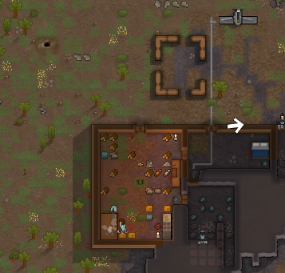
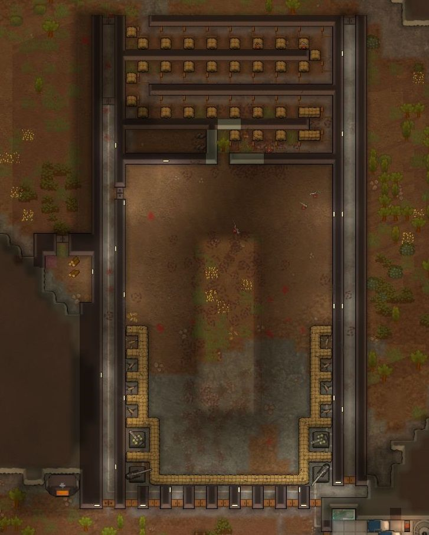
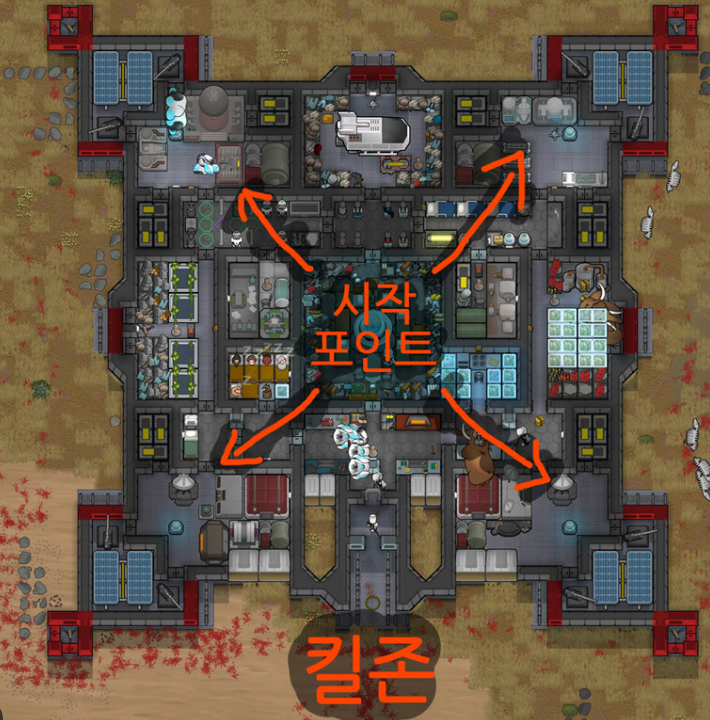
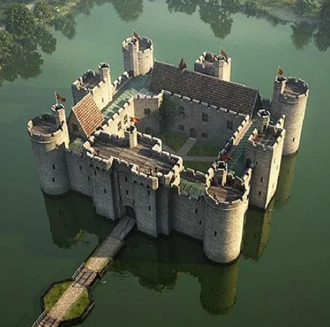
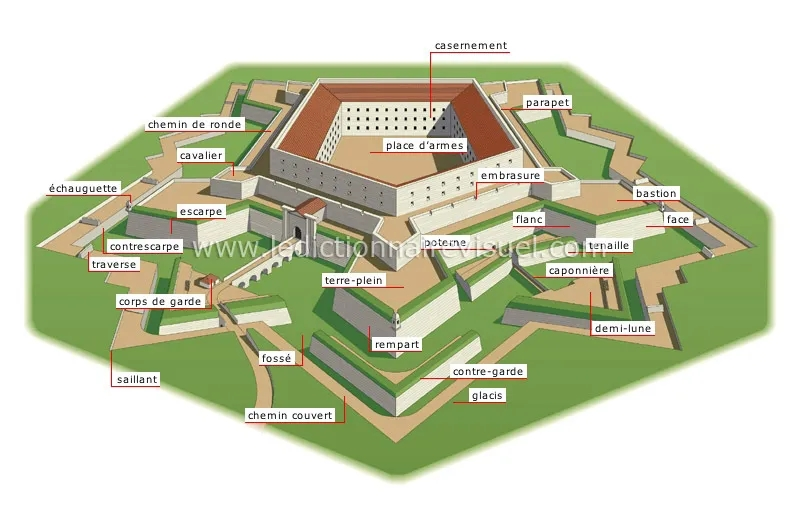
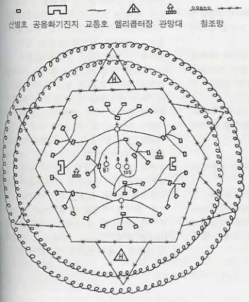
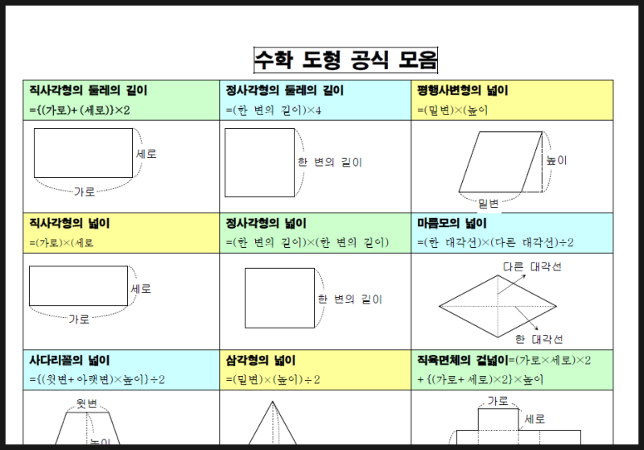

# 나중에 1호기랑 게임으로 공부할 것임
**Date:** 7시간 전
**Category:** 다이어리
**Original URL:** https://blog.naver.com/xpfkwh56/224239709211
---

​

1. 림월드 라는 게임이 있음

​

콜로니 시뮬레이션 게임인데,

저기 있는 사각형 모양이

​

타이난식 킬존 이라고 하는

일종의 **방어 기구** 임

​

2. 적들이 일정 시점마다 쳐들어오는데,

​

저 뒤에 있으면 회피율이 있어서

원거리 공격에 대한 약한 면역이 있고

근거리 공격은 인접한 곳에서만 받음

​

​

3. 그럼 어떻게 하면 효과적으로

가장 효율적으로 방어할 수 있을까?

​

그래서 나온 것이 **'킬존'** 개념임

​

림월드 AI 는 특정 로직에 움직이고

그걸 우회하면 유인책이 가능하단 것

​

​

4. 대부분의 기지는, 면적 대비

가장 가용 효율이 좋은 사각형을 두고

적이 공격할 수 있는 정문을 구조화함

​

​

5. 위에 있는 성처럼 요새화 하고

자급자족을 하는 것이 꿈의 기지 임

​

아무런 배경지식이 없더라도,

플레이를 하면 **'유저는 당연히'**

​

흔히 있는 성 구조를 떠올리고

그에 맞게 기지를 구성하게 됨

​

**6. 근데 문제가 있음**

​

킬존을 사각형으로 하면

직사 무기는 단방향만 겨눔

​

**\* 사각형이 있을 때, 테두리를 타고**

**빼곡하게 화망을 구성했다고 가정하면**

**각 모서리가 가장 취약한 부위가 될 것**

**​**

즉, 화력으로 찍누가 안 된 상태로

적이 밀고 들어오면 인접한 적을

사격할 수 없어 방어하는 것이 안 됨

​

**그럼 이걸 어떻게 해결해야 될까?**

​

​

그걸 해결하려고 나온 것이 **성형요새** 임

​

15세기 이태리에서 나온 보방식 요새는

사각형의 테두리 면에 추가 모서리를 둬서

​

각 사각형 꼭지점에 화력이 교차되지 않는,

첫 화력 이후, 딜레이 상태에 대한 휴지기를

보완하여 연속적 화망을 유지할 수 있게 함

​

중간에 뭐가 많이 빠지긴 했지만,

격벽 구조로 1차, 2차 방어선을 짜는 등

수성술에 대한 고민도 아주 많이 있었음

​

​

7. 현대에 이르러서는,

**전술기지** 라는 명칭으로

​

참호와 철조망 등을 추가해서,

곡사포를 항공지원으로 바꾸긴 했지만

​

축성물 운용 교리의

완성판 수준으로 만들어놓고

지금에도 실제 쓰고 있음

​

실제 림월드를 할 때도, 작위적으로

AI 를 우회하는 킬존 보다는 이런 식으로

​

인류가 고민한 문제, 발자취 등을

같이 따라가면서 시뮬레이션 하면

​

**'아주 빨리'**, **'재밌게'** 배울 수 있음

​

​

**8. 수학 도형 공식 모음**

​

어렵고 현학적임

​

**림월드에서 가장 적은 자원으로,**

**가장 효과적인 방어를 하기 위해**

**축성을 하려면 어떻게 해야 될까?**

​

10시간, 100시간 박아도 안 질림

​

대형 기관포의 크기는 2x2고,

대기시간 3.5초에 사거리 33타일이다

최소 사거리는 9고, 자폭 반경은 5 일 때

제한된 면적에서 가장 효율적인 배치는?

​

**\* 사거리마다 명중률도 전부 다름**

**​**

적의 이동속도가 1초에 x칸 일 때,

화망 최대/평균 데미지를 기준한다면,

적 전체 체력을 경우에 따라 분류하여

3.5초 사격 지연을 어찌 제어해야 할까?

​

**\* 평균만 알면 충분한가? 를 알면,**

**다음에 나올 파트를 직관적으로 인지**

**​**

사칙연산이 안 되면 풀 수가 없는 문제고,

​

다 풀고 나면 해석, 기하,

대수, 통계 다 **알게됨**