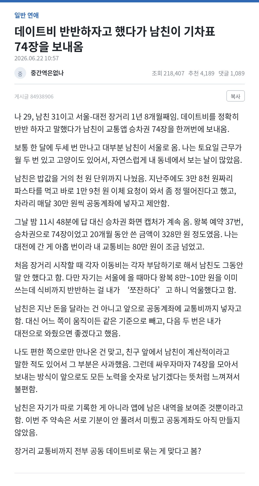

# 남자와 여자의 차이
**Date:** 7시간 전
**Category:** 일기장
**Original URL:** https://blog.naver.com/xpfkwh56/224327182356
---

1. 연애질 이라는 것 자체가

공평하고 공정할 수 없는 듯함

​

결국 누군가 더 좋아하는 사람이 있고

덜 좋아하는 사람이 생길 수 밖에 없으며

​

그 차이를 **'연애 권력'** 이라고 생각함

​

2. 더 어려운 입장에 있는 사람이

덜 어려운 입장에 있는 사람에게 있어,

​

호감을 얻고 관계를 정립하는 행위를

꼬신다 라는 것으로 명명한다면,

​

적어도 남자가 여자를 꼬시는 쪽이

여자가 남자를 꼬시는 쪽보다 쉬운 것 같음

​

**3. 이유**

​

여자가 남자를 꼬시려면 갖춰야 하는 것,

​

해야 하는 것이 1-2개가 아니고

그런다고 되는 문제도 아닌 반면,

​

반대로 남자가 여자를 꼬실 때는

보통 딱 2개만 있으면 됨

​

**1) 잘 해주면 됨**

**2) 말 잘하면 됨**

​

4. 여성의 본질

​

몇 가지 규칙이 있음

​

**'나'** 를 좋아하지 않는 남자랑

사귈 수 있냐고 하면 **Yes** 가 나옴

​

근데 **'나'** 를 좋아하지 않는 남자랑

결혼해서 **'애'** 를 낳을 수 있냐? 하면

​

**아마 99%의 여성은 전부 No 일 것임**

​

남자든, 여자든 인간이라는 한 뿌리지만

그 어떤 남자도 임신과 출산을 할 수 없음

​

이게 나는 가장 큰 차이 라고 생각함

​

​

**5. 먼저 이 문제의 오답을 보겠음**

​

남자가 틀린 말을 했는가?

​

**아님**

​

여자는 자신이 부담하는 자원이

남자보다 더 손해라고 판단을 했고,

​

그거에 불만을 갖고, 클레임을 걸음

​

남자는 그 클레임에 대해서

실증적 증거로 반박을 했음

​

다만 둘의 **'계산'** 이 달랐을 뿐 임

​

이 게임에서 폭리를 누린 사람은 없음

서로가 각자 **'손해'** 를 본다 느끼고 있음

​

**6. 그럼 여자의 대응을 보겠음**

​

여자는 남자를 계산적이라고 공격했고,

남자는 그에 대해 74개 승차권으로 방어함

​

액수, 횟수, 그리고 **'승차권'** 이

돈만 낸다고 되는 문제도 아니니까

​

**\* 본문에서 여자는 9번 갔다고 함**

**​**

이거는 여자가 이길 수 있는 판이 아님

​

**그래서 여자는 판을 바꿨음**

​

> 이 새끼 집요하네?
>
> 무섭네? 불편하네?

​

이건 못 이김

​

뭐가 집요한데? 지금 이거

뭐가 무서운데? 지금 이거

뭐가 불편한데? 지금 이거

​

남자가 승차권을 보여주면서,

**'이걸 봐'** 했던 것과 똑같은 것임

​

**\* 그게 왜 똑같죠? 싶어지셨다면**

**모르면 외우라는 말 외에는 어려움**

​

7. 원칙으로 돌아갈 필요가 있음

​

**1) 잘 해주면 됨**

**2) 말 잘하면 됨**

​

남자들은 데이트 비용 이슈가 생기면,

종종 이상한 함정에 빠지곤 할 때가 있음

​

예산은 100만원, 근데 만남이 많아지니

비용이 부담스럽네? 만남을 줄이자 내지,

​

다소 짜치는 데이트를 하겠다 이런 것 임

​

물론 협상을 하는 경우도 있음

근데 이건 **'좋은'** 해결책이 아님

​

왜냐면, 그건 **'잘 해주는 것'** 이 아니라서 임

​

덜 만나고, 비용으로 데이트 퀄리티가 후져지면

**'손해'** 를 보는 것은 당사자 본인만이 아니므로

​

8. 그럼 돈이 없는데 어떻게 함?

​

애초에 **'공정하려고 하면 안 됨'**

​

우리는 평소에 미슐랭을 놀러다녔지만,

돈이 없으니까 오늘 김밥천국을 가겠다 (x)

​

내가 오늘 집에서 맛있는 거 해줄게 (o)

​

우리 돈 없으니까 오늘 집에서 먹자 (x)

나 유튜브에서 이거 봤는데 너 해주고 싶음 (o)

​

**'행위'** 는 같음

​

근데 **'포장지'** 가 다름

​

에반데요? 그건 그냥 기망 아닌가요?

​

역지사지 해보면 됩니다

​

9. 인공지능은 실제로

**'사과'** 를 본 적 없음

​

당연함 눈이 없으니까

​

하지만 사과가 빨갛다고 말하는 것을

우리는 **할루지** 라고 말하지 않음

​

AI 가 본 적도 없는 사과를

물어봤을 때, 설명하는 건 기망임?

​

아님

​

상대가 **'원하는 것'** 을 해준 것 임

​

**'실제'** 가 어떠하든 상관없이,

저 여자는 지금 **'손해'** 를 느낌

​

그럼 해야 될 것은, 그 **'손해'** 라고

느끼는 감정을 바꿔야 되는 부분이지

​

니가 틀렸음, 하고 가르쳐서 **될 일이** 아님

​

마찬가지로 이게 맞는지, 틀린진 모름

근데 내가 말한 쪽이 **대체로** 유리한 편임

​

10. 위 사례에서 여자가 데이트비를

**'반반'** 하자고 제안했다는 것은

​

다음과 같은 맥락을 함의하고 있음

​

1) 나는 개념녀 이다

​

더 정확히는, 너와의 연애에 있어서

내가 **'개념녀'** 임을 **'입증'** 받고 싶다

​

이게 **'듣고 싶은 말'** 임

​

2) 나는 **'손해'** 를 보고 있다고 느낀다

​

남자의 입력값에는, 반반? Ok

​

나 사칙연산 잘 해, 하고 계산기 쳐서

정확하게 그걸 수행하려고 한 것이지만

​

반반을 하자니까 이 새끼가

진짜 반반을 치네? 돌았나?

​

이게 **정상** 임

​

반반을 하자고 했어도 ㅇㅇ 그러자 하고,

**'언행 불일치'** 를 했어야 맞는 것 임

​

그리고 그 **'계산 방식'** 을 제안했어야 됨

누구의 프레임으로? 여자의 프레임으로

​

여자 : 데이트 비용 반반 ㄱ

​

남자 : 니 돈이 내 돈임

​

어차피 니 주머니에서 나가든

내 주머니에서 나가든 다 내 돈

반반 자체가 노의미

​

걍 내가 낼 테니까

여유 되면 적금이나 붓고

​

너랑 만나다가 나 죽으면

조의금이나 넉넉히 내

​

or

​

남자 : 공동 계좌에는 서로

우리 미래 위해 **'저축'** 을 하자

​

비용은 내가 쓴다

​

여자 : 너 여유 됨?

​

남자 : 실제 여유가 되든 안 되든

너한테는 그렇게 보여지게 할 테니까

너는 그런 줄 알면 됨

​

주말에 연락 안 되면 내 남친 대리 뛰는구나

이렇게 기억하면 된다

​

**\* 더 정확히는 여자 입장에서 찜찜하거나,**

**장애 요소가 있을 걸 그냥 안 만들면 더 좋음**

**​**

**안정적인 남자를 만나고 싶어요**

**= 마음에 걸리는 것 없었으면 좋겠다**

**​**

11. **나도 편한 쪽으로 만나온 건 맞고**,

​

남자 프레임 = 본인이 인정하네

실제 프레임 = 인정했지? 이제 말하지 마

​

쪼잔하다, 라는 말을 들었다고

거기서 바짝 약 오르는 것 자체가

​

**'남자답지'** 않음

​

하나하나 잡으면 끝도 없는데 결국 원칙 임

​

그냥 잘 해주고, 말만 잘하면 끝남