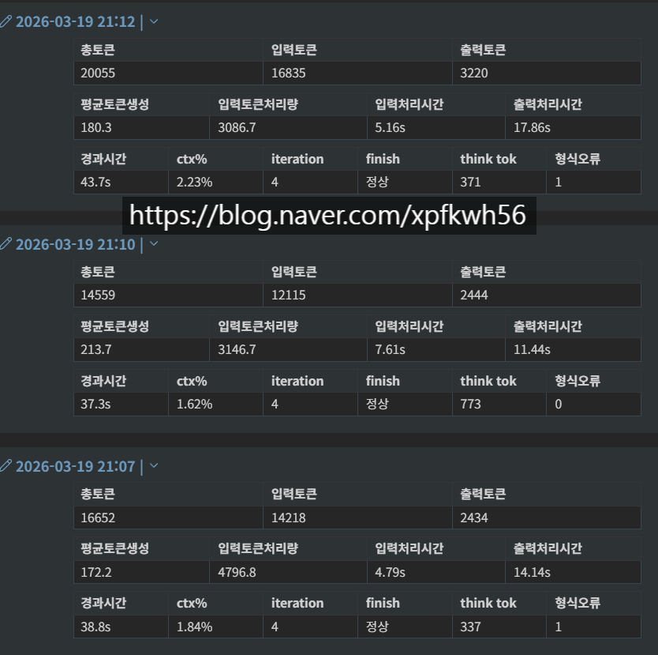
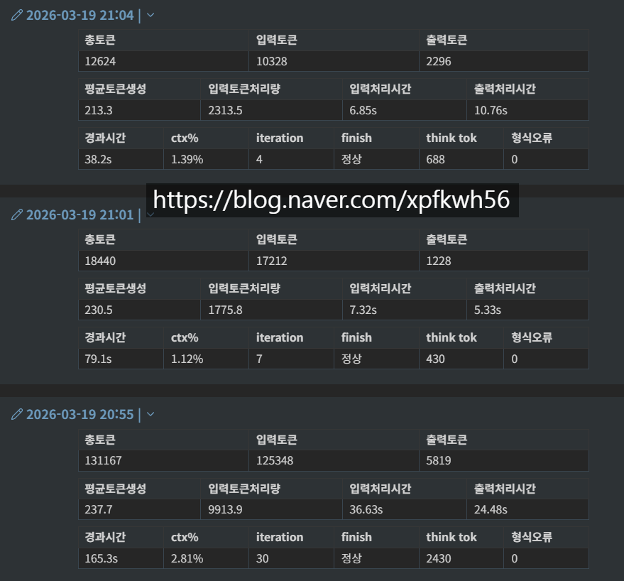
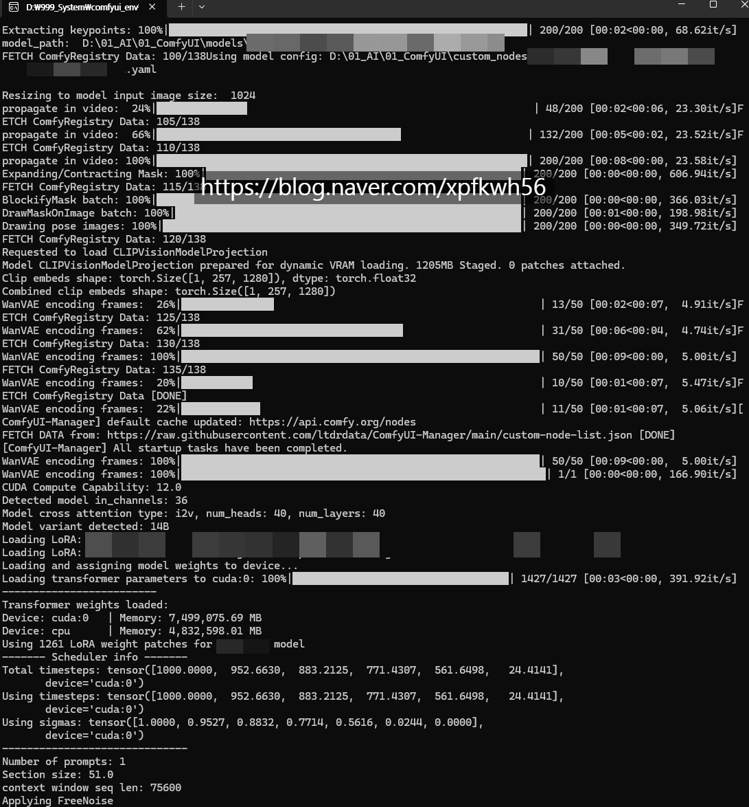
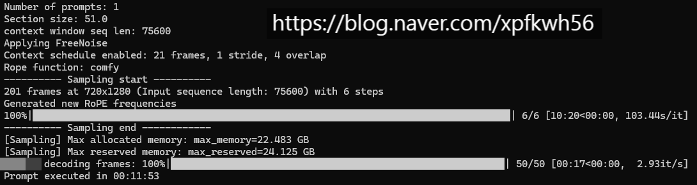

# 로컬 관련
**Date:** 7시간 전
**Category:** 다이어리
**Original URL:** https://blog.naver.com/xpfkwh56/224252203911
---

**중량 모델 쓰지 마라**

​

이미지, 영상 모델로 따지면

사람들은 Sota 를 좋아하니까

​

일단 가장 뛰어나다고 평가를 받는

모델을 하나 고른 다음에 **그거만** 함

​

근데 플럭스2 바닐라랑,

ZIT 로라, ZIT 파인튠 으로 하면

​

당연히 유즈 케이스에 제일

잘 맞는 것은 **ZIT 파인튠** 일 것임

​

그럼 ZIT 를 파인튠 하는 것이 쉽냐?

​

내가 디코 따거 채널 들어가서,

​

체크포인트 작업하는데 내 앞으로만

전처리 데이터가 **주당 4천개씩** 나옴

​

?미친 그걸 직접 보면서 했다고요

​

안 보면 어떻게 하죠? ,,

​

경량 모델 작업만 해도,

혼자서는 **'불가능'** 하고

​

**\* 디코 채널에 20명 이상 있음,**

**중간에 왔다갔다 하는 사람 빼고**

**상주하는 사람만 20명 있단 소리**

​

내가 알기론 지금 들어간

비용만 6천 이상임

​

여기에 **'인건비'** 는 다 빠짐

그냥 **서버비** 만 6천 들어갔음

​

ZIT 모델에서 특정 오브젝트만 뽑아서,

특정 레이어만 추출한 다음에, 특정한

부분만 연산 가중하는 작업만 해도 이럼

​

모델을 만든다?

​

사람이 그런 걸 어떻게 만들어!

소리가 **당연히** 나올 수밖에 없음

​

**\* 이미지 모델은 지금 기준으로 가면,**

**억도 옛날, 내 생각엔 최소 십억 단위**

**​**

그럼 경우는 조금 다르지만,

9B 이하 경량 모델이라고 치겠음

​

기본적으로 패러미터가 작으니까,

일단 **'이해'** 하는 것이 훨씬 쉬움

​

포르쉐를 분해해서 원리를 알아낼래?

아니면 모닝, 포터 뜯어서 연구할래?

​

하면 후자가 훨씬 쉽고,

​

**'마차'** 같은 레벨로 가면

대단한 공학적 지식이 없어도

​

이게 어떻게 돌아간다 라는

원리를 이해하기 훨씬 쉬움

​

실제로 비용 역시 아주 단순한데,

​

LLM 하면 사람들이 묻지마 언플래시,

묻지마 gguf, 라마로만 생각하지만

​

4B 모델 기준, **길어야 8시간** 정도면

내 추구미에 맞게 양자화도 할 수 있고,

데이터도 씌워서 목적 맞게 쓸 수 있음

​

블랙웰 기준으로, TensorRT 서빙이

아직 자리를 덜 잡았을 뿐이지

​

일전에 보여드린 것처럼,

​

qwen 3.5 9B nvfp4 에서

vllm 마린 서빙하고

​

qwen3 으로 코더 템플릿,

jinja 조금 깎아서 들어가면

​

vram 10gb 언저리 먹고,

엔트리 이렇게 뽑을 수 있음

​

​

구글링 했는데, 단일 사용자 기준으로

llm 추론 돌리기에는 맥이 제일 좋고,

올라마나, 랭 쓰면 국밥 이라던데?

​

라는 **'말'** 만 순진하게 믿고 있으면

이런 일이 가능하단 것은 알 수도 없음

​

저 같은 입장에선, 남들이 TPS 어쩌고

하면 그러시구나, 할 뿐 **할 말도 없음**

​

​

Vram 약 20gb 올리고, 샘플링 10분

210프레임 720\*1280 영상을

lcm으로 6스텝 썼고, fw 21 스트라이드 1

컨텍스트 오버랩 4(16)

​

영상 관련 외주 받아서 진행한 것인데,

물론 하기 나름이지만

​

1초 렌더링에 약 1분 언저리쯤 걸리고,

짧은 것은 30분, 긴 경우 2시간 정도 쯤

​

들어가는 라이브 커머스 영상 만들어줬음

​

광고, 라이브 커머스 영상 1회 제작시,

​

물론 영업력 차이가 있을 수는 있지만

통상 그래도 **30** 부터 시작하는 편이고,

​

기획, 콘티까지 들어가면

100-200 도 부당한 건 아닌데,

​

저는 이거를 **'50%'**

정도 가격에 판매하고 있음

​

그게 가능한 이유는?

나는 **'금형'** 이 있으니까, 임

​

동등 수준의 벤치 퍼포먼스로

만약 제가 고서빙 모델을 썼으면

​

3박 4일을 갈아야,

1개 나올까 말까 임

​

**결론**

​

최대한 가벼운 모델로, **표준화** 된

파이프라인을 구성한 다음에

​

시장에서 요구하는 퀄리티를 잡고,

​

그걸 어떻게 하면 빨리/잘/싸게

공급할 수 있을 것인지 정한 다음에

​

공급 체인 확보되면

영업으로 넘어가라

​

나랑 일을 해봤던 의류 및 커머스 대표라면

**'인간 모델'** 을 쓰겠다는 생각을 하지 않음