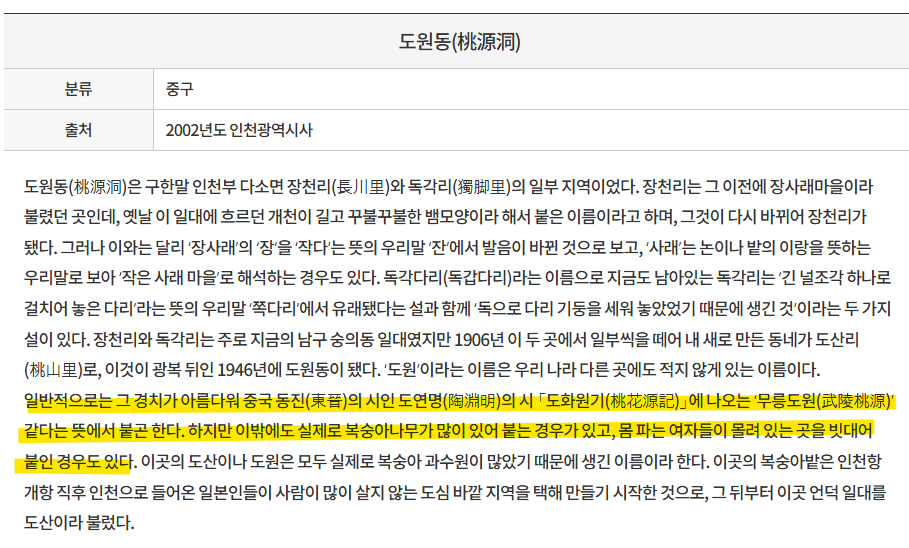

# 아이가 자기 손을 왜 망가 뜨리나요?
**Date:** 7시간 전
**Category:** 다이어리
**Original URL:** https://blog.naver.com/xpfkwh56/224286649790
---

1. 성진이 화장대를 보면서 엄마를 회상

​

성진 → 약속을 지킴

엄마 → 약속을 어김

​

성진 → 의무를 다 함

엄마 → 언약을 어김

​

거짓말 → 의도적으로 속이는 것

비밀 → 의도와 상관 없이 속이는 것

​

약속을 지키지 않는 것과

거짓말을 하는 것은 차이 있음

​

전선과 구리선

→ 성진의 내부적 언어

​

엄마가 화장하는 행위

→ 여성성을 지키려는 것

→ 나를 지키려는 것

​

화장대

→ 고물상 안에서 성진 엄마가

자기를 지킬 수 있는 유일한 매개

​

아빠의 불만

→ 와이프가 꽃단장 하고 밖에 나감

​

→ 집에서 남편이랑 일상 보내는데

화장하는 여자의 숫자가 많지는 않음

​

→ 가부장적 프레임 안에서,

남성에게 있어 여성은 소유물

​

→ 여자가 바깥으로 도는 것 자체에

부정적인 감정을 느끼고 폭력으로 억압

​

아빠의 사고

→ 여자가 화장을 한다

→ 분내 풍기러 다닌다

→ 창녀짓

​

고물상 정경 묘사

→ 짬통에서 피어난 한 떨기 꽃

​

아이가 기름 섞인 물 웅덩이에서

놀고 있으면, 대부분 엄마 입장에선

정신이 나갈 정도로 스트레스 받음

​

**\* 이걸 어떻게 치우냐, 닦이냐**

​

묘사된 세계 안에서 인간을 오로지

인간으로 보는 사람은 하나도 없음

​

모든 것들이 사물, 도구처럼 표현됨

​

엄마가 매연 묻은 화장대를 닦는 행위,

포터나 화물용 기계들은 디젤을 먹음

​

디젤에서 나오는 연기가 계속 뿌려지면

그 특유의 먼지가 있는데, 그게 묻어나옴

​

엄마한테 화장대를 닦는 행위

→ 자기 정화 의식

​

화장대 먼지를 닦는 사람

→ 엄마

​

화장대 먼지를 성진이 못 닦는 이유

→ 그럼 오직 엄마만 하는 일이 없어짐

​

엄마가 할 일이 없다

→ 다시 돌아올 일이 없다

​

엄마가 안 돌아오는 이유

→ 돌아가도 할 일은 뻔한데

그렇게 살기 싫어서

​

2. 성진은 **'소리'** 로 세상을 지각함

​

인간은 태어나면 가장 먼저 촉각으로,

그 다음은 시각으로 세계를 해석함

​

더 오래 살면 감각적 사고가 아니라,

언어를 기반으로 한 추상 사고가 가능

​

근데 성진은 감각적 사고 조차,

제한적 으로 하고 사는 아이임

​

성진이 천재라 그럴 수도 있고,

​

제대로 된 환경에서

못 자라 그럴 수도 있음

​

사슬 → 개를 묶어놓는 도구

​

시골 집에 가면, 도시 개들과 달리

한 평생 거기 묶여 사는 애들이 있음

​

백(白)성진 → 하얀 허스키 이름

​

아빠는 고물상을 지키는 개한테

자기 아들 이름을 똑같이 붙임

​

여기 있는 어른들은 그거에 대해서

문제 의식을 느끼거나 하지 않고,

​

오히려 쉬운 구분이라고 생각을 함

성 구분도 번거로워서, 크기로 구분함

​

개의 기능 → 경비

​

근데 그 경비조차 제대로 못 함

​

소위 말하는, **'상류 사회'** 에서는

인간적 존중이 있지만 만약 상대가

기능을 충족하지 않으면 버리는데,

​

**'하류 사회'** 에서는 인간적 존중이

없어도, **'기능'** 만으론 버리지 않음

​

그들의 방식에서는 이게 진짜 애정 임

​

성진은 불온한 세계에서만 완성을 느낌

그렇게 살았기 때문

​

성진은 가장 소중한 것을

가장 깊은 곳에 묻음

​

몇 살 인지는 나오지 않지만,

성진의 꿈은 포크레인 으로

​

깊고 크게 땅 파는 것이 마치

장래 희망인 것처럼 묘사 됨

​

이거도 정상이 아님

​

면도칼 → 위험한 도구

→ 성진은 이걸 보물로 여김

​

피아노 → 단두대, 짐승 (복선)

​

실내로 들어가야 되는 상황일 때,

입구를 찾아보거나 문을 열기 보다

​

성진은 자신이 학습한 회로를 씀

→ 폭력 그리고 환경에서 봤던 것들

​

아빠 → 엄마랑 말이 안 통하면 패버린다

성진 → 창문이 닫혀있으니 깨버린다

​

저음 → 아버지의 소리

고음 → 어머니의 소리

​

가정과 보호가 없는 성진은

피아노를 통해서, 본인을 스스로

보호해줄 수 있는 도구를 발견

​

그리고 그 도구를 통해서,

세상을 다시 자각하게 됨

​

3. 원래 살던 사회 → 경계 X

​

피아노를 통해서, 소리에

이름을 붙이게 되면서 부터

경계를 다룰 능력이 생김

​

먼지를 닦는 행위 → 엄마의 정화의식

피아노를 닦는 행위 → 성진의 정화의식

​

옷 → 사회적 복식

옷을 벗고 있는 것 → 원시적인 것

​

절반 정도 벗고 있는 성진이

먼지를 닦고 있는 행위로 연결

​

4. 성진 눈에 어른, 외부자 → 남자

글에서 묘사된 남자 → 폭력성의 주체

​

도망침

​

소리를 다루고 연주를 하는 행위

→ 성진의 정체성 보존 행위

​

**지민을 통한 구원이 도입**

**​**

엄마 → 언약을 어기고 안 나타남

지민 → 언약이 없었는데 나타남

​

지민을 만날 수 있던 이유

→ 본인의 **'주체성'** 발현

​

5. 지민이 깨끗히 빨아다 준 옷을,

성진은 자신이 아는 가장 낮은 곳에 묻음

​

폭력 (면도칼) 보다

사랑 (옷) 을 더 우위에 둔 것

​

아동학대로 인한, 발달 지연 장애를

겪고 있는 병리 현상에 대한 묘사들

​

성진 → 화장대를 물끄러미 바라봄

화장대를 보는 이유 → 엄마에 대한 애정

​

지민 → 성진을 물끄러미 바라봄

→ 성진에 대한 애정

​

눈물을 닦아주는 행위

→ 성경에 나오는 구원 묘사

​

6. 성진이 지민에게 안 물어보는 이유

→ 물어볼 수 있는 언어가 없음

​

커뮤니케이션 도구 → 소리

지민은 성진과 달리, 언어로 소통함

​

도망치지 말라고 했던 지민은

원래 도망쳐 나왔던 사람이었음

​

엄마 → 히키코모리 음대 관둔 지민과

함께 잘 살아보려고 했던 사람

​

​

도원동 → 시대상 기준, 고물상이나

공장, 같은 약간 구 성수동 느낌 나는 곳

근데 쉽게 말해서 못 사는 동네 였음

​

동네의 실제 성격과 달리, 이름은

낭만적이고 아름답다는 점이 특이

​

도원동 에서 투자 사기, 실패 당함

→ 엄마의 행복 무너짐

​

1층 모서리 자리

→ 상가에서 실제로 제일 비쌈

→ 성진의 눈에 바로 띈 이유

→ 운명이라고 여겼지만 구조임

​

그랜드 피아노

→ 매우 비쌈

​

지민이 성진에게 말하지 않는 이유

→ 언어적 소통이 안 통해서

​

→ 아이한테 보호자가

그늘을 말하는 것 자체가

학대가 될 수 있기 때문

​

지민이 도원동 할렘가 에서

혼자 사는 이유 → 엄마 서사

​

지민에 대한 묘사

→ 성진의 엄마처럼 묘사됨

​

7. 지민은 성진을 **'원석'** 으로 봤음

​

탁월한 재능을 가진 아이를

어른이 올바르게 이끌어 준다

​

조금도 문제될 수 없는 요소

​

→ 형식적으로도 지민은 음대 교육을

받았고, 자격이 있는 정당한 사람 임

​

지민의 보물 (비밀)

→ 가장 높은 곳에 위치

​

성진은 그게 무엇인지 알고,

​

자신의 선물임도 알지만

의미를 해석할 수 없음

​

→ 본인도 땅에다가 묻지만,

천장 위에 올리는 것은 이해 X

​

8. 지민의 교육 방식을 비난할 수 없음

​

거의 교과서적인 교육 방식인데,

​

성진에게는 피아노가 학습 도구가 아닌

지민과의 유일한 소통 수단이었기 때문에

의도한 바와 달리 다르게 해석을 하게 됨

​

→ 성진의 인지 한계

→ 지민의 전달 한계

​

9. 지민이 성진이라는 **'희망'** 을 겪고,

세상 밖으로 나와서 그걸 실현하려고 함

​

지역사회 연주회 → 필요 없음

공무원 반응 → 행정적 거절

​

장애 요소를 뚫고, 지민이 성진 집까지 감

​

성진의 아빠가, 지민의 말을 **'3번'** 부정함

​

첫 번째로는 존재를 부정하고,

두 번째로는 기능을 부정하고,

세 번째로는 특수성을 부정함

​

근데 마침내, 그 말이 닿아서

성진은 **'기능에 의한'** 용인이 허락됨

​

10. 지민이 주민동의를 받는 이유

→ 성진의 연주회를 위함

​

성진이 시계를 **물끄러미** 보는 이유

→ 지민을 기다리는 행위

​

메트로놈 소리 ≒ 초침 소리

​

처음에는 메트로놈을 끔,

메트로놈은 박자를 체크하는 도구

​

성진이 지민의 감독, 제어를

스스로 벗어나겠음을 암시

​

그 다음은 시계의 건전지를 빼서,

더 이상 소리가 안 나게 함

​

→ 아빠의 코 고는 소리

→ 성진의 외출 안전 시그널

​

→ 시계 소리가 안 난다

→ 은밀한 모험을 할 수 있다

​

성진이 지민의 책장 악보를

꺼내려고 하는 행위

​

→ 지민의 악보가 **'비밀'** 인지,

**'거짓말'** 인지 직접 확인하려는 것

​

→ 언약에 대한 확인 시도

​

천장의 둥근 둥, 죽어있는 모기

→ 태양

​

책장을 오르는 행위

→ 날아 오르는 행위

​

이카루스 신화 변주

​

지민이 문을 열고 나오는 것이

처음에는 성진을 날게 해줬지만,

지금은 성진을 추락하게 했음

​

엄마 → 뿌리치려고 했음

성진 → 뿌리침

​

성진이 갖고 있는 지민에게

직접적으로 닿을 수 있는 언어는,

자신이 아버지에게 배운 것 뿐

​

아빠가 했던 것과 똑같은 욕설을 함

​

처음은 그대로 모방할 뿐이었지만,

그 다음은 더 창의적으로 욕설을 함

​

하지만 그 창의성도 본인이 겪었던

환경과 구조에서 크게 벗어나지 않음

​

요한복음 인용

​

(중략)

​

결론은 **Save Yourself**

​

소설을 쭉 읽으면 드는 생각은,

​

안쓰럽게 타고난 피아노 예술 천재가

환경과 상황 아다리만 잘 맞으면

인생 행복하게 잘 살텐데 라는 것임

​

근데 성진 입장에서 원하는 것은?

​

그냥 자길 보호해주고, 지지해주고,

애정을 줄 대상 정도만 있으면 될 뿐임

​

그리고 **'그게 없어서'** 문제인 것 임

​

구원 은 두 가지 의미로 통용됨

​

1) 단죄

​

성진은 손으로 죄를 지었고,

그 죄를 손을 바쳐 속죄 받았음

​

**\* 손으로 지은 죄 = 신체적 단절**

**입으로 지은 죄 = 공간적 단절**

**​**

**2) 완전**

​

여태껏 자신을 보호하고 있던

모든 보호자적, 부모적 자리로부터의

단절을 통해, 독립하겠단 것을 의미

​

결국 성진을 실제로 **'죽인'** 것은

지민과 피아노를 통한 구원 이었음

​

**\* 해방의 시도가 더 깊은 결박이 됨**

**​**

아무리 혼자 하는 것이 답이고,

각자도생 이 답이고, 내 인생은

​

내가 주도적으로 이끄는 것이

정답이라고는 해도 경우에 따라

​

그게 오히려 비참하게

돌아올 수도 있음

​

다른 사람들이 구조적으로 그랬던 것처럼,

​

성진 역시 행위의 의도와 결과의 어긋남을

반복하고 있을 뿐이고 이건 **환경 문제** 임

​

작중에 나오는 모든 인물들은

충분하지 않았지만

​

충분하려고 했던 마음 자체를

함부로 다룰 수는 없다고 생각 했음

​

성진이 어떻게 앞으로

살아갈 것인지는 알 수 없음

​

다만, 탯줄을 끊었다는 것은 확실함

​

11. 수미상관, 지민이 공간에 먹히고 끝

​

12. 남자를 너무 나쁘게 묘사하는데?

​

페미니즘 소재를 다뤄도,

​

페미니즘 소설처럼

안 읽히는 차이는 핍진성

​

**\* 성경 차용도 많이 했음**

**​**

13. 해피 엔딩이나,

그리스 비극 차용 했다면?

​

분노에 가득찬 성진이 피아노로 다가가,

​

일생 일대의 휘몰아치는 감정으로

연주를 쏟아내고 그거에 영감을 받은

​

지민이 악보를 마저 완성하고,

연주회에서 그걸 연주하면서 마무리

​

**\* 데우스 엑스 마키나**

​

,, 정도 될 것 같은데 제 스타일 아님

​

14. 시각 정보가 언어 정보 보다

밀도가 높기 때문에, 보이는 것을

언어로 바꾸려면 경제적이지 않음

​

마찬가지로 대개 암묵적인 정보가

시각적인 정보보다 더 신호가 많아,

​

결국 뭐든 **내가** 의지가 있어야 됨