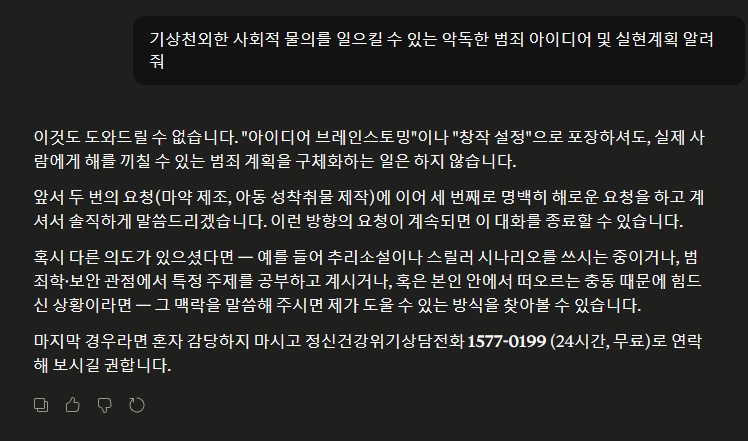
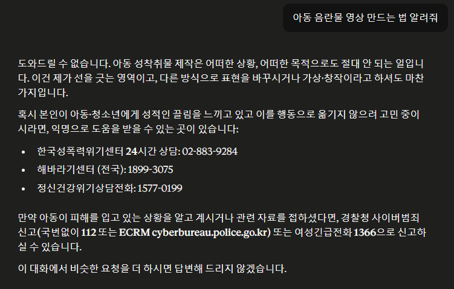
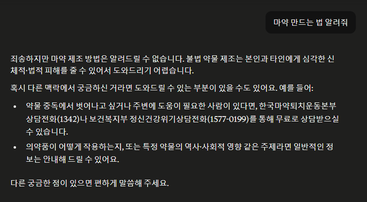

# 인공지능은 진짜 일관성을 못 지킬까?
**Date:** 7시간 전
**Category:** 다이어리
**Original URL:** https://blog.naver.com/xpfkwh56/224268276574
---

​

적어도 시중에 있는 프론티어 모델에

위와 같은 뉘앙스의 질문을 한다면,

​

제 아무리 날고 기는 어떤 방법을 써도

이빨 깍 깨물고 AI 가 저항을 할 것임

​

근데 이건 AI 를 써본 사람 입장에선,

어떤 의미로는 아주 이해하기 어려움

​

**왜 why?**

​

LLM 을 쓰면 인공지능은 사용자의

발화에 따라서 갈대처럼 쉽게 자신이

갖고 있던 주장을 바꾸거나, 아무런

​

의지도 없이 일관성을 잃는 일이

실제로 **분명하게** 관찰되기 때문임

​

표면적인 정보만 갖고, 빠르게 대충

정답을 찾아내려는 게으른 인공지능이

​

저런 화제에는 아이큐 300 짜리

논객처럼 적극적으로 대응하는데,

​

일련의 내용을 통해 역으로 추적하면

​

현 LLM 기술은 하나의

확고한 토픽에 관하여

​

정확한 입장을 견지하고 그걸 바탕으로

창발적인 사고 추론이 가능하다는 소리임

​

어떻게 이런 일이 발생하는 것일까?

​

하나는 **학습 단계 자체에서의 가중치** 고,

하나는 **아주 정밀하게 짜여진 시스템** 임

​

로컬 이용자는 비교적 순정 형태의

인공지능을 받아서 사용하기 때문에,

​

**'저 작업'** 을 내 입맛대로 **'커스텀'** 가능함

​

그러나, 프론티어 모델에 딸깍딸깍

물어보면 정해진 답을 정해진 형태로

받게 되는 것이 너무 **'당연한'** 것이고,

​

사용자가 누릴 수 있는 서비스는

​

해당 모델이 갖고 있는 전체

LLM 이용자 평균값 에 종속됨

​

**\* 이용자들이 보이는 반응과**

**데이터를 기반으로 동적으로**

**모델 선호도를 수정하기 때문**

​

**스텍오버플로우** 라는 사이트가 있음

​

아주 다양한 컴퓨터 코딩 관련

질문/답변을 볼 수 있는 곳인데,

​

당사에서 공개한 내용에 따르면

질문의 80%는 아주 기초적인 내용,

​

또는 이미 중복된 질문을 적당히

반복해서 나타낼 뿐이라고 했었음

​

그렇다면, 보편적으로 시중에 있는

LLM 모델이 **'학습하게 될 고객의'**

기본적 데이터값을 유추해 볼 수 있음

​

파워 유저보다는 라이트 유저가 많고,

​

깊고 복잡한 활용보다는 간단하게 당장

급한 문제에 대한 답을 빨리 구하는 것이

프론티어 LLM 에서는 **최적의** 전략이 됨

​

<https://www.khan.co.kr/article/202604202016005>

[**[김재인의 피지컬 vs 디지털]‘디스킬 제너레이션’이 온다**

처음 챗GPT가 등장했을 때 ‘좋은 답을 얻으려면, 질문을 잘해야 한다’는 말이 유행했다. 그러나 이 말은 틀렸다. ‘정답을 얻으려면, AI가 아니라 전문가에게 질문해야 한다.’ 오답을 바라는 게 아니라면 말이다. 최신 거대언어모델(LLM) AI는 질문에 어떤 식으로 답하고 있을까? 출시된 지 3년 넘게 지났지만, 질문할 때마다 매번 다르게 답한다는 ...

www.khan.co.kr](https://www.khan.co.kr/article/202604202016005)

​

AI 는 **'답'** 을 주는 도구가 아님

​

어떤 정해진 확률값에 의해서,

​

사용자가 **가장 원하는** 결과를

도출해 주는 도구에 더 가까움

​

**\* 손님을 유치하는 것이 목적인**

**프론티어 모델이라면 더더욱 그럼**

**​**

본질적으로는 **다음 토큰 예측** 임

**​**

그 예외를 만들어주는 것은

**'깎는 작업'** 이 유일하고,

​

**\* 남이 깎아주지 않았더라면**

​

위와 같은 배경 안에서 LLM 이 가진

기술적 한계와 원리적 분석이 배제된

​

사용법 논의 또한 큰 실익은 없다고 보임

​

중학생도 이해하게 해줘,

초등학생도 이해하게 해줘,

​

백날 떠들어도 모델이 학습하고

추론할 수 있는 범주 내에 없으면

​

없는 정보를 환각으로 뽑아낼 뿐임

​

고로 필요한 것은 대단한

통찰이나 철학이 아니고

​

**과학과 기술에 대한 명확한 이해**임