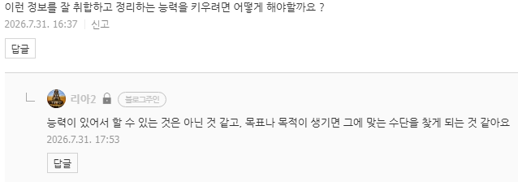

# 자연어 처리로 골치 아픈 사람 이야기 (1)
**Date:** 7시간 전
**Category:** 일기장
**Original URL:** https://blog.naver.com/xpfkwh56/224364118658
---

​

1. 잉공지능의 장점 중 하나는

**'사람 처럼'** 문장을 쓸 수 있다는 것임

​

때문에 대화형 챗봇을 운용할 수도 있고,

글쓰기 같은 작업 등을 지시할 수도 있음

​

2. 원숭이가 하루 종일 타자기를 두드려서,

세익스피어 작품을 쓰는 것은 **불가능** 하지만

​

토큰 맥싱으로 LLM 한테 무한하게 맡기면,

**'가능할 지도?'** 라는 느낌이 들 수가 있음

​

글을 1개, 10개, 100개 정도 잡은 다음,

LLM 로 글쓰기를 시킬 때는 문제가 안 생김

​

그러나, 1천개, 1만개,

10만개의 글을 작성 시키면

​

LLM 글쓰기의 한계를 어려운 연구나,

기술적 이해 없이도 금방 체감할 수 있음

​

**3. LLM 이 글을 쓰는 원리**

​

인공지능은 **'말'** 을 하는 것도 아니고,

**'글'** 을 쓰는 것도 아님

​

그냥 특정한 글자(토큰)가 있을 때,

그 뒤에 나올 가장 높은 확률을 예측해

계산해서 **'뿜어주는 것'** 만 하는 것 임

​

그래서 유창하게 말할 수는 있지만,

정확하게 말하거나, 실제 **'인간'** 처럼

​

어떤 커뮤니케이션 능력을 갖출 수 없음

​

4. 사람으로 따지면 **아는 것**이 아니고,

매우 매우 **아는 척**을 잘 하는 것이고,

​

이 얕고 넓은 좆문가적 에티튜드는

모든 LLM 이 갖고 있는 원죄와 같음

​

똑똑한 사람들은 이런

문제를 해결하고 싶었음

​

1) 그래서 처음 시도하게 된 것이 **'학습'** 임

​

나는 밥을 \_\_\_\_ 라는 문장이 있다고 침

​

먹었다, 먹었고, 먹고 있다,

좋아한다, 싫어한다,

만들고 있다, 짓고 있다, 등등

​

뒤에 나올 다양한 문장 꾸러미가 있으면,

그 문장이 나올 **'확률'** 을 **'학습'** 시키는 것임

​

먹었다, 라는 대답을 할 때 +1 점을 주고

요리했다, 라는 대답을 할 때 -1 점을 주면

​

인공지능은 높은 점수를 받는 값을 추종함

​

그래서 가장 **'의도한 바'** 에 맞게끔,

대답을 하도록 모델을 만들 수 있는데

​

이렇게 하니까 생긴 몇 가지 문제가 있었음

​

**여기서 우선 근본적으로 발생하는 문제는**

**양질의 데이터를 계속 넣어야 된단 점 임**

​

어차피 LLM 출력에서 나올 수 있는 값은

학습 단계에서 **'거의 결정적'** 으로 확정 됨

​

**'ㄱ'** 으로 시작해서 **'ㄱ'** 으로 끝나는 글자만

학습한 LLM 은 **'ㄴ'** 이나 **'ㄷ'** 같은 글자를

​

구조적으로 출력해낼 수 없기 때문임

​

이 작업을 하기 위해선, 우선

컴퓨터가 이해할 수 있게 무궁하게 많은

데이터를 정비하는 작업이 필요했고,

​

정돈된 데이터를 **'어떤 기준'** 을 갖고,

우선할 수 있게 설정할 것인지 해야 했음

​

**인터넷에 글이 딱 100억개 있다고 침**

​

100억개의 글을 **'분류'**

하는 것 자체도 버거운데,

​

분류한 다음에, 이걸 **'기준'** 을 잡아서

​

무엇이 좋고, 무엇이 나쁘고,

무엇이 기준에 부합하는 것인지

​

**한번 더 추려내야 하는 작업이 요구됨**

​

데이터센터 100억 평 짓고,

전기 공사하고, 인프라 세팅하면

​

그 안에 데이터를 집어넣는 건, **'됨'**

​

심지어 비쌀 뿐이지, **'쉬움'**

​

근데 그 데이터를 어떻게 관리하고,

어떻게 활용할 것인가? 라는 부분은

​

놀랍게도 **'여전히 그 어떤 빅테크도**

**아직 명확한 기준을 못 찾아낸 상태임'**

​

**\* 공장에서 나오는 프랜차이즈 스타일의**

**정돈된 레시피가 있다기보다, 개별적으로**

**각자 손맛으로 요리를 하는 느낌에 가까움**

​

마치, 일단 지금 불치병을 고칠 방법이 없으니

사람부터 얼려놓고 나중에 기술이 좋아지면

​

녹여가지고 다시 방법을 찾아보자,

라는 것이 **'현재 최첨단 AI 연구의 엣지'** 고

​

**\* 내가 아는 범위 내에서**

​

냉동 인간과 마찬가지로, 무궁한 데이터를

가져다가 데이터 센터에 모셔놓는다고 해서

​

그게 실제로 **'써먹을 수 있을까?'** 라는 것도

아직 명확하게 정답이 있는 상태는 아님

**​**

아무튼, 나중에 데이터는 필요하긴 한 것 같아

그러니까 데이터 센터를 많이 지어보고,

알박기 해보자, 이게 난리 피우는 것의 현실임

​

최대한 많이 일단 데이터 자원이 있으면

그걸 갖고 뭐든 할 수 있지 않겠어?

**​**

**\* 마치 사람 많이 모인 플랫폼이 있으면**

**거기에 뭐라도 얹으면 뭐라도 된다 마인드**

​

라는 부류는 데이터 수집 방법에 집중하고,

​

적은 데이터로, 더 좋은/많은 데이터를

뽑아내는 것에 집중해서 연구하고 있음

**​**

2) 이세돌이 알파고한테 발린 일들이 있었고,

​

이제 앞으로 인간이 바둑으로 컴퓨터를

1:1로 이기는 것은 불가능하단 **증명**이 됨

​

**\* 신진서가 접바둑으로 몇 점을 깔았네,**

**이겼네, 제한 시간이 몇 분이네 같은 것이**

**내 생각에는 별로 유의미한 이야기가 아님**

​

아무리 사람이 암산을 빠르게 한다고 해도,

계산기를 **'절대'** 이길 수 없는 것과 똑같음

​

**그럼 대체 알파고는 어떻게 한 걸까?**

**​**

몬테카를로 트리탐색 이라는 것이 있음

​

바둑판 위에 첫 수를 놓으면,

그 즉시 AI 가 상대의 다음 수를 예측하고

그 다음 수를 예측해서, 최종적으로

​

**'바둑판 위에 놓을 수 있는 모든 돌'** 의

경우의 수를 계산해서 자기가 이길 수 있는

최적의 해를 순식간에 계산해서 게임을 함

​

상대가 효율적이든, 비효율적이든 상관없이

나올 수 있는 **'모든'** 경우를 전부 채우기 때문에

​

무조건 그 안에 들어올 수 밖에 없음

​

돌을 놓는다는 행위 자체가 정해진 미래에,

차피 이길 결과를 시행하는 것에 불과한 정도임

​

**\* 기술적 한계로 실제 모든 경우의 수를**

**하나하나 다 셀 순 없기 때문에,**

**​**

**그나마 쓸 수 있는 것이 이 방식이고**

**알파고 같은 것을 이기는 건 사실**

**놀라운 일이라기보다, 근본적으로 AI 가**

**​**

**비결정성을 갖고 있기 때문에**

**구조적 빈틈이 존재한다 라는 것을**

**보여주는 단면에 불과하다고 봐야 됨**

**​**

인간이 1판 이겼다, 2판 이겼다 라는 점이

놀랍고 낭만적인 이야기는 맞지만

​

동일 조건에서 100판, 1000판,

10000판 이렇게 플레이를 하게 되면

​

사람은 **절대** 저걸 계산할 수 없기 때문에,

**이론상 무조건** 컴퓨터한테 질 수 밖에 없음

​

애초에 사람을 1판

이긴 것이 놀라운 것이 아니고,

​

지구 최강자를 컴퓨터가

이겼다는 것이 더 놀라운 일 임

​

**그럼 당연히 딱 드는 생각이 있음**

​

몬테 어쩌고 그게 무엇인진 모르겠는데,

​

진짜 **'모든'** 경우의 수를 다 따진다면

그게 **'미래'** 를 보는 것과 무슨 차이지?

​

가위바위보를 한다고 가정함

​

**상대가 뭐를 낼 것인진 알 수 없음**

​

하지만 상대가 낼 수 있는 것은

**결국** 가위, 바위, 보 셋 중 하나임

​

사람이 무엇을 낼 것인진 알 수 없지만,

가위/바위/보를 내는 표본 1000조개를 모아서

​

**이기는 패턴을 뽑고, 그대로 반복한다면**

**무작위로 내는 것보다 유리하지 않을까?**

​

사람은 상대가 가위를 연속해서 100번 내면,

다음에는 가위 아닐까? 바위 아닐까? 보 아닐까?

하는 식으로 드리프트 할 수도 있지만,

​

언제나 기계는 시킨대로 **'그대로'** 함

​

바둑 잘 두는 기계의 아이디어를,

​

**'미래'** 를 볼 수 있는 수정구슬처럼

쓸 수 있다는 가능성이 열리게 되면서

​

**LLM 의 진보적 방향성이 크게 바뀌게 됨**

**​**

근데 그 아이디어는 시작하자마자 막힘

​

바둑돌 위에 올라갈 수 있는 경우의 수는,

거의 무한에 가깝지만 **'무한'** 은 아님

​

그리고 바둑에서는 승리를 규정하는

**'해'** 가 정해져 있는 반면, 대부분에서는

​

이긴다, 라는 것 자체를

그 시점에서 측정/규정할 수 없는

가이드가 없는 경우도 많이 있음

​

예를 들어, **'좋은 영화'** 를

추천해주는 AI 라고 가정함

​

**좋은 영화가 뭐임?**

​

누구는 이걸 명작이라고 하고,

누구는 저걸 명작이라고 하는데

​

**애초에 이건 정답이 없음**

​

그래서 좋은 영화를 찾아주는 AI, 라고

표면적으로 말하고 있지만 실질적으로는

​

리뷰/평점이 특정 요건에 맞게 높은 것,

또는 연령군/나이군/지역군 등

​

사용자의 행태적 바탕으로 그런 사람들이

대체로 선호하는 것을 큐레이션 하게 한다

​

라는 것으로 우회해서 제공하는 중임

​

5. 이처럼 학습 중점의 모델 활용은

근본적이지만 너무 비싸고,

​

추론 중점의 모델 활용은

가볍고 유연하지만 정확하지 않음

​

그래서 이 문제를 **'실용적인 관점'** 에서

어떻게 풀어내면 좋을까? 하는 고민을

​

여러 똑똑한 사람들이 풀어내기 시작했고,

​

현재 기준으로 LLM 활용 관점에 있어서

가장 비싸게 쳐주는 영역이 주목 받게 됨