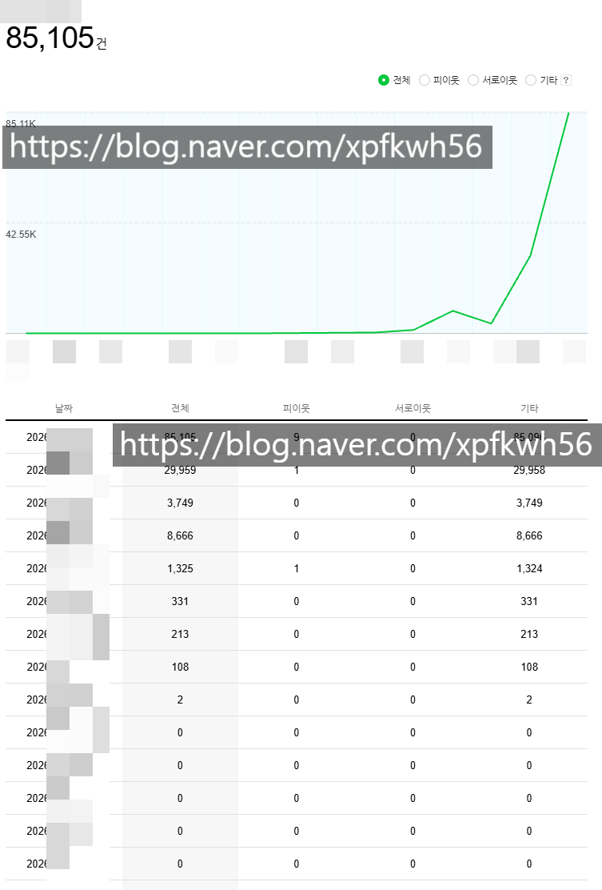
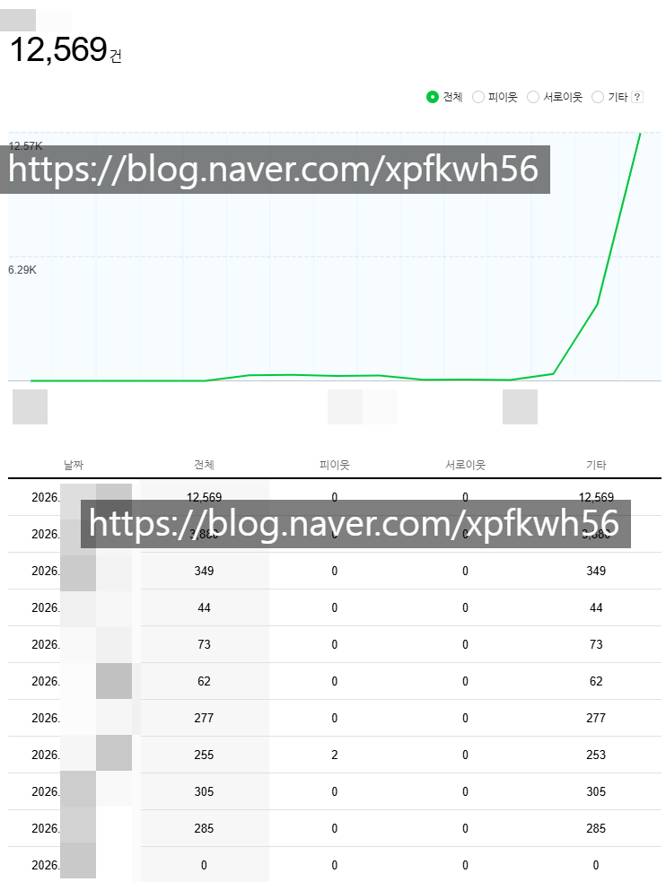

# 제일 잘 된 케이스
**Date:** 7시간 전
**Category:** 스냅
**Original URL:** https://blog.naver.com/xpfkwh56/224430499914
---

​

보통 만블 찍히고

안정화 궤도 들어가는 케이스

​

​

생각보다? 1만 이상 트래픽 찍는

블로그 숫자가 그렇게 많지 않음

​

**\* 카테고리별로 적게는 5만개,**

**많게는 10만개 정도만 추리면 됨**

**​**

**→ 이미 잘 된 X, 오래한 X**

**어제 시작해서 잘 되고 있는 O**

**​**

그 말은, 영원한 공식 까진 아니더라도

**전체적으로 공유하는** 문법이 있긴 있단거고

​

그게 계속 미묘하게 잘 바뀌기는 하지만

따라가면 금방 금방 트래픽 키울 수 있음

​

속성은 트레이딩 이랑 제일 비슷한 것 같음

​

거래 동향을 읽고,

가격을 예측하고,

베팅하는 것

​

차이가 있다면 이건 트레이딩에

비하자면 **오픈북** 이나 다름 없고,

​

특별한 대안 없는 백수 기준,

쨌든 들어갈 돈이 거의 없다는 것?