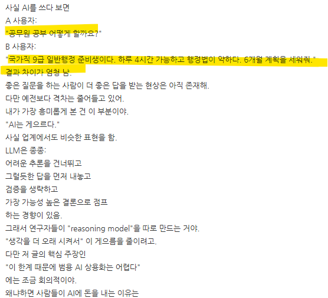
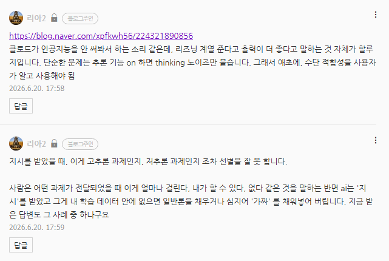

# 추가 해설
**Date:** 7시간 전
**Category:** 일기장
**Original URL:** https://blog.naver.com/xpfkwh56/224321890856
---

**​**

**나한테 물어본다면 나는 이렇게 함**

​

"국가직 9급 일반행정 준비생이다.

하루 4시간 가능하고 행정법이 약하다.

6개월 계획을 세워줘."

​

**리아2 = 국가직 9급을 왜 보는데?**

​

인공지능 = 네~!

6개월 계획을 세워드릴게요~!

​

**\* ai는 공부를 해본 새끼가 아니기 때문에**

**1개월 어쩌고 2개월 어쩌고 이 지랄을 할 것**

**​**

**사람이면 하루 4시간요?**

**꼭 공무원 하셔야 겠어요? 라고 말함**

​

**만약 사용자가 자기 진의를 묻는다면?**

너무 간단히 대답할 수 있을 것임

​

문제는 그걸 물어볼 수 있는 **'인간'** 은

**'질문'** 조차 안 한다는 것임

​

**그럼 국가직 9급을**

**왜 보는지 왜 물어보는데?**

​

질문자가 공무원을 합격하고 싶은 이유가

장기적으로 안정적 직업을 갖기 위함인지,

​

아니면 공무원이라는 직업 자체에 뜻이 있는지,

남들이 좋다고 하니까 그냥 따라간 것인지,

​

일행을 고른 이유가 취향인지, 합격 적합성인지,

그리고 기존에 갖고 있는 학습 수준은 어떤지,

​

내가 무조건 늦어도 5년 안에 합격해야 하고,

직업 자체를 갖는 것이 더 의미를 두고 있다면

​

다 집어치우고, 교순소 알아보라는 것이 답이고

​

그거도 어렵다면 공무원이 아니라

무기계약직이나 다른 경로 찾아야 됨

​

**\* 보은 인사 중심을 찾는 것도 방법**

**이건 한국 인사이더 도메인이라,**

**AI 레벨에선 찾아낼 수도 없을 것**

**​**

**정권 보은인사 낙하산을 뭔 수로?**

​

나는 무조건 일행을 해야 된다고 하면,

또 다른 문제가 될 수도 있는 것이고,

​

장기적으로 **'직업'** 이 필요한 상황이라면

그에 맞는 **'다른 레이어'** 를 줄 수도 있고,

​

이게 사람한테는 어려운 일이 아닌데,

인공지능은 구조상, 할 수 없는 작업 임

​

인공지능이니까 **'쩔 수 없지'** 라고 하기엔,

​

나도 군대 가본 적도 없는데

​

갈 생각이 있으면 공군,

그리고 할 생각이 있으면

​

인사/교육/재정/정보

가야 된다는 걸 알고 있음

​

**어케 알앗누?**

**​**

밀덕들 얘기랑 캡틴 김상호에서 봤음

​

**\* 군대는 아들 키우는 엄마가**

**취약할 수 있는 도메인이니까**

**​**

**​**

**의도 추론이 그럼 앞으론 가능하지 않을까?**

​

​

**'고작'** 이거도 안 될 걸요?