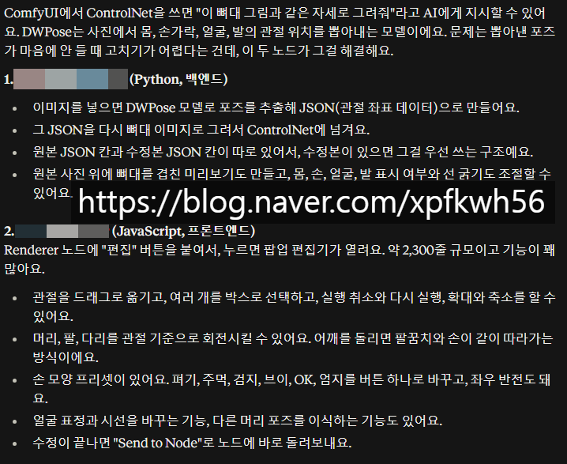

# 26년 초쯤, 만들었던 커스텀 노드
**Date:** 8시간 전
**Category:** 스냅
**Original URL:** https://blog.naver.com/xpfkwh56/224429719188
---

​

1. 이미지 입력

→ 자세, 포즈 및 정보 추출

​

2. 그 뼈대 기반으로

전처리 이미지 생성

​

**3. 그게 뭔데요?**

​

사람 이미지가 있으면, 저기에 넣음

그 다음에 시선/표정 같은 걸 바꾸거나,

​

tilt, yaw, pitch 바꿔서 내가 원하는

모양에 맞게 커스텀 해서 뽑을 수 있음

​

4. 이 사진 참 마음에 드는데,

팔을 조금 더 들었으면 좋겠는데?

​

앉아서 찍었는데 눕혀보고 싶은데?

​

고개를 45도 각도로

돌려봤으면 좋겠는데?

​

싶을 때, 사용하면 그거에 맞게

이미지가 바꿔서 나옴

​

5. 3D 툴이랑 섞어서 쓰면, 컴피 비결정성

때문에 할 수 없는 **1도 단위 각도** 커스텀 가능

​

이미지에서 사람 바꾸기 같은 것도 가능

포토샵 AI, 멀티 앵글이랑 섞어 쓸 수도 있음

​

6. 당시 시댄스가 워낙 비쌌고

접근도 안 되는 상황이었기 때문에,

​

wan 으로 영상 만들고 렌더링 할 때,

생성된 이미지를 중간 중간 넣어서

유효율을 계산하는 도구로 사용 했었음

​

**\* 드리프트 방지**

​

저렇게 전처리 + 렌더링 에디터 만들면

시간도 많이 걸리고 귀찮기는 하겠지만,

​

깎는 능력에 따라서 로컬만 사용해도

애니메이션 뚝딱뚝딱 찍어 뽑을 수 있음

​

**7. 아이랑 해볼 수 있는 재미난 놀이**

​

아이 사진을 갖고 **로라** 를

같이 구워보는 시도 해보세요

​

과적합 만드는 건 어렵지 않은데,

이렇게 하면 이미지에 있는

​

**'모든'** 사람을 다 아이 얼굴로만

나오게 할 수 있음

​

움직이는 사람을

아이로 바꿀 수도 있음

​

Wan2\_2-Animate-14B\_fp8\_e4m3fn\_scaled\_KJ.safetensors

flash\_attn\_2

block\_swap 10

LoRA lightx2v\_I2V\_14B\_480p\_cfg\_step\_distill\_rank64

steps 4

cfg 1.0

shift 5.0

scheduler lcm

T5 umt5-xxl-enc-bf16

CLIP Vision clip\_vision\_h

VAE Wan2\_1\_VAE\_bf16

해상도 720×1280

프레임 150

frame\_window 77

pose\_strength 0.8~1

face\_strength 1.0

pose ViTPose-H + YOLO (VitPose-H wholebody + DrawViTPose)

mask SAM2 large, GrowMask(expand=10), BlockifyMask(32)

​

지금도 키자이 래퍼가 sota 인진 모르겠는데,

이정도만 돌려도 갖고 놀기에는 차고 넘칠 것임

​

제가 예전에 썼던 표준 워크플로우 스택인데,

지금은 더 기술이 좋아져서 찾으면 더 많을 듯

​

막상 돌려보니까,

​

5090 기준일 때, sageattn

18.5s/it 정도 나오더라

​

**\* Pusa+sage+vae32+face0.5**

**속도는 빠른데, FA2 가 더 안정적**

**​**

TorchCompile X

​

**\* graph break 효과 없었음**

​

allow\_compile X

​

pose\_images 만 SDPose 로 교체

​

**\* keep\_face=false**

**​**

하니까 출력이 더 잘 되더라,

뭐 이런 것은 해보면서 맞추면 됨