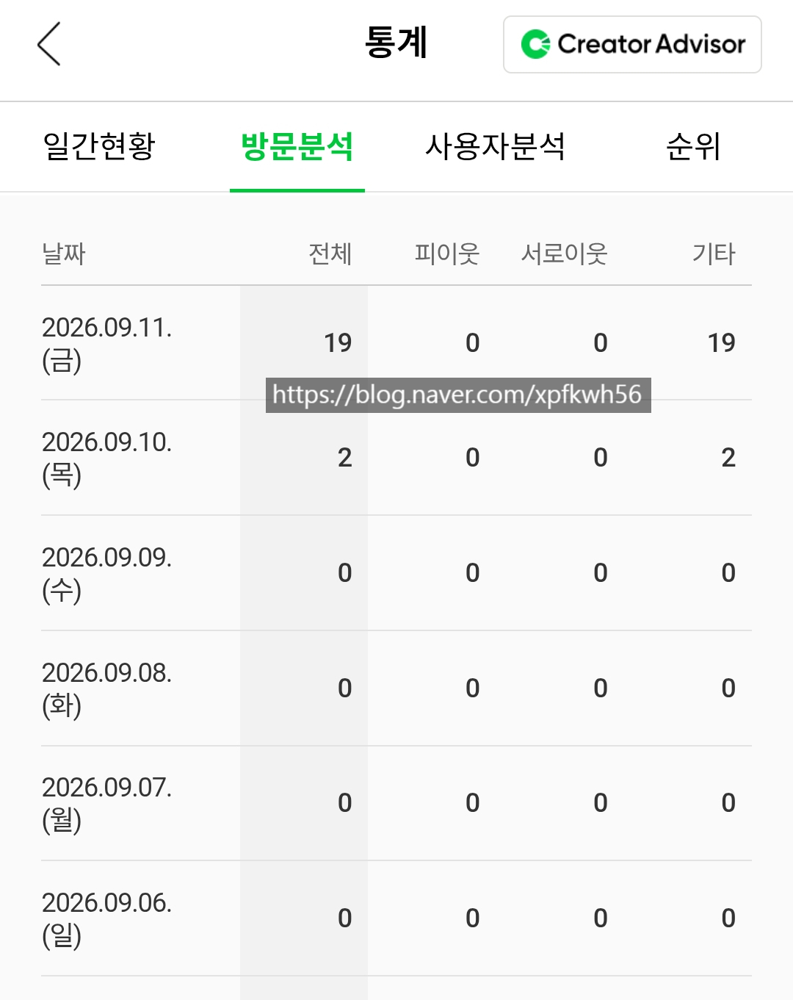
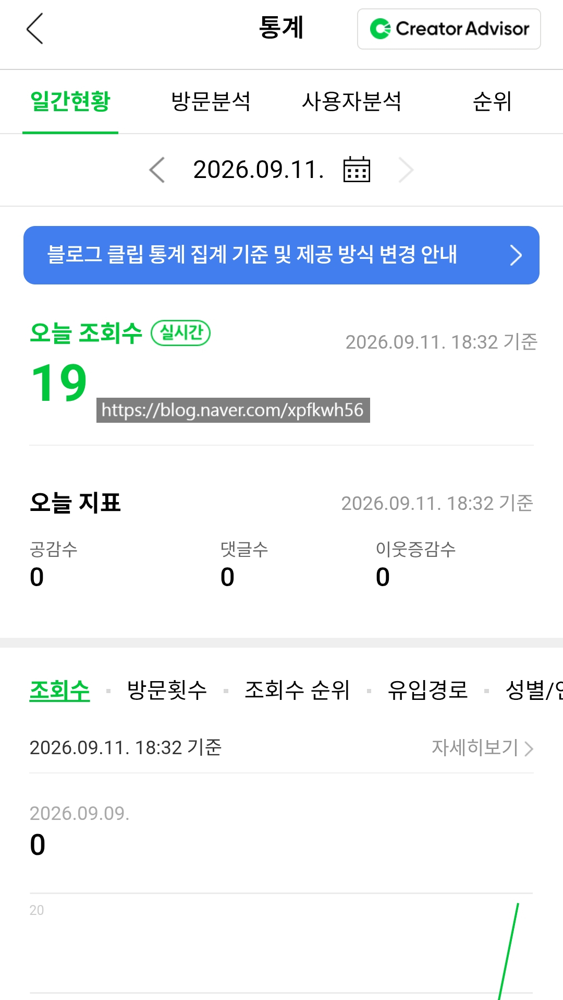

# 가쥬아
**Date:** 8시간 전
**Category:** 스냅
**Original URL:** https://blog.naver.com/xpfkwh56/224408592101
---

​

1. 이거 까지만 자리 잡으면

이제 자체 예선 통과 확정

​

메이쟈 가고 싶다

​

테스트 한다고 날려먹은

블로그 30개 이상 쯤 되는 듯

​

하지만 그걸 지불하고

만블 벽 깨는 법을 깨달음

​

**\* 일방 1만 찍히고 홈판 간간히**

**노출 해봤자 폐지줍기 +a 일 뿐**

​

결국 내가 **'좋다'** 라고 생각하는

콘텐츠 기준을 확보하는 것이 중요

​

2. 내가 생각하는 고객의

콘텐츠 여정은 다음과 같음

​

1) 클릭

2) 게시물 체류

3) 공유/댓글/좋아요/이추

4) 다른 글 보기

5) 재방문 하기

​

클릭 한 다음에, 그 페이지를 끝까지 보고

상호작용을 한 다음에, 다른 글도 누르거나

나중에 재방문을 하는 퍼널 구조 있어야 됨

​

3. LLM 도움을 받을 수 있는 부분은 여기임

​

1) 먼저 사건의 흐름 축을 확정함

​

2) 있으면 동태적 범주에 넣고,

없으면 정태적 범주에 넣음

​

**\* 통시, 공시 라우팅**

​

3) 동태적 범주에서는 무엇을, 왜, 이렇게

라는 것을 중심으로 다시 연결함

​

무엇이 중심일 때는 서사, 행위/시간/의미

​

이유가 중심일 때는 왜 라는 질문을 중심으로

원인과 결과 ,전체와 결론, 인과적 근거를 씀

​

어떻게 일 때는, 과정에 있어서

순사, 차례, 절차, 단계, 방법, 등을 다룸

​

4) 공시적인 콘텐츠를 다룰 때는,

​

소재, 화제, 주제가 1개인지, N≥2 인지 나눔

​

1개라면, 정의/분류/분석/묘사/예시/논증 과

같은 방식의 흐름으로 서술하게 하고,

​

2개 이상이면 동일 범주 유무성 체크 하고,

같은 범주로 묶이면 비교, 대조

​

차이가 있으면 유추, 내부 성격이나

속성 중심으로 N gram 알고리즘 비유 씀

​

학습은 한국 국어교육 과정 그대로 따랐고,

심화는 국립대들 신입생 교양 글쓰기 강의 읽힘

**​**

**4. SEO 글쓰기 왜 안 가르침?**

​

어필리에이트 오염이 심해서

그리고 잘 깎은 프론티어는 모르겠는데,

**​**

**\* 맛보기로 내가 돌려본 결과 터무니 X**

​

CTA 마그넷도 너무 촌스러워서

저 방식은 내가 공감할 수가 없었음