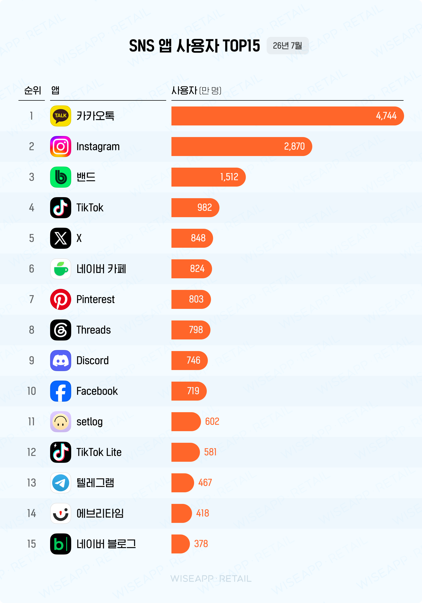
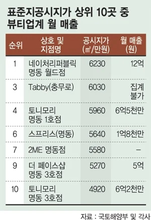
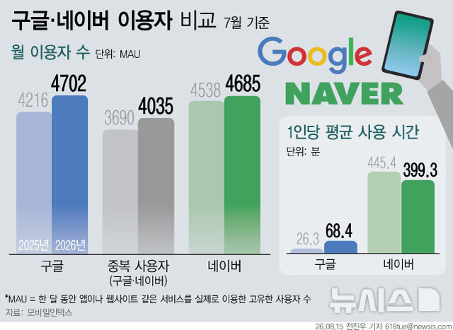
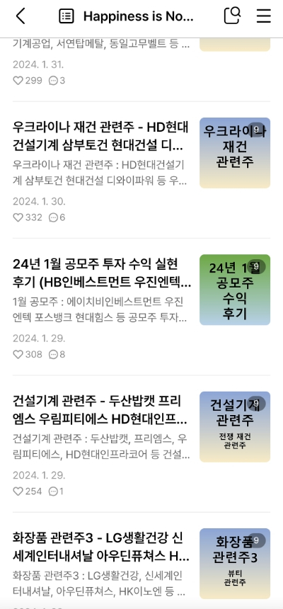
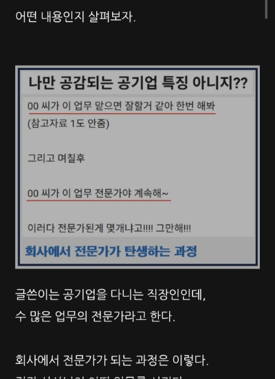
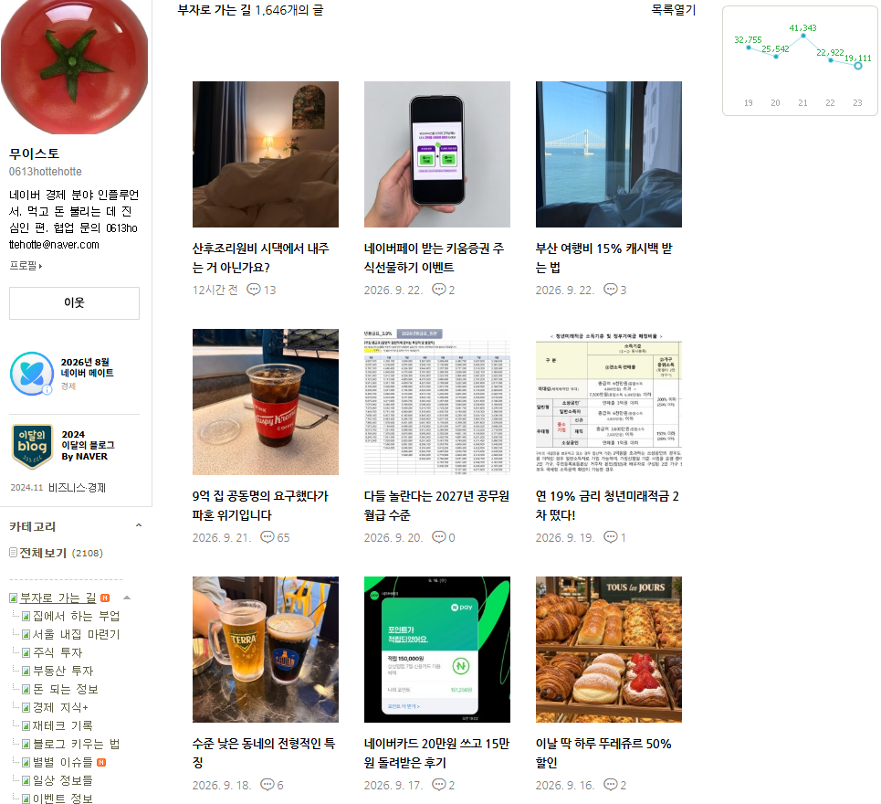
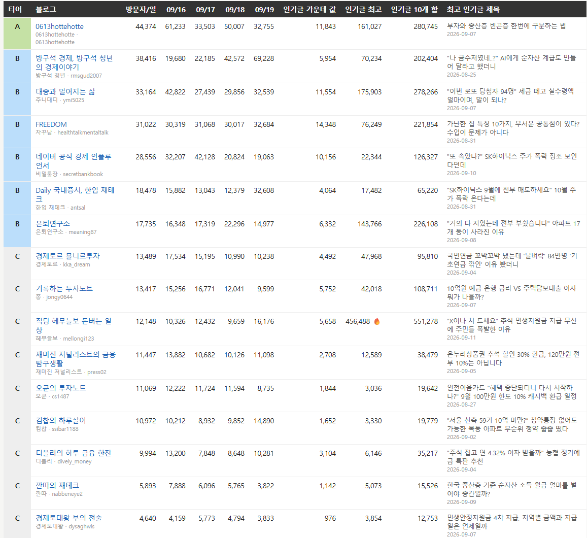
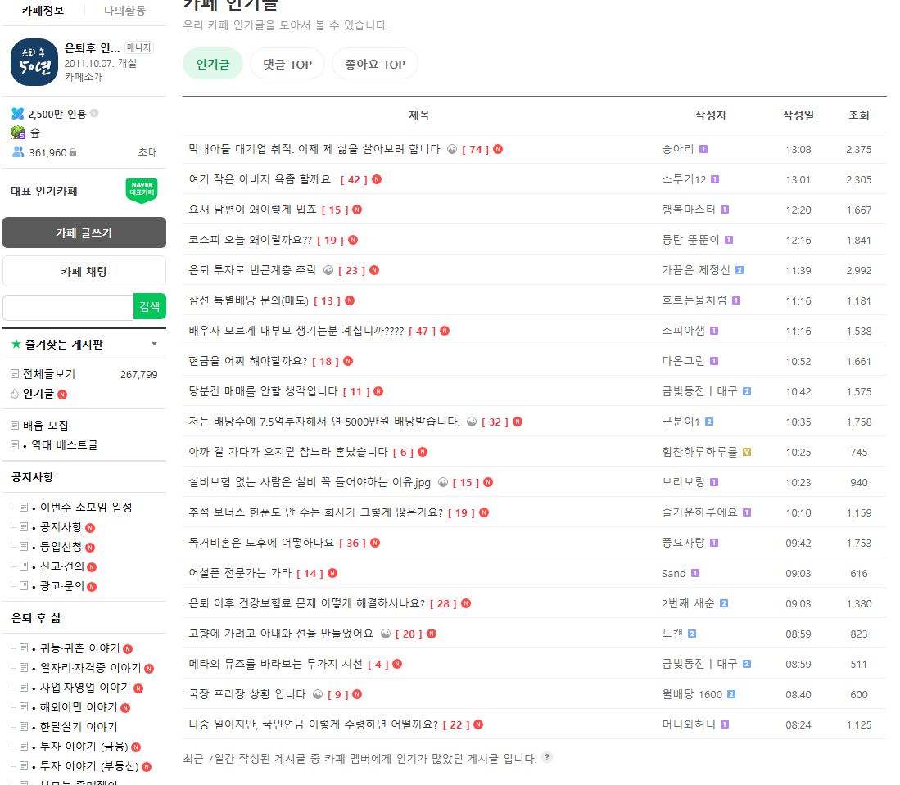
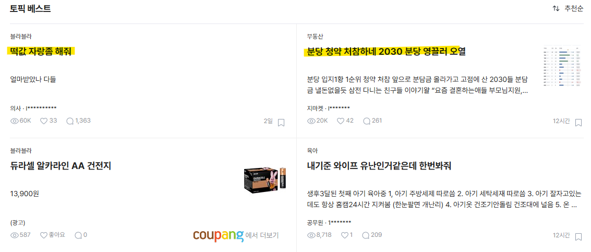
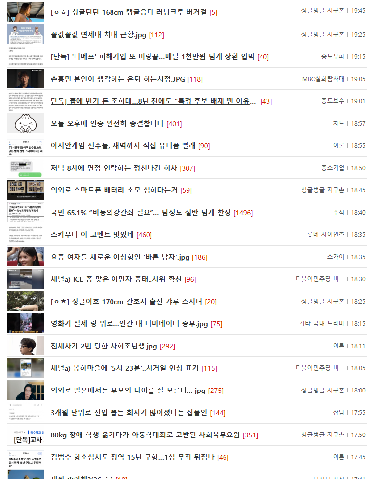

# 경제/비즈니스 홈판에서 있었던 밥그릇 싸움
**Date:** 8시간 전
**Category:** 스냅
**Original URL:** https://blog.naver.com/xpfkwh56/224421214878
---

**1. 트래픽은 돈이 된다**

​

**와이즈 리테일** 이라는 회사가 있음

​

​

시장조사 기관인데, 한국인들이 가장 많이

사용하는 앱은 무엇인지? 같은 걸 **조사** 함

​

일반적으로 사람들은 네이버를 **'검색엔진'**

이라고 생각하고 있지만, 사실 네이버는

하나의 거대한 **'광고판'** 과 다를 바 없는데,

​

​

여기서 발생하는 **'트래픽'** 을

**'유동인구'** 라고 이해하면 빠름

​

블로거 1명 1명이, 트래픽을 발생 시켜서

돈을 벌고 싶은 것과 똑같이 서비스 공급자는

​

자사 서비스로 사람을 락인 시켜서,

보다 **'높은 광고 가치'** 를 제공하길 원함

​

​

세계 최고의 광고 회사는 **'구글'** 임

​

서양 철학이 플라톤의 주석인 것처럼,

구글이 했던 방식을 조금씩 바꾸면서

​

벌이로 바꾸는 것이 현대 IT 빅테크들이

하고 있는 일종의 공식 과 같은데,

​

네이버랑 카카오톡도 **'하고는 싶지만'**

잘 안 되던 문제들이 있었음

​

우선 서버비만 먹고, 개발비만 먹을 뿐,

​

실제 **'수익'** 이랑 이어지지 않는다는 것이

그들 입장에선 가장 배가 아픈 일이었고

​

현대 미디어 산업에서 가장 **'핫하다고'**

할 수 있는 것들을 벤치마킹 하기 시작함

​

그게 뭐냐?

**'피드형 콘텐츠 배열'** 임

​

​

카톡만 해도, 엄청난 반발에도 불구하고

**유튜브 숏폼, 인스타 스타일** 로 개편했고,

​

그 무렵, 네이버 또한 **시스템** 을 바꾸게 됨

​

그 바뀐 시스템이 바로 **'홈판'** 임

​

​

2. 홈판을 하면 돈을 번다던데? 라는

말이 슬슬 인터넷 판에 떠돌아 다닐 무렵,

​

**'노그리드'** 라는 블로거 가 있었음

​

​

노그리드는 다른 경제/비즈 블로거가 그렇듯,

가장 파이가 큰 **'주식'** 위주로 시작을 했는데

​

**\* 관련주, 급등주, 시황 이슈 같은 것들**

​

​

어느 시점부터, **'갈라치기'** 콘텐츠를

집중적으로 다루기 시작함

​

블라인드나, 디시 커뮤니티 같은 곳에서

사람들이 어그로 끌리고, 많이 입에 올리는

내용들을 주로 가져와서 쓰기 시작한 것임

​

그 결과는?

​

**초대박** 이었음

​

하루 적게는 5만, 심하면 10만이 넘는

트래픽이 쉬지 않고 찍히기 시작 했고,

​

당시 홈판 애포 시세를 추측한다면,

​

하루에 적게는 30만 심하면 100만 가까운

수익을 꾸준히 찍었다고 알려져 있음

​

문제는, **'콘텐츠 피로도'** 가 높았단 건데

​

맨날 누구 연봉이 어쩌고, 저쩌고

어떤 직업이 얼마니, 저쩌니 하는 얘기에

​

사람들끼리 싸울 법한 이야기만 나오니까

**'재미'** 는 있었지만, **'격'** 이 조금 떨어졌음

​

그리고 꽤 많은 고인물 경제 인플들이

그 부분에 대해서 **문제를 삼기 시작함**

​

결과적으로 노그리드는 블라그 에서

예전처럼 더 이상 꿀을 빨 수 없게 되었고,

​

네이버에서도 자체적으로 커뮤니티

렉카형 포스트를 검열하겠다고 알림

​

그럼 실제 **'개선'** 이 일어났을까?

​

사람만 바뀜

​

​

3. 현재 경제/비즈 판에서

가장 핫한 블로그 중 하나임

​

​

경제/비즈로 알고리즘 정렬한 다음에,

고빈도 로 나타나는 목록을 뽑아낸 것 임

​

부자와 중산층 빈곤층 한번에 구분하는 법

2026-09-07

​

"나 금수저였네..?" AI에게 순자산 계급도

만들어 달라고 했더니 2026-08-25

​

"이번 로또 당첨자 94명" 세금 떼고

실수령액 얼마이며, 말이 되나? 2026-09-07

​

가난한 집 특징 10가지, 무서운 공통점이 있다?

수입이 문제가 아니다 2026-08-31

​

혹시 **기시감** 이 느껴지심?

​

블로그 좀 오래 하셨으면, 옛날에 있었던

**'아비투스'** 이론에 대해 들어보셨을 것 임

​

이른바 찐부자는 이렇다, 저렇다,

하면서 **'계급'** 을 중심으로 푸는 문법임

​

경제/비즈 상위 트래픽 1천개 블로그를 보면,

​

망한 이야기, 하락한 이야기, 돈으로 누가 싸운 이야기,

갈등 하는 이야기, 논쟁/판정을 요구하는 이야기,

누가 대박난 이야기, 쪽박난 이야기 같은 스타일의

​

다양한 **'생활 가십'** 콘텐츠가 주력으로 나타나는데,

​

읽고 있으면 **'왕도적인'** 문법들이 나옴

​

**돈을 주제로 사람들이 의견을 낼 수 있고,**

**싸울 수 있으면 클릭 베이트가 높게 발생함**

​

<https://blog.naver.com/andtnl123/224396341212>

[**대학 안 보내고 그 돈 준 부모.. 자녀는 지금 어떻게 됐나**

수능을 석 달 앞두고 아들이 말했다. 대학 안 가고 싶다고. 아버지는 사흘을 말이 없다가 계산기를 두드렸...

blog.naver.com](https://blog.naver.com/andtnl123/224396341212)

​

그 다음으로는 니치한 화제로 가는 건데,

​

네이버 블로그 이용자의

대다수는 **40~59** 연령대고,

​

대부분이 모바일 환경 이용자 임

​

**이 말이 무슨 말일까?**

​

andtnl123 블로그의 경우,

​

특정 이슈를 서두에 놓고

그거로 인한, **'노후'** 키워드랑 묶음

​

그리고 이건 내 **'뇌피셜'** 이지만,

​

​

여기에 있는 소재, 화제를

자주 다루는 걸로 보였음

​

4. 그래서 만약 내가 순수 경제/비즈 관련으로

블로그를 **'트래픽 목적'** 으로 돌려야 된다고 치면,

​

이렇게 운영할 것 임

​

​

먼저 블라인드 토픽 베스트 에서,

**'먹힐 법한'** 소재를 피킹함

​

​

디시 같은 커뮤 전체를 긁어도 됨

​

​

그리고 이 **'서사 구조'** 를 그대로 따올 것 임

​

그 다음 홈판st 글들에서 **'용인되는'**

가드레일 따라서 저거만 계속 따라하면,

​

그게 얼마나 갈진 모르겠지만,

트래픽은 잘 나올 수 있음

**​**

**5. 결론**

​

1) 인터넷에서 화제되는 이슈를 찾는다

2) 그걸 리액션 하는 콘텐츠를 쓴다

​

**\* 독자 연령대 감안해서, 짧고 간단하고**

**스크롤 쭉쭉 내려갈 수 있게 구성한다**

​

3) 이걸 그냥 무지성으로 많이 올린다

그렇게 하다보면 언젠가는 얻어걸린다

​

6. 카테고리는 다르지만, **'유사한'** 방식으로

나는 뷰티/아이티 블로그를 운영하고 있고,

​

최근 n개월 사이에 네이버 메인

유입 top20 에 올라간 적도 있음

​

7. 본문이랑 관계는 없지만 정보성 콘텐츠도

**'보통'** 사람들이 말하는 것들과 차이가 큰데,

​

1) 지속적으로 문제가 발생할 수 있고

2) 검색자의 고통 크기가 크면 클수록

​

트래픽이 잘 붙을 가능성이 **'현저히'** 높음

​

예를 들어, 주식 계좌 만드는 법 (X)

​

이런 것 써봤자 노출도 안 되고

찾아와서 읽는 글도 안 되는데,

​

~한 상황에 있을 때, ~한 문제를 필연적으로

겪을 수 밖에 없고 **안 될 때 힘들면 힘들수록**

**​**

트래픽이 잘 붙고, 광고 수익이 높을 확률이 큼

​

설명을 잘 하는 것이 재주가 아님

누가 오늘 죽는 소리, 앓는 소리 하느냐

​

이게 검색블 키우는 핵심 임

​

8. 나는 네이버 메이트 처음 생겼을 때,

​

네이버가 정말 대대적으로 서비스 개편해서

아주 뛰어난 기술력을 선보일 줄 알았는데,

​

**'서비스 가치'** 만 놓고 보면,

**이 회사가 앞으로 괜찮을까?** 싶을 뿐 임

​

이렇게 대단한 기술력, 이렇게 많은 자본,

​

이렇게 엄청난 영향력을 갖고도

**이거 밖에 못 한다는 점이 놀랍기도** 함

​

네이버가 정말 좋은 문서를 많이 갖고 있고,

이용할수록 사용하는 사람에게 **'이득'** 을 주냐?

​

**No**

​

**'포탈 서비스'** 인데,

서비스가 좋은 것이 아니고

​

**'쨌든 하면 돈이 되긴 됨'**이라는 것 자체가

얘네한테 유리한 포지셔닝인지 의문스러움

​

**\* 고트래픽 찍히는 블로그 체급 좀 올라오면**

**어디 쪽팔려서 내 블로그라고 자랑도 못 하겠음**

**​**

​

서비스 개발자들이 실제 네이버를

이용하는 사람들이긴 한지, 더 의문스럽고