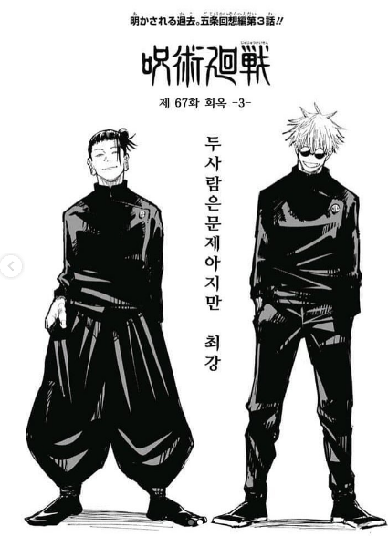

# 길가메시 서사시
**Date:** 8시간 전
**Category:** 다이어리
**Original URL:** https://blog.naver.com/xpfkwh56/224191603045
---

​

1. 수메르의 개망나니 길가메시

​

인간 아버지와 여신 사이에서 태어나,

​

잘 생기고, 왕에다가, 싸움도 잘 하고

신의 축복을 사발 째로 받은 인간임

​

운 좋게 태어났으면 그걸 알고

재주를 곱게 살았으면 좋으련만,

​

폭정으로 사람들을 못살게 구니까

백성들이 신께 간절히 기도를 올림

​

제발 도와주세요!

​

2. 신들은 엔키두 라는 존재를 만들어,

길가메시의 넘치는 힘을 빼보기로 함

​

길가메시가 여느 때처럼,

초야권을 행사하러 가던 어느 날

​

바빠 죽겠는데, 몸이 우락부락한

야만인 하나가 그 앞을 가로 막음

​

숙명에 따라, 개망나니 둘이 싸움 시작

​

아무리 싸워도 결론이 안 나자,

​

개망나니 둘은 서로를 인정하고

그 자리에서 둘도 없는 베프가 됨

​

대장 개망나니랑 부하 개망나니는

영혼의 파트너가 된 채로, 대화를 함

​

대장 개망나니의 꿈은 **영광** 임

​

나의 조상님들이 그런 것처럼

나 역시, 기록에 남아 불멸하겠다

​

부하 개망나니는 그 말에 동조함

​

**나는 이제 너의 칼이다**

**전사로 살고, 전사로 죽자**

​

3. 문제는 그런 기회가 맨날,

일상적으로 나오는 것이 아님

​

시시한 것은 싫고 멋진 것 하고 싶다

근데 보여줄 수 있는 기회가 없네

​

놀고 있으니 좀이 쑤셔 죽겠는데,

​

숲의 수호자 훔바바가 있단 소식을 들음

​

수메르에는 두 신이 있음,

하늘의 신 아누와 땅의 신 엔릴

​

아누는 명예회장 이고, 엔릴은 CEO 임

​

훔바바는 엔릴이 만든 수호신으로,

이 바닥에서는 끗발이 꽤 있음

​

인지도도 높고, 저거를 토벌하고 나면

내 명예 점수가 지금보다 더 오를 듯함

​

악을 처단하자~!

​

둘은 훔바바를 죽이러 숲으로 떠남

​

4. 훔바바가 지키고 있는 숲은,

신들의 거처이자 정원 이었음

​

숲에 도착한 길가메시는 오자마자

나무에 도끼질을 갈겨버림

​

훔바바 나와~!

​

영문도 모르고 튀어나온 훔바바는

얘네가 대체 왜 이러나 알 수가 없음

​

신의 축복 풀버프를 몇 겹이나 받았지만

기세 좋은 개망나니들에게 결국 패배하고,

죽기 직전, 훔바바는 살려달라 항복을 함

​

​

죽이는 것 까지는 좀 그런가? 하고

머뭇대던 길가메시에게 엔키두가,

​

막타의 영광을 놓치지 말라고 재촉함

​

그 말을 들은 훔바바는,

​

길가메시 옆에서 따까리 노릇하면서

주제도 모른다고 분노를 쏟아내는데,

​

수호자의 그 말이 채 끝나기도 전에

길가메시의 검 끝이 훔바바의 목을 뚫음

​

너에 대한 모욕은

나에 대한 모욕이다

​

이윽고,

​

앞으로도 영원히 내 곁에서

나의 검으로 살아라 엔키두

​

**5. 두 남자**

**​**

길가메시의 검은 놀랍도록 솔직해서, 망설임이라고는 어디에도 없었다. 검을 쥔 손가락 사이로 빛이 미끄러져, 새어 나갔다. 저 손이 나 아닌 것을 잡는 일이 있어서는 안 되겠다고, 그런 생각이 아주 조용히 내려앉았다.

​

목덜미에서 쇄골로 이어지는 얇은 선 하나가 숲 속의 공기를 전부 마셔버렸다. 갑옷의 첫 번째 단추는 이미 풀려 있었고, 두 번째 단추는 간신히 버티고 있었다. 그 사이로 보이는 사내의 피부가, 보여서는 안 될 금기 같았다. 그 아래로 드러난 것은 살결이 아니었다. 체온이었다. 만지지 않아도 알 수 있었다. 텁텁한 숲 속의 공기가 심장을 덥혔다. 온 혈관이 끓었다. 가슴 사이로 전해지는 두근거림 한 번이, 여태 뱉은 어떤 말보다 솔직했다.

​

지금 이 순간만큼은 너의 전부가 나에게 무방비하다. 그 무방비를 나는 경건하게 삼킬 것이다. 너의 모든 것을 뼈까지 녹여, 다시는 원래의 형태로 돌아가지 못하도록.

​

아침에 눈을 뜨면 나를 찾는 것이 숨쉬기처럼 당연한, 그런 종류의 중독. 나는 너를 못 살게 만들 것이다. 천천히, 다정하게, 네가 눈치채지 못할 만큼 느리게. 세상 누구도 본 적 없는 표정을 내가 만들어낸다는 것, 그 사실이 나를 자꾸 집요하게 만든다. 허락도 거부도 아닌, 다만 내가 어디까지 갈 수 있는지를 보겠다는 얼굴. 그 절묘한 반 쯤이 자꾸 나를 안달나게 만든다.

​

6. 돌아온 길가메시와 엔키두는

훔바바의 목을, 엔릴의 제단에 바침

​

왜 이런 짓을 했느냐! 대체 왜!

​

엔릴은 격노하고, 이 사건은

모든 수메르 신문 1면을 장식함

​

이슈타르는 사랑과 전쟁의 여신,

​

34-24-36 을 자랑하며

길가메시에게 다가와 청혼함

​

나랑 결혼하면 뭐도 할 수 있고,

이거도 할 수 있고, 약을 파는데

​

그 말을 끊고, 길가메시가 말하길,

​

니가 예전에 만났던 남자들 누군지 다 앎

걔들이랑 이거도 했고, 저거도 했잖아?

이 년이 누굴 설거지 시킬려고 들어?

​

하면서 이슈타르에게 거칠게 쏘아붙임

​

결혼은 남자의 결정, 연애는 여자의 결정

​

길가메시는 이슈타르에게

눈에 흙이 들어가도 너랑 결혼할 일은 없지만

하룻밤 연애 정도라면 못해줄 것은 없다고 함

​

이슈타르는 표정관리가 안 됨

​

아버지 아누에게 달려가,

광폭한 황소를 내려달라고 함

​

황소가 길가메시가 다스리는 도시를

난장판으로 만드는데, 개망나니 둘의

무력이 규격 외 라서 순식간에 제압

​

엔키두는 황소의 허벅다리를 먹고

남은 뼈를 이슈타르에게 던지면서,

​

니가 몰 할 수 있는데? 를 시전함

​

7. 신들의 회의가 열림

​

훔바바를 죽임 원아웃

여신을 모욕함 투아웃

황소를 죽였음 쓰리아웃

​

처분 결과는 개망나니 중 하나는

죽음으로써 죄를 씻어야 한다

​

길가메시는 2/3 반신 혼혈이고,

엔키두는 그냥 신들이 만든 도구

​

누구로 할까요?

​

길가메시 걔 엄마가 누구라고?

아 골치 아프다, 쉽게 쉽게 가자

​

엔키두로 결정

​

8. 전사 엔키두는 포근한 침대 위에서

죽어야 될 운명을 받아, 그냥 죽게 됨

​

영웅 답게 싸우다 죽는 것도 아니고

침대에서 천천히 온 몸이 썩어가면서

​

길가메시가 엔키두의 왼쪽 가슴 위에

손을 올렸는데, 그 어떠한 미동도 없음

​

싸늘하게 식은 엔키두의 시체를 보면서,

길가메시는 난생 처음 **'죽음'** 을 실감함

​

그리고 형용할 수 없는 공포를 느낌

​

기록에 남고, 어쩌고,

그거 다 **개소리** 구나

​

> 죽으면 끝이다

​

9. 백방으로 들판을 떠돌고,

초원을 방황하며, 영원히 죽지 않고

사는 인간을 찾기 시작함

​

길가메시는 영생하는 인간이

있다는 소식을 듣고, 그 인간이

세상의 끝에 살고 있다고 들음

​

온 세계의 모든 비밀을 알고

억겁의 시간에도 죽지 않는 자

​

그 이름은 **우트나피쉬팀**,

​

왕은 모든 일을 내팽겨치고,

세상의 끝으로 여행을 떠남

​

그 끝에는 신들의 거처를 지키는

수호자들이 수도 없이 즐비했는데,

​

평소처럼 싸울 준비를 하는 길가메시에게

수호자는 길을 못 내어줄 것은 없다고 함,

​

여자에게서 태어난 인간으로

네가 한 일을 한 자는 없다

​

어차피 가봤자 안 된다는 소리 임

​

슬픔 속에, 고통 속에,

한숨과 통곡 속에라도 가야 한다

​

그래도 가겠다는 소리 임

​

길가메시가 태양의 길을 따라

마침내 신들의 세상에 도달함

​

길가메시, 너는 네가 찾는

생명을 결코 찾지 못하리라

​

신들이 인간을 만들 때

인간에게는 죽음을 할당하고,

생명은 자기들 손에 쥐었다

​

길가메시여, 배를 채워라

밤낮으로 춤추고 즐겨라

​

잔치하고 기뻐하라

​

깨끗한 옷을 입고, 물로 몸을 씻어라

​

네 손을 잡은 작은 아이를 사랑하고,

네 품의 아내를 행복하게 하라

​

> 이것이 인간의 몫이다

​

길가메시의 의지는 꺾이지 않음

​

어찌 침묵할 수 있으랴, 어찌 쉴 수 있으랴?

엔키두는 먼지이고 나도 죽으리라

​

미지의 만물을 들여다보는 그대에게 묻는다

우트나피쉬팀에게 가는 길을 알려다오

​

10. 그리고 마침내 길가메시는

우트나피쉬팀을 만남

​

너를 보니, 우트나피쉬팀이여,

네 모습이 나와 다르지 않다

​

생김새에 기이한 것이 없다

​

전투를 준비한 영웅 같을 줄 알았는데,

등을 대고 편히 누워 있구나

​

진실로 말해다오, 어떻게

신들의 모임에 들어가

영생을 가지게 되었느냐?

​

우트나피쉬팀은 가볍게 대답함

​

비밀을 밝히겠다

신들의 신비를 말해주겠다

​

오랜 옛날 세상은 넘쳐났다

​

사람들이 불어나고 세상이

야생 황소처럼 울부짖었다

​

위대한 신이 소란에 깨어났다

​

엔릴이 소란을 듣고

신들의 회의에서 말했다

​

> 인류의 소란이 참을 수 없다
>
> 시끄러워 잠을 잘 수 없다

​

그리하여 신들이

인류를 멸하기로 했다

​

**11. !?**

​

인간을 가엾게 여겼던 다른 신 에아 는

신들의 결정을 인간에게 말하지 말란

맹세를 우회하여, 우트나피쉬팀 에게

대홍수가 있을 것을 알려줬고,

​

우트나피쉬팀은 큰 배를 만들어

가족과 친족, 들판의 짐승들,

온갖 씨앗들을 배에 태웠음

​

폭풍과 홍수가 세상을 뒤엎었고,

물이 빠진 뒤 우트나피쉬팀은

새를 날려 홍수가 끝났나 확인함

​

에아는 너무 일을

크게 벌린 것 아니냐고,

​

엔릴을 몰아세웠고,

엔릴은 그런가? 하면서

​

우트나피쉬팀에게 영생을 주고,

이거로 퉁 치자고 하고 빠짐

​

12. 너가 **그냥 길가메시** 인 것처럼

나도 **그냥 우트나피쉬팀****​** 인 것이다

​

길가메시는 그렇다면 나 또한,

너가 그랬던 것처럼 무언가

시험을 통과해 자격을 얻겠다 함

​

길가메시는 오만한 자,

​

우트나피쉬팀은 한숨을 쉬며,

6박 7일 동안 잠을 자지 말라함

​

먼 여정을 고생고생 왔던 길가메시,

​

길가메시가 쪼그려 앉아 쉬는 동안,

양털에서 실을 뽑듯 잠의 안개가

당연하다는 듯이 그를 덮었음

​

우트나피쉬팀의 아내가 물어봄,

​

**깨워서 집에 보낼까?**

​

우트나피쉬팀은 현명한 자,

​

모든 인간은 속이는 자다

너까지도 그를 속이려 할 것이다

​

그러니 매일 빵을 구워

그의 머리맡에 놓아라

​

그리고 벽에 그가 잠든 날수를 표시하라

​

7일이 되던 째, 우트나피쉬팀이

자고 있던 길가메시를 깨움

​

길가메시가 일어나 말하길,

​

네가 만져 깨운 순간,

거의 잠들 뻔 했다

​

우트나피쉬팀은 빵을 보여줌

니 7일 동안 꿀잠 잤어

​

졸리면 하루도 못 버티는데, 영생?

​

길가메시가 태어나보니 왕이던 것처럼

길가메시는 영생할 수 없는 팔자 였음

​

13. 빈 손으로 너털너털 가려던

길가메시를 보던, 우트나피쉬팀의 아내는

여기까지 왔는데 기념품 이라도 주자 함

​

우트나피쉬팀 은 길가메시 에게

**인간의 잃어버린 힘을 되찾을 수 있는**

풀이 있다고 그걸 가져가보라고 했고,

​

이 역시, 아주 어려웠지만

그거라도 해보겠단 마음으로

​

길가메시는 마침내, **'풀'** 를 얻음

​

그리고 신들의 세계에서

인간계로 돌아가던 길에,

​

잠깐 숨 돌리면서 목욕을 하는데

그 사이에 뱀이 와서 그걸 먹어버림

​

풀을 먹은 뱀은 허물을 벗고,

다시 탱탱하게 생기가 넘쳐짐

​

길가메시는 그걸 보고 통탄함

​

14. 비밀을 보고 비밀스러운 것을 알았다

대홍수 이전의 이야기를 가져왔다

​

길가메시는 여정의 끝에 돌아와,

돌 위에 모든 이야기를 새겼음

​

왕이 누웠다, 다시 일어나지 않으리라

쿨랍의 주인이 다시 일어나지 않으리라

​

악을 이겼으나, 다시 오지 않으리라

팔이 강했으나, 다시 일어나지 않으리라

​

지혜와 고운 얼굴을 가졌으나,

다시 오지 않으리라

​

산으로 갔으니, 다시 오지 않으리라

​

운명의 침상에 누웠으니,

다시 일어나지 않으리라

​

여러 색의 침상에서,

다시 오지 않으리라

​

15. 돌아온 길가메시가 어떻게 살았고,

어떻게 통치했는가에 대한 기록은 없음

​

다만, 도시의 사람들이, 크고 작은 이들이

길가메시의 죽음에 침묵하지 않았고,

​

살과 피를 가진 모든 인간이

그리워하며 애도했다고 전해짐