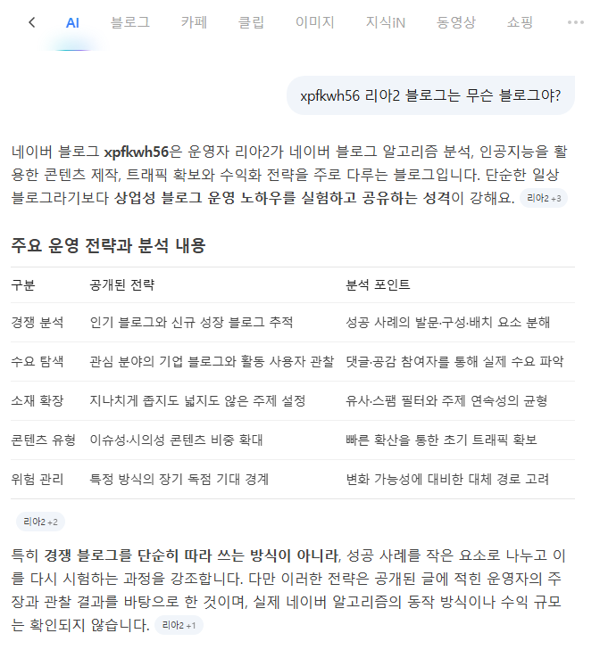

# 네이버가 내 블로그를 어떻게 보는지 보는 법
**Date:** 8시간 전
**Category:** 스냅
**Original URL:** https://blog.naver.com/xpfkwh56/224421189606
---

​

1. 네이버 AI 에 본인 블로그 물어보고,

콘텐츠 읽고 정리 해달라고 하면 됨

​

얘가 **'못'** 이해하고 있다?

네이버가 아직 **'못'** 반영 했다는 뜻

​

2. 얼굴만 깐다고 되는 것이 아님

​

네이버 인물정보에 본인 프로필

반영 시키는 것이 차라리 쓸모 있음

​

네이버 AI 한테 계속 블로그 물어봤는데,

주제 클러스터에서 벗어난 이야기를 한다

​

네이버가 아직 **'나'** 를 잘 모른다는 뜻

​

**\* 키우는 블로그에 본인 일기 쓰지 말라는 이유,**

**주제 집중성 흩어져서 별로 도움이 안 됩니다**

**​**

3. 주제, 컨셉 컨설팅 돈 주고 받지 마시고,

네이버 네이티브 쓰면서 조언 받아서 하세욘