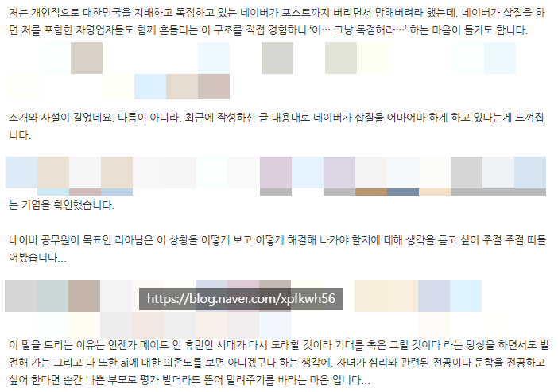

# 답변
**Date:** 8시간 전
**Category:** 일기장
**Original URL:** https://blog.naver.com/xpfkwh56/224325968533
---

​

**1. 네이버가 삽질을 하고 있는가?**

​

내 생각에는 **'X'**

​

제도와 시스템에 대해 불만을 가질 수도 있고,

심지어 그건 아주 건전한 접근이라 할 수 있음

​

단, 하나의 전제를 잊어선 안 됨

**지금 그게 적절한 나의 관심사** 인가?

​

판 밖에 있는 사람이라면 얼마든 해도 됨

평소 사회와 정치에 관심이 많아도 괜찮

​

근데 당장 내가 **'수험생'** 인데,

​

남조선 교육부가 어쩌고, 정책이 어쩌고

이런 이야기가 재밌다면 전공을 바꿔야 됨

​

**규칙이 무엇이든, 나는 이 게임에 이긴다**

이게 조금 더 생존에는 도움이 될 수 있음

​

**2. 메이드 인 휴먼의 시대가 올까?**

​

마찬가지로 내 생각에는 **'X'**

​

로봇 청소기가 턱에 걸려 못 넘어가도

한 자리에서 뱅글뱅글 계속 돌기만 해도

​

식세기의 음식 처리 능력이 떨어져도

세탁/건조기의 단점이 있다 하더라도,

​

써야 될 때는 써야 될 수가 있다고 생각

​

이런 상황에서 사람들은 크게 둘로 나뉨

​

1) 목적에 어긋나므로 안 쓴다

2) 그 문제를 해결하는 도구를 찾는다

​

AI 능력은 **'곱하기'** 능력 임

​

앞에 문사철이 달리든, 의치한이 달리든

하나가 **'0'** 이면 나머지도 전부 **'0'** 임

​

반대로 둘 중 하나가 압도적 이라면,

나오는 숫자의 크기는 높을 확률이 큼

​

3. 질문의 요지는, **'네이버를 모르겠다'**

그리고 **'지금'** 인공지능에 닦이고 있는데

​

이런저런 이유로 마음이 복잡하다로 읽힘

​

저는 1년 뒤가, 무척 **기대되는** 사람임

​

1년이 아니라 불과 2개월 뒤만 하더라도

어떤 변화가 생길 것인지 매일 설레고 있음

​

그럼 왜 그렇게 생각하는지 이야기 해봄

​

**4. 네이버와 리니지**

​

리니지 라는 게임이 있음

​

월 2-3만원 정도 받고 정액제로 돌리던

센세이셔널한 온라인 RPG 게임이었는데,

​

이 회사에게는 답답한 문제가 있었음

​

재주는 곰이 부리는데, 왕서방이

그 수혜를 전부 가져가는 것이 그럼

​

게임을 하는 사람들은 재화를 원함

그래서 **'현질'** 이 **'자연발생'** 했음

​

아이템 베이 같은 회사가 돈을 벌고,

작업장이 돈을 버니 회사는 배알이 꼴림

​

중간 단계 치우고 **유통혁신** 을 **단행** 함

게임사가 직접 공급자가 되길 자처한 것 임

​

사람들은 엔씨가 **'도박장'** 을 운영했다고 함

근데 엔씨가 종사한 사업은 **'카지노'** 가 아님

​

**무기상** 임

​

**'M'** 시대가 왔을 때,

엔씨는 엄청난 수익을 거둠

​

하지만 여론, 그리고 법령의 이슈로

더 이상 그걸 할 수 없는 상황이 되었음

​

그래서 리니지 **'클래식'** 을 새로 론칭함

​

**'C'** 의 시대가 온 것 임

​

그럼 리니지 클래식은

무슨 차이가 있는데?

​

리니지M 에서는 게임사가 직접

재화를 판매하고, 거래의 주체가 됨

​

하지만 리니지 클래식은,

**'표면적'** 으로 **'결제'** 가 없음

​

예전처럼 스킬 팔고, 인형 팔고

이게 아니고 **'우회적'** 으로 참여함

​

겉만 보면 게임사는 **'심판'** 역할만 하고,

시스템은 **'시장 논리'** 로 굴러가는 듯하지만

​

그 판 자체가 **엔씨가 규정한 것** 임

​

내가 정액비 3만원 정도 지불하면서,

게임으로 쌀먹할 수 있다고 생각하지만

​

엔씨에서 **'요 만큼은 너가 먹어라'**

라고 정해진 만큼만 받아서 하는 것 임

​

이게 **'공무원'** 이 가져야 될 **'기본'** 임

​

**5. 드래곤 슬레이어**

​

리니지에는 전설의 드래곤이 있음

​

실상 잡을 수 없게 설계된 몬스터인데,

​

이게 게임사에서 의도했던 것 보다

훨-씬 더 빠르게 잡혔던 적이 있음

​

잡힐 줄은 몰랐기 때문에, 용을 죽이면

아직 서비스 하지 않은 더미템까지 나옴

​

어떤 사람은 정말 **우연하게도**

용을 잡을 수 있단 것을 알았고,

​

그 방법으로 좋은 경험을 한 바 있음

​

하지만 그 사람은 **'공무원'** 처럼

일을 하지 않았기 때문에 금방 막힘

​

쓰레기를 버리라고 손에 쥐어줬으면

그걸 주머니에 넣으면 **안 되는 것** 임

​

**6. 네이버와 블로거의 관계**

​

1원 한 장 내지 않고, 서비스를 쓰면서

​

내 소중한 시간을 썼다면서

월 적게는 몇 십, 많게는 몇 백을

​

네이버가 내 통장에 꽂아 넣어줄 이유를

설명할 수 있는 사람은 그리 많지 않음

​

이는, 공부를 잘 하고 싶은 것이 아니고

투자를 잘 하고 싶은 것이 아니고

​

시험 성적이 좋아졌으면 좋겠음을,

그냥 돈이 생겼음을 좋겠음을,

​

추구하는 사람이 더 많기 때문 임

​

약 10년 전, 네이버 컨퍼런스를 보면

임원이 직접 나와서 하는 이야기가 있음

​

**급변하는 시대에, IT 플랫폼이 가야할**

**미래와 비전은 무엇 이라고 생각합니까?**

​

그에 대한 네이버의 답변이 이랬음

​

**우리도 모르겠습니다**

​

네이버의 행동은 **'가치중립적'** 이자,

​

고작 살고자 하는 몸부림에 불과하므로

동등한 시야를 갖는 것에서 시작해야 됨

​

어떤 공무원이 좋은 공무원 입니까?

어떤 기업이, 어떤 직원이 좋은 기업?

​

그건 **'민원 주체'** 가 평가하는 것 이고,

​

결국 소비자가 평가하는 것이며,

본질적으로 **시장이 평가하는 것** 임

​

나한테 월급 꽂아주고 있다고 해서,

사장이 뭐든 다 안다고 착각하면 안 됨

​

만약 더 빨리 배우고 싶으면

직접 자영업을 해보면 더 빠름

​

**7. 상황을 어떻게 보는가?**

​

나는 이걸 엄청 좋다고 생각하는데,

나처럼 생각하는 사람이 없구나?

​

하루만 지나도 난리가 날 줄 알았는데,

3주가 지나가는데도 다들 관심이 없다

​

**8. 어떻게 해결해야 하는가?**

​

1) 사고력

2) 생산성

3) 능동성

​

원래 내가 누리던 것을 당연했다고 생각하면

당연히 바뀌는 시대에서 당연히 못 누리는 것

​

규칙은 기존과 상당히 많이 달라졌고,

기득권과 비기득권의 경계가 모호해졌고

​

시시각각 계속 변화하고 있는 상황이므로,

무엇 하나 배워서 그거만 우직하게 나아가서

​

출근과 퇴근이 분리된 저녁과

주말이 있는 삶을 원하고 있다면,

​

그 목적에 부합하는 일을

찾아보는 쪽이 좋다고 생각

​

하루 방문자 n만, 일 트래픽 20만-30만도

만든지 **일주일** 도 안 된 블로그에서도 가능

​

**'불가능'** 하던 것이 **'가능'** 해졌는데,

아쉬운 소리 할 것이 무엇 이겠읍니까

​

비싼 하루는 비싸게 사용하십시오

매일 매일이 같은 값이 아닙니다

​

**9. 6월 말 기준 엣지는?**

​

어떻게 하면 잘 키울 수 있느냐?

어떻게 하면 잘 할 수 있냐가 아닙니다

​

**'얼마나 덜 어그로 끌리는 상태'** 에서,

**내가 내 파이만큼 자족할 수 있냐** 죠

​

그냥 성적을 내는 것은 **'기본'** 이고,

​

얼마나 내가 공부 열심히 하고 있다

​

라는 것을 덜 유난 떠느냐,

어쨌든 얼마나 눈에 덜 띄느냐,

​

공부하는 **'티'** 가 안 나면서

성적을 누가 덜 잘 내고 있냐?

​

같은 문제들로 접어들고

있는 상황 같아 보이네요