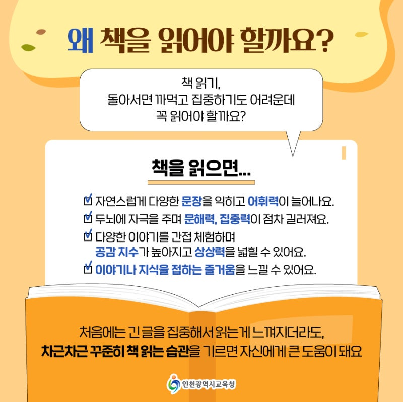

# 아이 책읽기 습관을 잡기 전에, 알면 좋은 것
**Date:** 8시간 전
**Category:** 다이어리
**Original URL:** https://blog.naver.com/xpfkwh56/224294433147
---

​

1. 심심치 않게 들어오는 질문이,

그래서 넌 **'무슨 책'** 봤냐는 것이다

​

이건 숨길 것도 보탤 것도 없는 얘긴데,

​

10대 시절에는 남들이 보는 만큼만 봤고

그나마도 입시 한다고 시간도 별로 없었다

​

내 경우는 내신 + 수능 + 입시미술 을

동시에 준비하면서 고등학교를 보냈다

​

**암기**가 전부인 내신이야 말할 것도 없고,

​

예체능 해보신 분들은 잘 아시겠지만

**'물리적으로'** 시간을 내기 **아주** 어렵다

​

**\* 그림 그리기는 예술 활동 이라기보다**

**인간을 갈아내는 3D 노가다에 더 가까움**

​

20대 시절에는 먹고살기가 많이 바빴다

​

어른이 되니까 재밌는 일들도 더 많아졌고,

​

한 권의 책으로 내가 얻을 수 있는 것 보다는

다른 즐거운 일들이 많아서 소홀히 보냈다

​

내 배경지식의 9할은 **구글링** 이고,

활자로 된 것이라면 **만화** 정도나 본다

​

인생을 통틀어 뭐를 제일 많이 읽었냐? 하면,

​

자신 있게 말할 수 있는 것은 20대 초반 시절

​

사이비 종교 할 때, 열심히 봤던

성경 정도는 꼽을 수 있을 것 같다

​

누가 더 말씀을 잘 아는가? 가 중요 했었고,

많을 땐 하루에 2번씩 시험을 봤기 때문이다

​

그나마도 **'근본 있는'** 읽기는 아니었기 때문에,

​

삼위일체를 부정하는 등의 신학적 접근이

별 도움이 되었다고도 보기는 어려울 것이다

​

내용 조차, 당연히 다 **좋은** 말들 뿐이기도 하다

​

**\* 욥기 = 인생 원래 그런 것이다, 견뎌라**

​

2. 심지어 나의 부모님 조차도, 책을 읽어라

읽어라 말씀은 자주 하셨던 것으로 기억을 한다

​

오라비들이야 그걸 어찌 들었나 모르겠지만,

​

여전히 우리 아빠는 주변에 딸 자랑을 하실 적에

우리 딸이 책을 많이 읽었어 라고 말은 하시지만

​

정작 당사자인 나는 읽은 책이 많지도 않고,

독서를 습관으로 갖고 있는 상태도 아니다

​

아빠의 **'주장'** 에 의하면

본인은 책을 많이 읽으셨다는데

​

그 시절 아빠가 몇 권의 책을 보셨든 상관없이,

​

컴퓨터 앞에 키보드 잡은 내가 **'정보'**만큼은

**비교할 수 없는 속도로** 취급할 수 있기도 하다

​

살면서 몇 가지 중요한 원칙들을 새긴 적 있다

그 중 하나는, **'끌려다니면서 살지 않겠다'** 였다

​

나는 늘 내가 내 삶의 **주인** 이길 바라고,

**내가** 내린 결정에 **내가** 책임지고 살고 싶다

​

작년에 아이를 낳고, **'내가'** 부모가 되면서

배운 것도, 느낀 것도, 알게 된 것도 많아졌다

​

요즘 우리 아기는 벙긋 벙긋

**'엄마만 알아듣는'** 말을 한다

​

인간 발달적인 측면에서, 과학적 사실에서

그건 **'언어'** 라고 하기가 민망할 정도이지만,

​

다른 엄마들이 그렇듯, **'나는'** 그 의미를

읽고, 해석하고, 소통해낼 수 있는 것 같다

​

입술을 부르르 떨면서 굉음을 내거나,

우아아 하면서 동물 같은 소리를 내더라도

​

엄마들은 그 안에서 귀신같이 단어를 잡고,

우리 애가 **'말을 했어!'** 를 믿고, 느끼게 된다

​

3. 종종 어른들이 하는 입버릇이 있다

​

**'무엇을 해야 좋은지 모르겠어요'**

**'내가 뭘 좋아하는 줄 알 수 없어요'**

​

그리 말하는 사람들에게도

아기였던 시절이 있을 것이다

​

1호기가 좋아하는 것은 강아지 계단을 타고

소파에 올라가서, 반대편으로 내려오는 일이다

​

거실에 풀어놓으면, 도저히 이해할 순 없지만

그 행위를 하루에 10번이 넘게 **계속** 반복한다

​

맨날 보는 집이 무엇이 그리 신기한지,

부엌이다, 가내 분리수거장이다 찾으며

​

로봇 청소기 위에 올라타거나,

정리해둔 캔, 종이 등을 꺼내다가

​

**'어떻게든'** 입에 넣으려고 하기도 한다

​

마치 **'프로그래밍'** 된 기계처럼

뒤집을 수 있으면 **하루 종일** 뒤집고,

​

설 수 있으면 **뭐든** 잡고 일어서며,

걸을 수 있으면 **어떻게든** 걷고자 한다

​

듣자 하니, 말을 배우면 로또 맞아서

처음 돈 써보는 졸부 마냥

​

**'언어적 권능'** 을 마구마구

남용한다는 이야기도 들었다

​

학습의 **'즐거움'** 은 생득적인 것일까?

아니면 배워서 얻게 된 기능인 것일까?

​

적어도 내가 여태껏 관찰한 결과에 의하면,

한 인간의 발전은 **'본능'** 에 가깝다고 본다

​

이제 **학령기**, 니까 **책을 봐야 돼** 가 아니고

​

시작 자체를 끝도 없는 저 **'의지'** 의 불씨를

꺼뜨리지 않는 것을 목표로 함이 좋은 것 같다

​

**4. 무슨 책을 보셨어요?**

​

아이가 우선 읽어야 되는 것은

활자가 아니라 **'세계'** 그 자체 다

​

GPT 에 제목만 써넣으면 5초도 안 돼서

줄거리부터 비평까지 포맷에 맞게 깔끔히

뽑아주는 내용을 달달 볼 것이 아니고,

​

이미 있는 것이든, 없고 새로운 것이든,

​

**'본인의 머리에서 나온 관점'** 과

**'나의 가치관과 취향'** 이 반영된 말을

언어로 다룰 수 있음이 중요한 것 같다

​

그래서 책 육아에 대해서는 내 경우,

적어도 아직은 별 생각이 없는 입장이다

​

늦든, 빠르든, 지가 살면서 필요한 언어는

**'알아서'** 갖춰질 것이라고 보기 때문에

고급진 어휘력 같은 것도 별 관심이 없다

​

그보다 집중하고 싶은 것은,

​

**'내가 본 것을, 내가 느낀 것을,**

**내가 아는 것을 아이에게**

**들려주고자 하는 것'** 이다

​

> 나를 이스마엘이라 부르라

​

아닌 말로 이런 문장은 아이가 봐봤자

특이하게 본인이 꽂힌 것 아닌 이상,

​

검은 것은 글자요, 흰 것은 종이가 된다

​

그런데, **'거의 비슷한'** 의미로

​

콩쥐도 콩쥐 나름의 사정이 있듯이,

팥쥐도 팥쥐 나름의 사정이 있었음을

​

온실도 온실의 세계가 따로 있고,

야생도 야생의 세계가 있음을

​

들려준다면, 스티브 잡스가 왜 맥킨토시를

개발할 때, **'해적'** 드립을 쳤는 줄 알 수도 있고

​

두 **선** 사이에 **점**을 **'본인이'** 찍을 수도 있다

​

5. 세상 그 어떤 아무리 좋은 책을 내민들,

부모의 **'존재'** 보다 좋은 책은 없을 것이다

​

우리 이전 시대의 부모들이,

​

**'나는 이렇게 살았으니,**

**너는 다르게 살아라'**

​

라면서 외부의 권위에 의탁해,

​

자녀의 **'학부모'** 이기 이전에

**'부모'** 임을 아웃소싱

했던 모습을 떠올려보자

​

무튼, 내 인생이 정답은 아닌 것 같아

근데 내가 아는 가락은 이거 밖에 없어,

​

그렇다고 이걸 권하거나 말할 순 없다

​

그러니, 무엇이든 **'내가 못 해봤던 것'**,

**'내가 못 누려봤던 것'** 을 너는 **다** 해라

​

라는 것이, 그 방식의 기틀 이었다

​

우리의 어린 시절로 돌아가 보자면,

**필요했던 것** 은 그런 것들 이었을까?

​

6. 우리 엄마는 시집을 제법이나

**'잘'** 간 축에 속하는 것 같은데,

​

아빠의 벌이가 여유로웠다던가,

​

적어도 사회 통계적인 기준에 따를 때

그다지 여유로운 집에 간 것은 아니었다

​

다만, 엄마는 **'할 줄 아는 것'** 이 없다

​

엄마가 세상에서 가장 두려운 것은,

**'혼자'** 라는 것에서 시작하기 때문에

​

그게 뭐든 아빠가 다 해주고,

​

아빠는 모르는 것이든, 아는 것이든

엄마가 해야 될 것들을 자주 대신한다

​

엄마가 하는 것들은 몇 가지 정해져 있다

​

신랑이랑 집에 갈 적이면,

나야 맨날 보던 살림 이지만

​

마치 누르면 나오는 주기도문 처럼

​

아유, X 서방 올 줄 알았으면

집을 치워놓을 걸 그랬어

​

엉망이지? 라면서 너스레 떠는 것,

​

그리고 나도 모르는 나의 기억들을

어제 일인양, 생생하게 말해주는 것들이

엄마가 **'주도적'** 으로 하시는 일들이다

​

너가 아기 때, 이랬다 저랬다

​

도저히 무슨 근거인지는 모르겠지만,

​

신랑을 볼 때마다 우리 XXX 이가

아침에 뭘 먹으면 소화를 잘 못 해서

누룽지 해주면 좋아한다는 것들이나,

​

**\* 다만 이건 ,, 이제 참아줬으면 좋겠다 ,,**

**유난스러운 유치원 학부형 같이 느껴짐 ,,**

**​**

엄마만 볼 수 있는 책에 있는 글귀들을

엄마가 즐겁게 이야기 하는 것들은

​

나한테는 그 어떤 많은 책들 보다도

유익하게 느껴지고, **'재밌다'**

​

우리 아빠는 우리 아빠 밖에 못 하고,

우리 엄마는 우리 엄마 밖에 못 한다

​

내가 부모님한테 어떤 대단한 교육적인

환경을 제공 받았냐면 그건 모르겠지만,

​

꽤 자신 있게 말해볼 수 있는 것이라면,

​

무수리로 살고 있는 아줌마가 된 지금도

​

여전히 우리 엄마, 아빠한테

나는 세상에서 제일 예쁘고,

​

제일 소중한 **'겅쥬님'** 이라는 것이다

​

7. 청년실업이 폭증하고, 기계에 의해서

인간이 대체되는 격변의 무한 경쟁 사회,

​

몇 살에는 뭐를 읽어야 하고, 언제까지

무엇을 떼야 하고, 언제는 뭘 해내야 하고,

​

같은 것도 현실적인 관점에서는 결코

의미가 없다곤 볼 수 없을 것이고,

​

그 또한, 각자가 가진

애정의 방법 일 수 있겠으나

​

대상이 **'책'** 이든, **'무엇'** 이든,

​

기능적으로 책 읽기 습관을

만들어주는 것 뿐만 아니라,

​

그 이전에 아이가

관심을 갖는 것들에 대해서

관심을 가져주는,

​

임신 했을 때, 혹여나 하고

범사를 소중히 여겼던

​

그 **'초심'** 을 부모가 유지하는 것이

어쩌면 더 본질에 가깝지 않나 싶다

​

**\* 100만원, 500만원짜리 전집 긁고**

**그거 사놓으면 영재, 천재 될 것이라고**

**기대 하는 것은 무모하다고 확신 한다**

​

책 이라는 매개체나 학습의 형식보다,

​

내가 옆에서 본 것도 아닌,

​

허황될 수도 있는 풀오토 무한동력 자가발전

엄친아 엄친딸 육성 단기완성 커리큘럼 보다

​

아이가 가진 배움의

본능적 의지를 꺾지 않는 것,

​

그리고 부모 자기 스스로가 아이에게

건네는 **'존재'** 가 다른 형식들보다

우선하는 일이 많을 것이라 생각한다

​

하려는 것이 무엇이든, 우리는

이 반석 **'위에'** 그걸 쌓아야 한다

​

8. 시대가 빡빡하게 흘러가면서 점차 우리는

**'무엇'** 이 아닌 **'누가'** 의 문제를 느끼고 있다

​

과거에는, **'같은 행위'** 를 해서

**'같은 결과'** 가 나올 가능성을

증진하는 행위에 이익이 컸다면,

​

시간이 가면 갈수록,

​

똑같은 것을 해도 누구는 오답에 가깝고

누구는 정답에 가까운 결과를 얻게 된다

​

그 차이를 만드는 시도는

아마 멀리 있지 않을 것이다