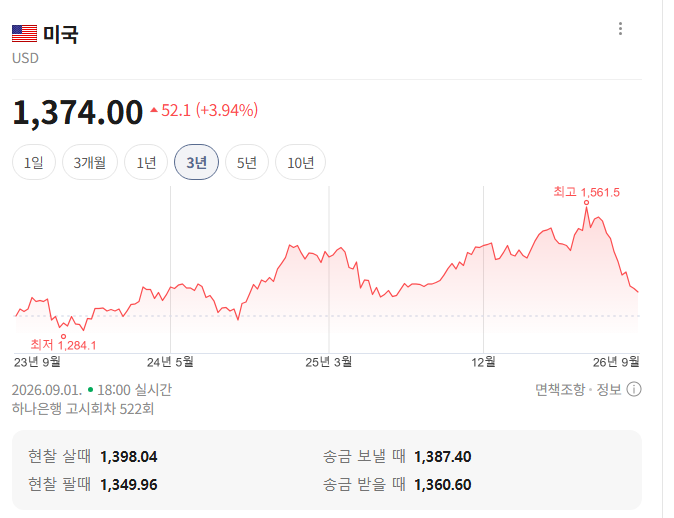

# 오늘을 말하는 사람들을 믿지 말아야 될 이유
**Date:** 8시간 전
**Category:** 일기장
**Original URL:** https://blog.naver.com/xpfkwh56/224397584666
---

​

1. 경제/금융 파트에 관심이 많은 사람들은

달러가 오르면서 남조선이 망한다 라는

이야기를 특히 25년 무렵부터 들었을 것임

​

원화를 갖고 있으면 그 자체로 손해 다,

​

같은 여론이 팽배 해지면서 실제로도

달러가 크게 비싸져 **'그렇게 보였는데'**

​

최근 급격하게 환율이 안정된 상태 임

​

여기서 기억할 부분은, 누가 이걸 맞췄는가?

어떻게 맞췄는가? 같은 문제가 아님

​

기본적으로 복잡계는 **'가설 기반'** 이라는 것을

기억하는 것이 대체로 사람들에게 훨씬 유리함

​

**2. 가설 기반 이라는 것이 뭐임?**

​

우리는 정답이 있는 게임을 오래 하고 살아서,

어떤 경로가 있고 그 경로를 온전히 수행 했을 때

그에 맞는 성과나 결과가 따름이 당연하다 **믿음**

​

공부를 열심히 했으면 좋은 직업을 갖고,

좋은 직업을 가지면 좋은 인생을 살게 된다

​

같은 것이 대표적 **'신뢰'** 라고 할 수 있음

​

그러나, 야생을 겪거나 인생 짬바가 많아지면

저런 믿음이 하나씩 사라지는 경험을 하게 됨

​

**'정해진 것'** 이 없단 믿음이 강해진다는 것 임

​

곰곰2 따져보면, 저건 마치 **'신앙'** 이랑 비슷함

​

종교가 없는 사람한테 교리를 지키고

착하게 살고 열심히 믿고 살면 나중에

​

천국을 갈 수 있다는 말은 **'허황'** 되게 들림

​

1) 천국이 뭔데?

2) 거긴 화폐가 있음?

3) 사회 시스템은 어떤데?

4) 언어는 뭘 쓰는데?

5) 물리 법칙이 적용 됨?

​

같은 개념으로 **'따지기 시작하면'**,

천국의 존재 자체가 회의적이게 보임

​

마찬가지로, 이 게임을 **'결정론적'** 으로 보는

시각 또한 **'가설 기반'** 으로 보면 똑같게 보임

​

3. ~하면 ~하기 때문에 ~한 결과가 나온다,

​

그런 것은 없음

​

단지, 내가 ~하면 ~할 것 같기 때문에

나는 그 가능성을 높다고 **'여긴다'** 에 있음

​

1) 내려왔으니까 앞으로 다시 또 올라간다

2) 내려왔으니까 앞으로 더 내려간다

3) 내려온 상태로 유지 될 것이다

​

**'셋 중 하나가 답이라고 믿으면'**,

똑같이 또 어리석은 판단을 반복할 뿐임

​

변하지 않는 것은 특정 값을 기준으로

​

오른다, 내린다, 유지된다

셋 중 하나 라는 점이고,

​

그 시기가 대략 언제쯤 일 것이다,

라는 **'측정'** 에 불과함

​

나는 이 가격에서 1년 안에 오를 것이다,

1년 안에 내릴 것이다,

1년 안에 유지 될 것이다,

​

라는 세 가지 가설을 넓게 열어놓고,

그 안에서 이게 정답은 아닐 수 있지만

​

**'나는 그게 가장 타당하다고 여긴다'**

라는 내 **믿음** 을 결정하는 것임만 알면 됨

​

4. 결론

​

맞췄냐? 틀렸냐? 가 중요한 것 X

​

**'변화하고 있는 것'** 을

다루고 있다는 것이 중요

​

있는 가설과 정설을 충분히 파악하고,

​

거기서 없는 것들을 꺼내는 작업이

**'피로'** 하니까 이게 어려운 것 임