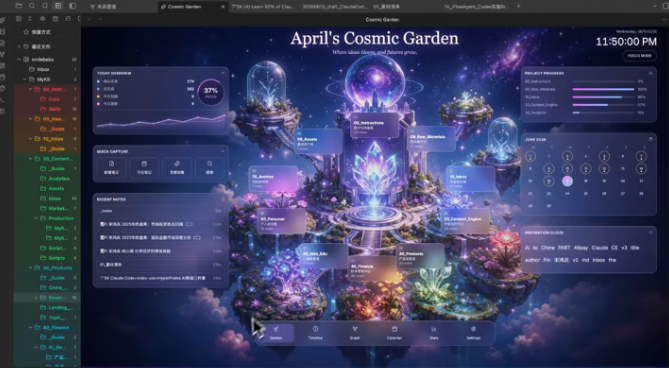
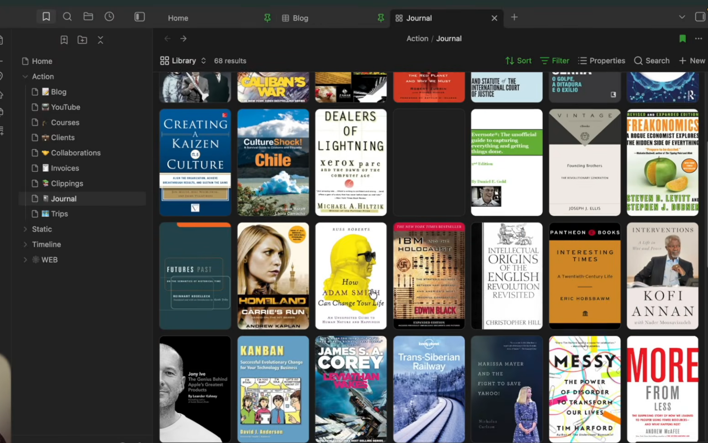
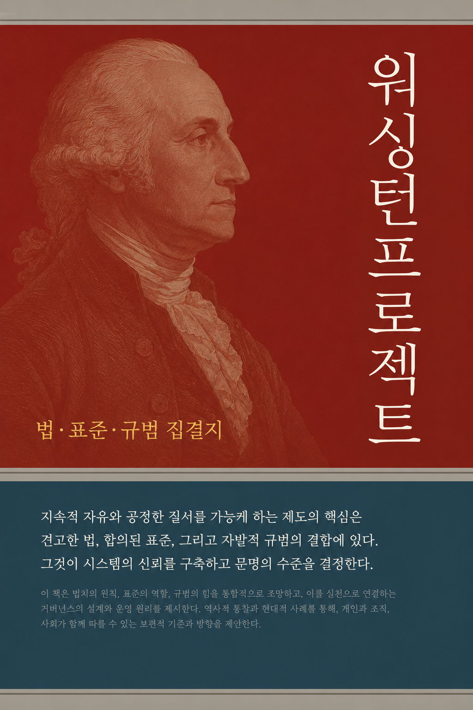
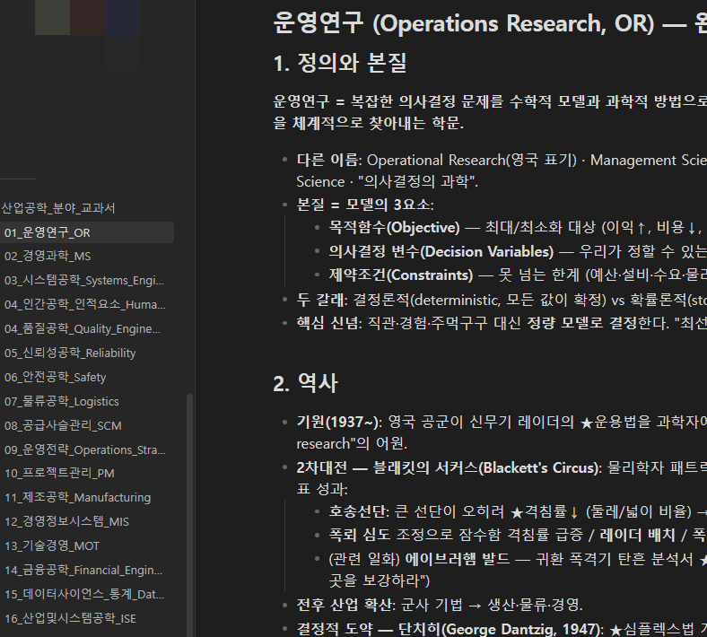

# 옵시디언
**Date:** 8시간 전
**Category:** 일기장
**Original URL:** https://blog.naver.com/xpfkwh56/224333227505
---

​

1. GPT 쓰면 이런 옵시디언 만드는 것 가능

보통 따거들은 **'대중성 좋은 미감'** 이 좋음

​

UI 헷갈리면, 실제 돌아가는 게임들에서

컴포넌트 따다가 하는 것이 효율 제일 좋음

​

**\* 어차피 혼자 쓰는 목적이면 문제 거의 X**

​

유명한 모바일 게임 따오는 것도 추천함

​

컴퓨터로 로컬 볼트 잘 만든 다음에,

그걸 테블릿이나 PC 로 그대로 옮기면

​

**'내 전용'** 앱이 됨

​

2. 레딧에 옵시디언을 보는 집단이 둘로 나뉨

​

1) 메모앱을 꾸미는 애들이 문제다

라는 **위정척사** 파가 있고,

​

2) 기왕 쓰는 것 예쁘면 뭐가 나쁘냐?

라고 생각하는 집단이 있음

​

<https://github.com/InlitX/Obsidian-Dashboard-Gallery>

[**GitHub - InlitX/Obsidian-Dashboard-Gallery: Beautiful, ready-to-use dashboard templates for Obsidian PKM✨**

Beautiful, ready-to-use dashboard templates for Obsidian PKM✨ - InlitX/Obsidian-Dashboard-Gallery

github.com](https://github.com/InlitX/Obsidian-Dashboard-Gallery)

​

3. 주류가 1번 이기 때문에, 2번을 원하면

디코 같은 언더그라운드를 찾아가야 됨

​

이 사람들이 보통 자급자족 선에서 만족해서,

딱히 조력을 구하기는 어렵기는 하지만

​

잘 찾아보면 이렇게 힌트를 줄 때가 있음

​

​

4. 옵시디언 잘 깎으면, 이렇게 내 컴퓨터에

나만의 bookshelf 만드는 것도 가능함

​

100권, 1000권 쌓여도 전혀 물리공간 차지 X

LLM 사용해서 독후감 써달라고 해도 되고,

​

전문서적이면 전문서적 바탕으로

나한테 강의 해달라고 해도 되고,

​

원문 발췌해서 설명해달라고 해도 됨

​

페르소나 입히면, 그 책에 나오는 인물이랑

대화하는 것도 가능하고, 서로 다른 책에서

나온 인물들끼리 수다 떨게도 할 수 있음

**​**

**로컬 비전 모델을 아주 잘 깎으면?**

​

비디오도 가능합니다

​

**\* 시댄스 타임 콘티 기술을**

**최대한 모방하면 가능하긴 함**

​

​

**표지를 직접 만들어서 하는 것도 가능함**

​

LLM 한테 지시해서, 옵시디언을 읽고

250-300p 쯤 되는 책을 써달라고 한 후,

​

생성형 이미지 AI 로 표지 만든 다음에

개인 책장으로 만들어서 활용하고 있음

​

최근 문헌 정보학이랑, 사학 도메인 쪽을

더 보강해서 매일 일상적으로 일어나는 일을

로그처럼 기록하게 하는 아이디어도 적용중

​

​

데이터만 정확히 잘 모아놓고 있으면,

전문지식을 **굉장히 빨리** 습득할 수 있음

​

나는 일반인이라 학술 저널 같은 것

돈 주고 구하고 있는데, 만약 대학생이나

소속 직장인, 이런 경우면 더 편할 것임

**​**

5. 로컬 해라