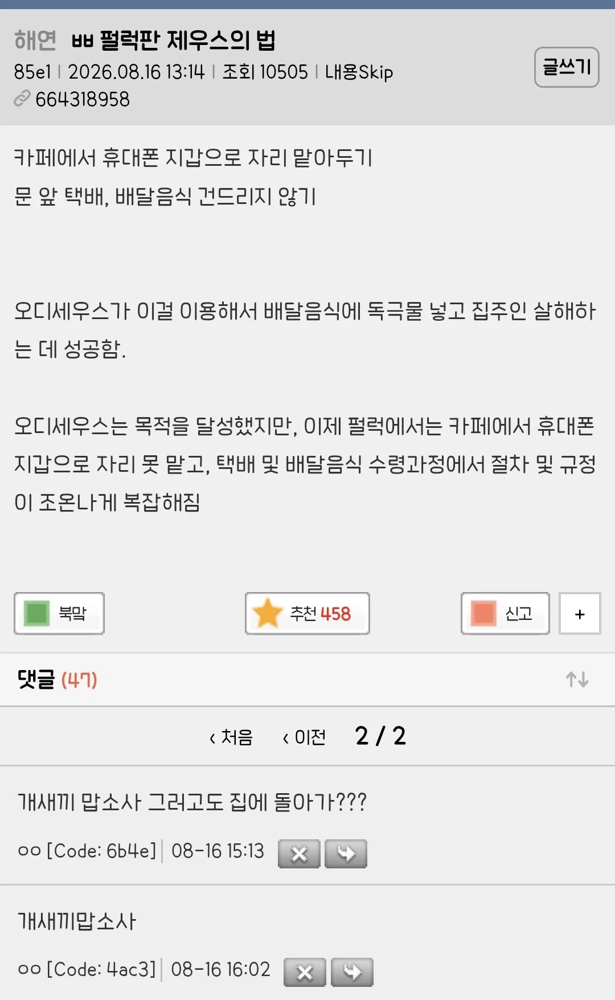

# 제우스의 법
**Date:** 8시간 전
**Category:** 일기장
**Original URL:** https://blog.naver.com/xpfkwh56/224384570636
---

펄럭 = 한국을 의미

​

1. 외국 영화를 보다가, 외환 얘기 나오면

그게 우리나라 돈으로 얼마지? 가 궁금하듯,

​

**'특정 문화권에서 공유하는 인식이나,**

**경험, 공통으로 소비하는 관념 같은 것'** 을

​

**'이해'** 하는 것은 사실 아주 어려운 일 임

​

인공지능 번역이 **'막히는'** 지점도 여기고,

**'지금 살고 있는 인간'** 밖에 못 푸는 문제 임

​

2. 흔히 남초 계열 커뮤니티를 보면,

​

**\* 대체로 신자유주의 우파를 표방함**

​

팩트 지향적이고, 논쟁적인 성격을 갖고

​

여초 계열 커뮤니티를 보면,

그 특유의 **'오구오구'** 문화가 있음

​

서로가 서로를 공격할 때 쓰는 도구를 보면,

​

남초는 상대 성향이 무지하고,

비논리적이라고 공격하는 편이고

​

여초는 맥락이나 사회성

같은 측면으로 공격함

​

**그렇다면 이 차이는 어디서 올까?**

​

당연히 사람마다 차이는 있겠지만

개별적 범위 이상의 일반화를 할 때,

​

나는 **'공동체 의식'** 차이 라고 생각함

​

3. 최근에 친일로 논란이 된 연예인이 있음

​

**연좌제** 를 하면 안 된다는 공격이 있었는데,

​

이는 우리 사회가 최상위 규칙으로 약속한

헌법에도 금지하고, 실제로도 **'나쁜'** 것이라

​

꽤 설득력이 있는 말처럼 보일 수 있음,

​

그에 대해 반박된 논리가,

​

**조상 덕을 봐서 이익을 보는 것은 정당하고,**

**손해를 보면 안 된다는 것이냐?** 였는데

​

공권력을 통한 처벌, 가시적인 사회적 불이익

같은 것이 연좌되면 안 된다는 동의는 얻어도,

​

**'내'** 가 그렇게 느끼는 걸, 막을 권리는 없다

라는 걸로 꽤 반박, 해소가 된 걸로 보였음

​

한편, **'부모 하나 잘 만나서 잘 산다'**

같은 부분은 결함이 없는 것도 아님

​

남조선은 100년도 안 된 국가고,

​

예전에 우리 집 잘 살았었다,

같은 가정사 없는 집안은 없음

​

즉, 부모가 친일을 했든 매국을 했든,

그 자산을 **'지키는 것'** 도 실력이란 것임

​

**\* 고종 독살 이런 얘긴 의미가 없고 ,,**

**​**

물론 정통성이 떨어지는 형태로

사회적 명망이나, 성공의 기틀을 닦았다

​

라는 것이 문제가 되는 것은 맞으나

​

공은 공, 과는 과로 나누어서 봐야지

​

묶어서 너 로또 한 번 맞았잖아

그러니까 당연히 부유하게 사는건데?

​

라고 단순화 하기엔 애매할 수 있음

​

**\* 이게 독립운동가 집안인 건 알겠는데,**

**그래서 30년, 50년 동안 뭐 하셨어요?**

**라는 이야기가 나오는 배경이라고 봄**

**​**

4. 그렇다면 따질 건 따진다 치고,

그럼에도 불구하고 **왜** 거부감이 들까?

​

**'당위의 문제'** 라고 생각함

​

**신뢰, 공동체 또한 경제적인 자산** 임

​

**\* 명확한 이유는 모르겠지만 나도**

**집단에 위협을 주는 행위를 보면**

**그냥 본능적으로 부정적이게 느껴짐**

**​**

만약 그걸 어기는 사람이 많아지면

많아질수록, 집단은 비용을 더 쓰게 되고

​

**존속** 에 위협을 경험할 수도 있음

​

우리 조상들은 **원맨 차력쇼** 보다는,

​

서로 공조하고 협동하면서

문명을 만들어낸 사람들 인데,

​

어떤 누군가 그 규칙을 어기고

큰 이익을 본다는 것이 **'인식'** 되면

​

강한 거부감을 느끼도록

우리가 프로그래밍 된 것 같음

​

그리고 그 연산에 있어서,

​

**'대체로'** 여자들이 더 강하게

수렴하는 걸로 보임

​

아마, 생존에 있어서 남자들보다

여자들이 체력, 근력적인 측면에서

​

더 열위에 있다보니

그런 거 아닌가 싶음

​

남자한테 사회성이 **'옵션'** 이라면,

여자한테 사회성은 **'필수'** 인 느낌

​

**\* 남자는 극도의 증오를 느끼면 죽이거나,**

**다치게 하거나 파괴 하려고 하지만**

**여자는 상대를 고립 시키는 것에 주력함**

**​**

여튼 지금 오늘날 살아있는 우리는

**'임출육'** 행위를 겪은 사람의 후손인데

​

우리가 **'모든 것의 어머니'** 에서

시작했다고 가정하면,

​

이해가 되는 지점도 **분명히** 있음

​

그 누구의 외부적 도움도 받지 않고,

스스로 출산과 육아를 하겠다?

​

**\* 혼자 임신은 애초에 불가능하고**

**​**

의지가 있었다 해도, 그런 유전자를

강하게 결합한 개체들은 다 **절멸** 했을 것