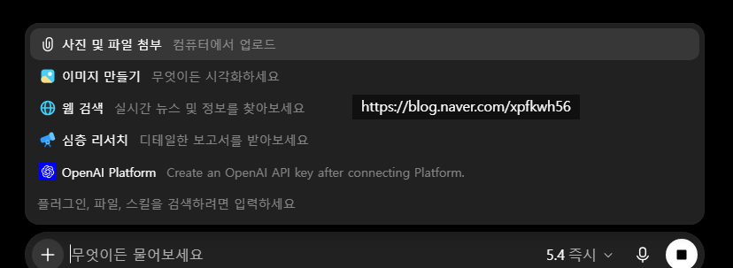
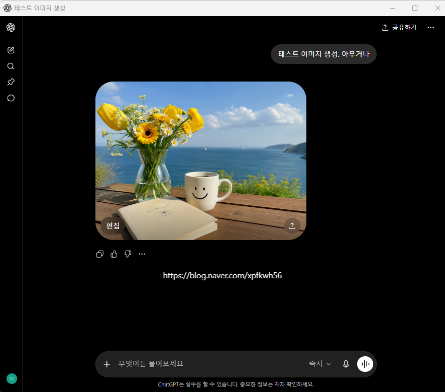

# 지피티 이미지 생성 오류 "이미지를 만들지 못했어요"
**Date:** 8시간 전
**Category:** 일기장
**Original URL:** https://blog.naver.com/xpfkwh56/224339418719
---

1. 7월 7일 기준으로, 서버 오류(RPC)

때문에 이미지 생성이 안 되는 것임

​

기다리면 해결 됨

​

컴퓨팅 자원은 웹 서비스 보다,

대체로 API 우선으로 할당 됩니다

​

같은 API 면, B2B 엔터프라이즈가 더 우선이고

거기서 남는 자원만 B2C 시장에 할당되는 구조

​

​

2. 정 급하게 써야 되면 쓸 수 있는 트릭

​

1) 이미지만들기 로 들어간 다음에

2) 5.5 ver 말고 5.4 로 바꾼 다음,

3) 이미지 생성하면 느리지만 생성됨

​

​

3. 아니면 네이티브 앱으로 하면 됨

API 호출은 가능하니 그렇게 해도 됨

​

나는 아주 오래 전부터,

로컬을 쓰라고 권유하는 사람이고

​

**\* 옛날엔 프론티어만 가능했던 작업의**

**상당수가 점점 진입 장벽이 낮아져서**

**어렵긴 하지만 대체가능한 수준까지 옴**

**​**

유료 결제를 한다고 해도,

​

**웹 모델 사용하지 말고**

**가능하면 앱 모델로 사용하고**

​

기왕 앱 모델을 쓸 생각 있으면

커넥터 붙이고 API 쓰라고 하는 중임

​

<https://blog.naver.com/xpfkwh56/224312184679>

[**제미나이 1076 오류 1099 오류 원인 및 해결**

1. 선결론 구글 서비스 문제니까 기다리시면 풀립니다 2. 비슷한 상황 생기면 어떻게 해결? https://aistud...

blog.naver.com](https://blog.naver.com/xpfkwh56/224312184679)

​

**4. 이런 일은 왜 생기나?**

​

애초에 프론티어 모델들이

웹 서비스 하는 이유는,

​

**'진짜 쓰라고 만든 것'** 이 아니라

유저들 빅데이터 확보하기 위함이고

​

그냥 **'돈 주고 하는 테스트'** 에 가까움

​

**\* 무료면 모를까, 항상 있는 일입니다**

**​**

1) 무조건 싸게 쓰시고

2) 제한적으로 쓰시고

​

도구 자립성 올리시는 것을 추천함

​

지금 웹 AI 쓴다는 건, 내가 내 돈 주고

​

개인정보 + 학습데이터

+ 베타테스터 한다는 소리임

​

**\* 본인이 쓰면서 스트레스 받고, 답답하고**

**이건 왜 안 되지? 하는 것이 나중에 전부 다**

**데이터로 들어가서 모델 개선에 이용됩니다**

**​**

**계정도 임시 계정으로 만들어서 결제하시고,**

​

결제 걸었다가 환불 ↔ 취소 와리가리 쳐서

체리피킹 할 수 있는 것은 바짝 다 땡기세요