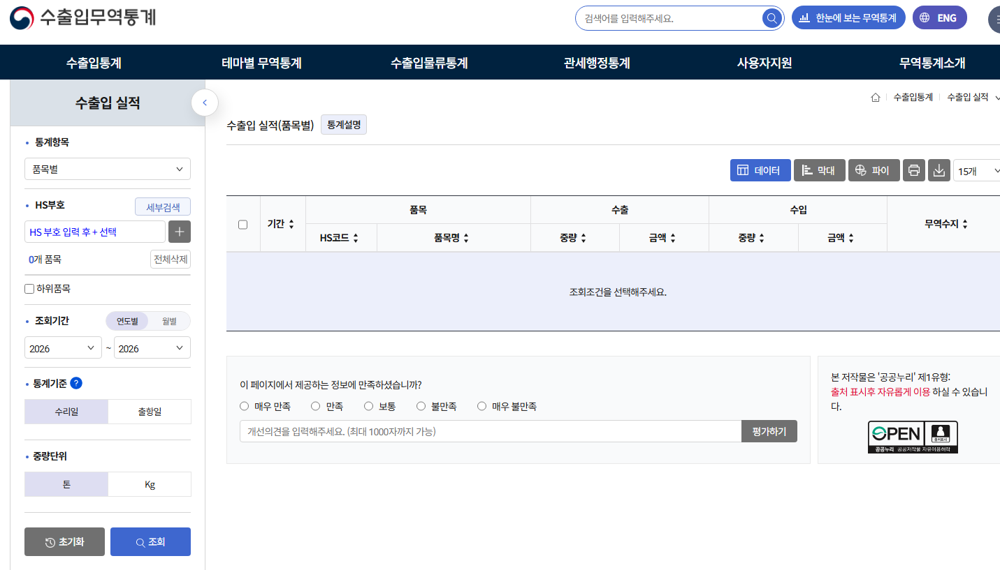

# 투자에 앞서, 수출기업 동향 파악하기
**Date:** 8시간 전
**Category:** 일기장
**Original URL:** https://blog.naver.com/xpfkwh56/224362999736
---

<https://tradedata.go.kr/cts/index.do?menuId=ETS_MNU_00000134>

[**관세청 수출입무역통계**

수출입 현황, 물류통계 등 관세청 무역통계정보를 종합적으로 제공

tradedata.go.kr](https://tradedata.go.kr/cts/index.do?menuId=ETS_MNU_00000134)

<https://stat.kita.net/newMain.screen>

[**K-stat 무역통계 - 한국무역협회**

K-Stat, 한국무역협회에서 제공하는 국내 최대의 글로벌 무역통계 서비스로, 한국무역통계, 해외무역통계, 세계통계 등 61개국 관련한 무역통계 서비스를 제공합니다.

stat.kita.net](https://stat.kita.net/newMain.screen)

​

여기 들어가면 특정 상품에 관한

수/출입 물동량 공개해놨는데,

​

시장 점유율이 압도적으로 높거나,

지배력 높은 기업의 경우, 실질적으로

​

전체 물동량 ≒ 개별기업 물동량 처럼

해석할 수 있는 경우들이 있음

​

주요 수출품목 체크 해놓은 다음에,

​

실제로 잘 나가고 있나?

돈으로 잘 바뀌고 있나? 같은 것을

​

공시랑 같이 읽으면 안할 때보단

조금 더 정확하게 파악할 수 있음

​

시간 있을 때 쭉 표로 만들어놓은 다음에,

추세가 튀는지, 평평한지, 트렌드가 어떤지

​

만지작 거리면 본인이 할 다음 스텝이 나옴요