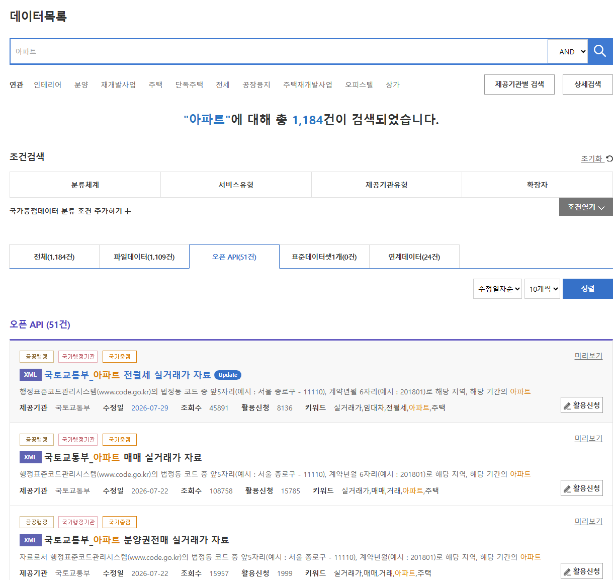

# 해외에서는 최소 몇 만 달러씩 하는 데이터들
**Date:** 8시간 전
**Category:** 일기장
**Original URL:** https://blog.naver.com/xpfkwh56/224362988456
---

<https://www.fsc.go.kr/in060301>

[**개방 현황 - 공공데이터개방 - 정보공개 - 금융위원회**

주제별 API 및 테이블 수 주제 API 수 테이블 수 기업정보 7 19 금융회사정보  8 15 공시정보 3 71 자본시장정보 42 106 국가자산공매정보 3 3 금융회사통계정보 26 95 시세정보 6 16 금융상품기본정보 10 15 개인사업자정보 4 8 진위서비스 1 1 합 계 110 349 주제별 API 및 테이블 목록 주제 API명 테이블명 기업정보 기업기본 정보 기업개요조회, 계열회사조회, 연결대상종속기업조회 지배구조 정보 주주정보조회, 대표이사정보조회 외 2개 기능 기업 재무 정보 요약재무제표조회, 재무상태표조회, 손익계산...

www.fsc.go.kr](https://www.fsc.go.kr/in060301)

<https://data.seoul.go.kr/together/guide/useGuide.do>

[**오픈PAPI 소개**

데이터참여.소통 오픈PAPI 소개

data.seoul.go.kr](https://data.seoul.go.kr/together/guide/useGuide.do)

<https://www.findatamall.or.kr/market/main?menuNo=18>

[**금융데이터거래소**

최신상품 컨슈머인사이트 2026년 4월 금융앱 확보고객 순위 컨슈머인사이트 2026년 1분기 금융 앱 고객경험 평가 대학내일20대연구소 주류 시장의 구조적 변화와 최신 주류 소비 행태의 이해 대학내일20대연구소 [데이터] 가치관 정기조사 2026 NH농협은행 [2026-02호] 가성비 커피의 역습, 대한민국 카페인 수혈지도 NH농협은행 [2026-01호] 운동하고 세금도 아끼고... 수영 열풍 NH농협카드 [NH농협카드] 시도별 업종별 카드이용현황\_2021년 6월 NH농협카드 [NH농협카드] 시도별 업종별 카드이용현황\_2022년 6...

www.findatamall.or.kr](https://www.findatamall.or.kr/market/main?menuNo=18)

​

남조선 국적만 있으면 전부 공짜 입니다

​

이런 정보는 마누스, 퍼블렉시티

할애비가 와도 못 찾아줌

​

근데 사람이 클릭 한 번만 해놓으면

컴퓨터에 쌓아놓고 볼 수가 있음