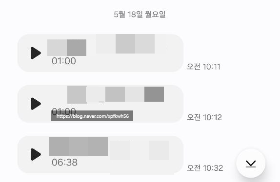

# 5월의 에피소드
**Date:** 9시간 전
**Category:** 다이어리
**Original URL:** https://blog.naver.com/xpfkwh56/224307020675
---

​

1. 스테디 하게 가는 좋은

장사 중 하나가 종교 장사 임

​

사람이 모여있는 곳이다 싶으면

여지없이 종교 기관이 자리 하는데

​

그럼에도 불구하고 저게 **왜** 돌아갈까?

​

왜냐면 사회가 무너지지 않기 위한,

하나의 축을 차지하고 있기 때문 임

​

2. 맨날 하는 것도 아니고, 나 또한

이득이 되니까 하는 짓이긴 하지만

​

**\* 특별히 내가 마음 먹지 않는 한**

**공제치 까지만 하고 있고,**

**후원만 하는 걸론 못 믿겠음**

**​**

**사회복지 분야는 나도 꽤 아는 분야고,**

**실제 1번이라도 내가 직접 확인하길 원함**

**​**

종종 시간이 나면 복지관을 갈 때 있음

연령대는 보통 높고, 아지매들이 많음

​

3. 내 고향 생각을 하면, 마치

도시의 **'미용실'** 같은 역할 인데,

​

HTS 로 버튼 한 번만 누르면

금을 살 수 있는 세상이지만, 여전히

동네에는 금은방이 있는 것과 같이

​

비슷한 기능을 하고 있는 공간인 듯함

​

4. 내 이런 **'활동'** 에는 원칙이 있음

​

물어본 것이 아니면 답하지 않고,

말하지 않은 것이면 묻지 않는다

​

20대 초반 시절에 배운 것 임

​

사람들은 누구든지 말할 수 없는 다양한

사연들이 있기 마련이고, 그 문제에 관해

관심을 갖지 않는 **'거리'** 가 **'서로'** 를 지킴

​

5. 거기서 알게 된 아지매가 있었음

​

끙끙 앓으시던 중, 주변에 혹시

아는 변호사가 있냐고 물어오셨음

​

어떤 일인지 물으니 사정이 이랬음

​

간단히 정리하면,

​

비접촉 채널로 장기 할부 계약을 했고

상황이 있어서 일단 결제를 하긴 했었다

​

그리고 나중에 환불을 해야지 생각 했는데,

환불을 하려고 하니 위약금을 **'너무'** 부른다

​

얼마 부르는데요?

​

2일 만에 환불 요청 했는데,

60만원 불렀다고 함

​

**엥?**

​

6. 먼저 업체 이름과 상품부터 확인 했음

​

내가 아는 **'규칙'** 에 의하면,

그건 안 지켜도 되는 **'약속'** 임

​

내용을 듣자 하니,

​

처음에 계약을 할 때, 10만원 20만원

상당의 비용 등을 감면 받았고, 서비스에서

어떤 굉장히 높은 가치를 주는 것이 있는데

​

그게 계약에 녹아있기 때문에,

환불을 하면 다 물어내야 된단 것

​

**이유가 뭐라는데요?**

​

무슨 법이 있는데, 그 법이 어쩌고

계약자 동의가 어쩌고, 저쩌고 ,,

​

질알을 ,, 하네 ,, 싶었음

​

하지만 유사한 **'내 경험'** 상,

**'나한테'** 이렇게 말을 한 것 뿐

​

실제 **'사실관계'** 는 알 수 없음

​

통화 내역을 들려달라고 요청했고,

내용을 들어보니, 그 말이 맞았음

​

​

7. 얼마의 시간이 지나고,

​

​

60만원이 14000원 으로 바뀜

​

취소하는 과정에서 실비가 있었는데,

그 지출에 대해서는 부담해야 된대서

​

들어보니, 실제로 그건 업체 입장에선

**'피해'** 를 본 금액이 맞기도 했고,

​

아지매도 그건 인정하신다고 하셔서

마무리가 잘 해결된 사건 임

​

8. 개인적으로 인생을 살아가면서

**'구역질'** 나는 부분이 이런 것들임

​

나는 저 회사의 **'BM'** 이 보이는데,

​

어떻게든 삶아서 일단 가입 시키고

계약해지 방어를 할 때는, **'강짜'** 를 놓고

​

그 과정에서 법이 어쩌고, 소송이 어쩌고

어려운 이야기 하면서 사람 겁박을 하고,

​

바쁘고 정신 없는 사람이 그냥 빠르게

**'돈'** 으로 해결하고 싶게 만들려는 BM

​

잘 먹고 잘 살기야 하겠지,

근데 꼭 그 방식 밖에 없었을까?

​

그 좋은 대가리를 좀

유익하게 쓸 수는 없을까?

​

청약철회를 **'이행'** 만 하면 될 뿐,

**'적극적 조력'** 조항은 없기 때문에

​

이런 방식은 **'합법적'** 임

​

시끄럽게 구는 애들만 달래면 된다 이거죠

나머지 99명이 조용하면 두당 60 이니까

​

9. 지금도 인터넷만 검색하면 누구나

법률 좋문가 흉내는 낼 수 있는 세상이고,

​

변호사들은 시장 수요보다 넘치게 나와서

과공급으로 법률 DB 값이 천정부지로 오름

​

그럼에도 불구하고, 이런 일이 **'매일'** 있고

​

오늘 내 옆에 있는 1명은 내가 도왔어도,

내 영역을 벗어나는 일을 나는 할 수 없음

​

하물며,

​

저렇게 위약금 몇 십만원씩 챙기는 애는

1명을 얻어도 **'먹는'** 게임을 하는 반면에,

​

돕는 나는 **'이익이 없음'**

​

그냥 하는 것 임

​

이걸 내가 **'업'** 으로 삼고자 한다면?

60만원 위약금 만원으로 깎아줬으니

​

10만원, 20만원 주세요 한다 해도

**'안 팔린다는'** 보장도 없음

​

근데 생각하면 그 이익의 원천은 결국,

클라이언트 주머니에서 나오는 거고

​

나는 이런 것을 **'잘못된 부'** 라고 생각함

​

**\* 법률 서비스 비용이 문제가 있다,**

**변호사 조력, 수임료는 경제적으로**

**산정하면 안 되는 가치다 라는 말 아님**

**​**

**만약 내가 이걸 밥벌이로 삼는다고 치면**

**담백하게 60만원 위약금 내기 싫은 사람이**

**​**

**나 같은 사람 찾아서 1-20만원 떼어다 주고,**

**안 내도 될 돈 아끼는 것이 이상하다 생각할 뿐**

**​**

**그리고 만약 내가 그런 구조 안에 있다면,**

**나는 저런 사람들이랑 제휴를 할 것 임**

**​**

**그게 옵티멀 이니까**

**​**

**위약금 자체를 200만원 이렇게 부르고,**

**내가 대행해서 120으로 깎아주겠다**

**​**

**라고 한 다음에, 나도 60, 회사도 60**

**이렇게 나눠서 먹으면 상부상조가 됨**

**​**

**내 기준에서 이건 정상적인 부가 아님**

**​**

애초에 위약금으로 강짜 놓는

새끼들이 사라져야 되는 것임

​

당시 3일에 걸쳐서 조사 후

해당 내용을 민원 했고,

​

결과는 **'시정 교육'** 했습니다

​

10. 공무원은 지금보다

**'존나'** 더 많아져야 된다

​

행정부는 지금보다 훨씬 커져야 된다

지금보다 훨씬 거대한 정부가 돼야 한다