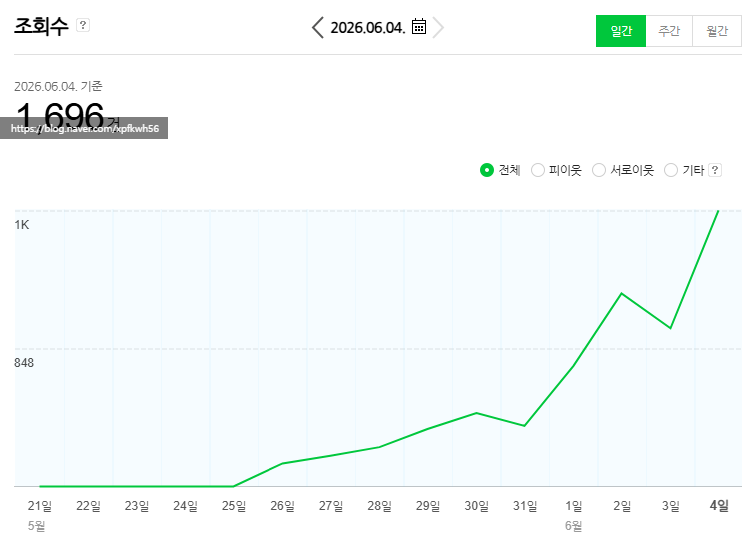
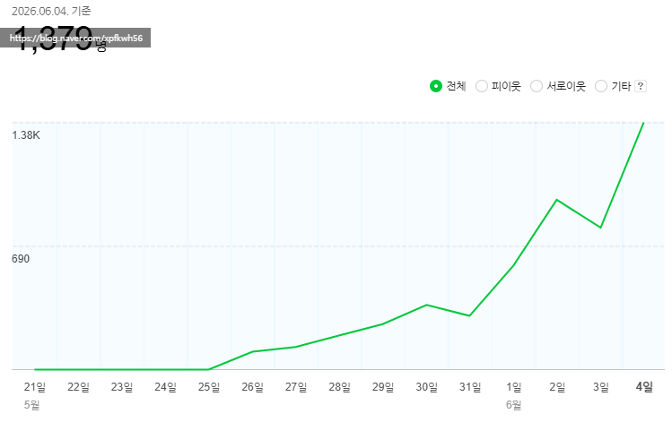

# 기출문제 노출
**Date:** 9시간 전
**Category:** 다이어리
**Original URL:** https://blog.naver.com/xpfkwh56/224306968660
---

1천블 완성

​

네이버 메이트 결과가 공개 되면서,

전보다 쉽고, 정확하게 알 수 있게 됨

​

이래서 **'지키는 자리'** 가 어려운 것 임

​

**'평준화'** 가 일어난 시장에서 싸우면

**'비평준화'** 에서 있던 장점이 다 사라짐

​

**\* 꿀통 타령 하면 생기는 일**

**​**

중간마다 눌림목 있는 것은 뭐냐?

​

**'정비'** 하는 피드백 시간 임

​

시장 상황, 제반 환경 변화를 체크하고

일주일마다 전략을 계속 바꾸는 것임

​

1) 많이

2) 잘 생각해서

3) 오래 꾸준히

​

비법 같은 것은 없음

​

일주일 전만 해도 내가 알던 것들의

30% 정도는 쓸모 없는 가십이 됨

​

**'생물'** 을 다루는 것이라고 봐야 됨