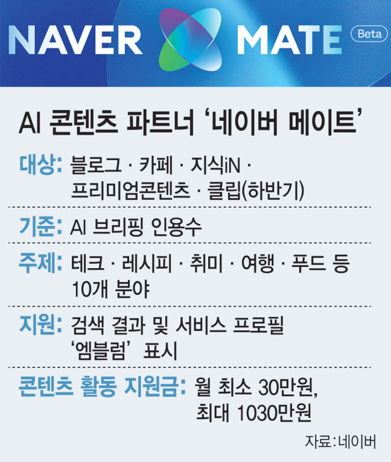
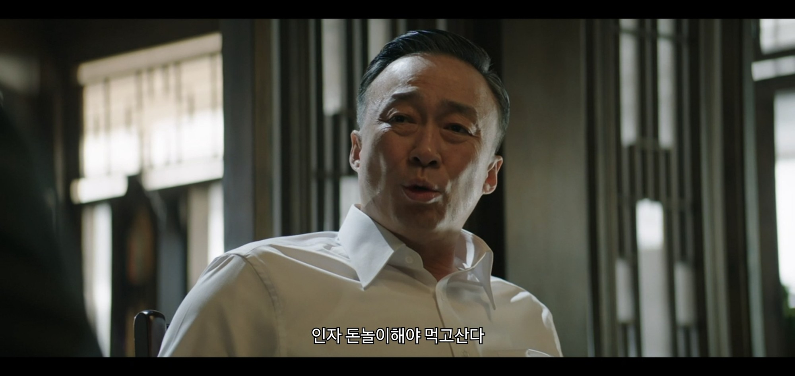
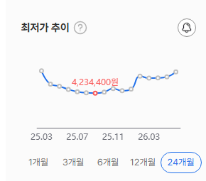

# 네이버 메이트
**Date:** 9시간 전
**Category:** 다이어리
**Original URL:** https://blog.naver.com/xpfkwh56/224300245475
---

<https://blog.naver.com/naver_search/224290490478>

[**네이버 메이트 프로그램이 새롭게 시작됩니다.**

안녕하세요. 네이버 검색입니다. 2026년 6월부터 네이버 메이트 프로그램 베타 운영이 시작됩니다. 네이버 ...

blog.naver.com](https://blog.naver.com/naver_search/224290490478)

<https://blog.naver.com/naver_search/224296857688>

[**AI 시대에 사용자의 선택을 받는 콘텐츠 작성 가이드**

안녕하세요. 네이버 검색입니다. AI와 함께 변화하는 환경에서 네이버와 창작자, 커뮤니티가 함께 콘텐츠...

blog.naver.com](https://blog.naver.com/naver_search/224296857688)

<https://mkt.naver.com/shopping_agent>

[**AI 쇼핑 에이전트**

쇼핑지능, 모두의 지식으로부터

mkt.naver.com](https://mkt.naver.com/shopping_agent)

​

1. 구글 1년 = 레딧에 800억 씀

디시인사이드 작년 매출 275억 영업익 110억

​

2. 부동산 에서 **'금융시장'** 으로 자금 쏠림

3. 3+1차 서비스 산업 육성 **'인프라'** 구축중

​

​

4. 저는 5090 을 25년 12월 경에 구입했음

​

​

계속 구경하고 있다가,

​

산업이 딱 트리거 터질 때

들어가는 것을 제일 선호함