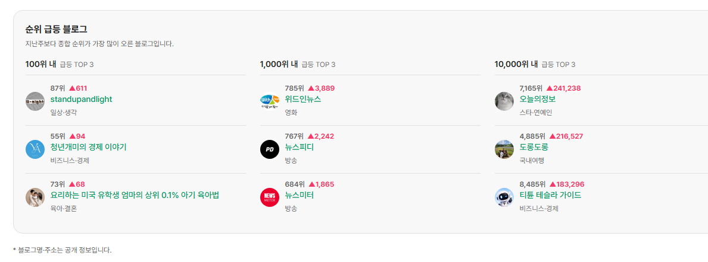
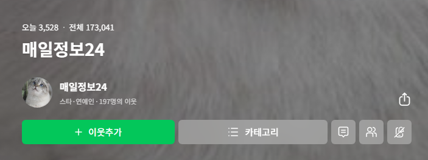
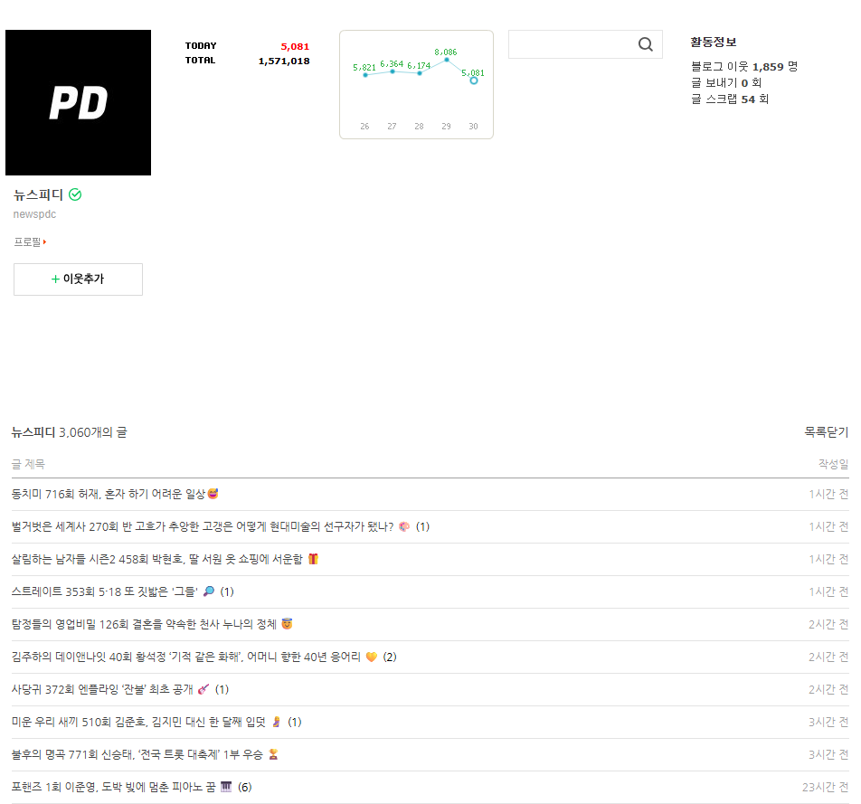
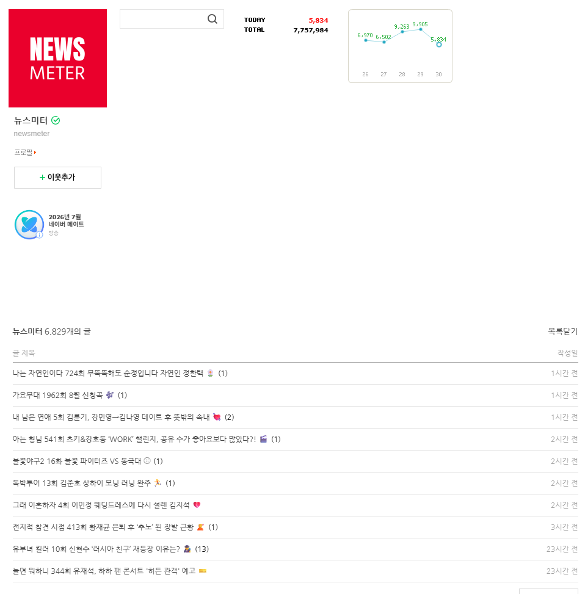
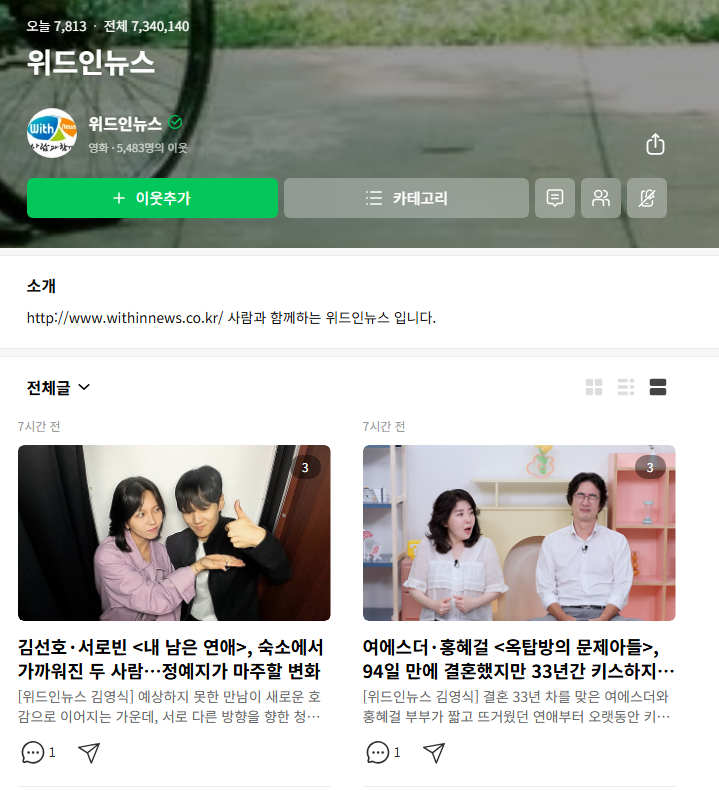
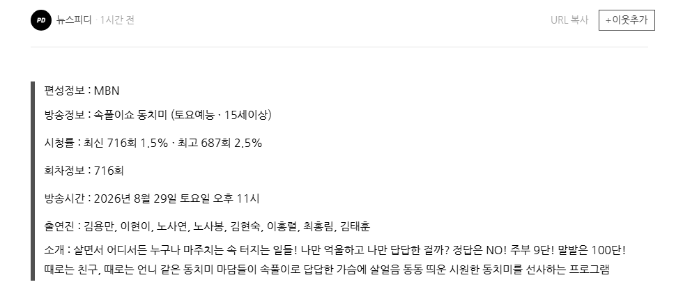
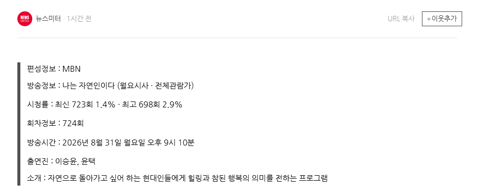

# 블로그 다계정은 어떤 식으로 굴리는 건가요?
**Date:** 9시간 전
**Category:** 일기장
**Original URL:** https://blog.naver.com/xpfkwh56/224395161674
---

​

1. 블라이 들어가서 모니터링 함

​

2. 100위 내 ← 고였음 나랑 노상관

​

3. 1만, 1천을 주로 보면 됨

​

블로그 지수 순위를 파악하고 싶으면

귀납적으로 밖에 분석할 수 없는데,

​

특정 쿼리 글을 올렸을 때,

​

내가 '기존 경쟁자' 를 이기나

유지가 되느냐? 를 모니터 하면

​

상대적으로 내 위치가 지금 어디다,

이 쿼리의 주인이 누구나 파악 가능

​

​

4. today 위젯이 없어도

모바일로 들어가면 오늘 방문자 나옴

​

블로그 주소를 체크한 다음에,

자동화 브라우저로 체크해서

​

매일 특정 시간 today를 잡는 것임

제 경우, 오후 9시, 10시, 11시 수집함

​

​

5. 위에 있는 3개의 블로그를 보면,

​

딱 봐도 위에 2개는 유사성이 높아보이고

아래 1개는 조금 그래도 달라 보임

​

**\* 물론 다루는 주제, 화제, 성격은 비슷**

​

저 위에 2개 있는 블로그가,

**'다계정'** 블로그일 확률이 아주 높음

​

​

최근 게시물 1천개를 수집한 다음에,

기계적으로 수집을 하면 결론이 나옴

​

하지만, 그렇게 코딩하지 않더라도

이 경우는 **'딱'** 봐도 그냥 눈에 보임

​

6. 즉, **'잘 되느냐?'** 가 중요한 것이 아니고

**'내 노하우'** 를 노출하지 않는 것도 실력 임

​

그럼에도 불구하고 이 분 같은 경우,

1개 계정당 일 5천 정도 찍히시니까

​

계정당 **10만원 정도** 수익은 나올 거고,

​

그런 계정이 5-10개 정도 된다면

50-100 정도는 벌겠다 유추가 가능함

​

**여기서 이제 더 복잡하게 할 수 있음**

​

템플릿 형식으로 작성하는 것이 아니라,

글의 레이아웃 구조나 성격을 바꾼다던가

​

와이어 시스템 같은 것을 추가하면

더 세련된 형태로 운영하는 것이 가능함

​

**7. 결론**

​

블로그에 글 1개 쓰는 시간이 중요한 것이 아니고,

​

무슨 콘텐츠를 어떤 전략으로 작성해서

전체적으로 어떤 퍼널을 갖고,

어떻게 운영할 것인지 **'생각'** 해야 됨

​

정답이 없는 분야 이기 때문에,

아무리 뛰어난 사람의 조언을 받아도

​

내가 **'참고 할 수 있는 근거'** 정도고,

​

배운다고 다 똑같은 결과가 안 나오는 이유도

사람마다 어떻게 묶일지 알 수 없기 때문임

​

예를 들어보겠음,

​

A 라는 사람은 **'음악'** 블로그를 운영하고,

B 라는 사람은 **'방송/연예'** 블로그 운영함

​

현직 아이돌, 연예인이 운영하지 않는 한

A 가 B 를 이길 가능성은 **지극히** 낮음

​

상위 1천 게시물 평균 조회수 절대값을 재면,

24-10월 대비,

​

스타, 연예인 62,145 (2.53배)

패션, 미용 58,259 (1.16배)

비즈니스, 경제 41,598 (1.42배)

스포츠 36,360 (2.07배)

방송 33,742 (0.75배)

교육, 학문 25,765 (2.08배)

자동차 20,946

인테리어 19,850

요리, 레시피 16,388

상품리뷰 14,167

맛집 11,941 (0.71배)

국내여행 12,952 (0.71배)

미술, 디자인 2,583 (0.58배)

​

나오는데, 여러 지표들이 있지만 **결론만 보면,**

그냥 뷰티/아이티 하라는 소리 임

**​**

**8. 스포츠, 방송/연예, 트래픽도 큰데요?**

​

뉴스 기사 긁어오면 저작권 리스크 있고,

방송/연예도 마찬가지고 개인 이슈 잘못 만지면

나중에 감당 안 되는 사건 생길 확률이 있음

​

반면에, 아이티 같은 경우 공식 스펙이 있고

정량 지표 기반으로 작성할 수 있기 때문에,

기계 생성에 유리하고, 트래픽 유입이 높음

​

실사용 후기는? 유튜브 찾으면 나옴

​

패션과 미용도 마찬가지 임

​

건강 주제나, 의료/의학 관련으로

얻어걸릴 문제만 제외하고 풀면 됨

​

MBTI 에 잘 어울리는 패션 코디

같은 것은 문제가 될 여지가 없음

​

**\* 오라클이 없으니까**

​

순전히 내가 깎아서 하겠다고 하면,

​

여행, 맛집, 요리 를 하면 되는데

콘텐츠 1개의 집필 비용이 높아서,

​

**양산**이 어렵고, 자동화는 거의 불가능함

​

때문에 블롭형으로 운영해야 되는데,

​

이렇게 운영하면 쿼리 결속이 낮아서

그냥 아무 잡블이나 운영하는 거랑 같음

**​**

**아무 잡블이나 운영하면 왜 안 되는데요?**

​

에버그린이 안 생김,

생겨도 밀림

​

에버그린이 뭔데요?

글 1개 작성하면 **꾸준히** 가는 것 임

​

네이버가 블로그 자체를 1개의

1인 미디어 채널로 추구 하면서,

​

가만히 키워드 1개만 만든 다음에

그거로 계속 꿀 빨게 못 하고 있지만

​

그럼에도 몇 가지 키워드들은 걸림

​

대표적으로, **~ 뜻** 같은 것임

​

교육/학술 키워드로 묶이는데

사전식, 나무위키 식으로 갖고 있으면

​

글 1개가 지속적으로 트래픽을 점거함

​

**\* 주식 etf 뜻 은 비즈니스에 결속되는 식**

​

레시피만 백날 쓰고 있던 사람이,

​

정책성 키워드 쓰면 정책성 키워드만 잡던

사람보다 소재/주제 관련성에서 밀리니까

​

매우 큰 키워드를 잡아서, 시의성 위주로

가십을 노려야 트래픽이 나오는 구조 인데,

​

이렇게 할거면 처음부터 잡블이 아니라,

​

그냥 이슈/가십 키워드로

스타/연예인 하는 것이 낫고

​

그럼 돌고 돌아서, 결국 뷰티/아이티가

답이란 결론이 똑같이 나오게 됨