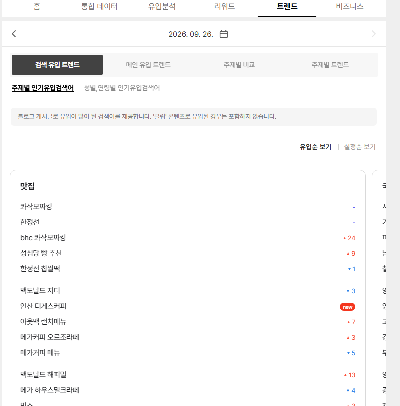
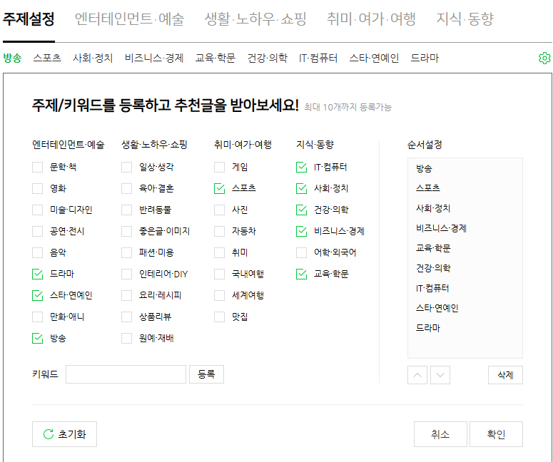

# 블로그 소재 찾는 법
**Date:** 9시간 전
**Category:** 스냅
**Original URL:** https://blog.naver.com/xpfkwh56/224423991126
---

​

1. 여기 들어가서 있는 것 중에

내가 말 한 마디라도 붙일 수 있는 것

아무거나 골라서 쓰면 됨

​

<https://trends.google.co.kr/trends/>

[**Google 트렌드**

지금 전 세계 전 세계 에서 무엇을 검색하고 있는지 알아보세요. 검색 관심도, 지난 24시간 탐색 이(가) 인기 있는 이유는 무엇일까요? 검색 상세 데이터 검토 트렌드 데이터팀에서 선별한 문제와 이벤트 자세히 살펴보기 FIFA 월드컵 2026 사람들이 토너먼트를 어떻게 검색하고 있는지 확인해 보세요.

trends.google.co.kr](https://trends.google.co.kr/trends/)

​

2. 거기 도저히 쓸 것이 없으면 여기

​

​

3. 저기도 없으면 여기서 찾으면 됨