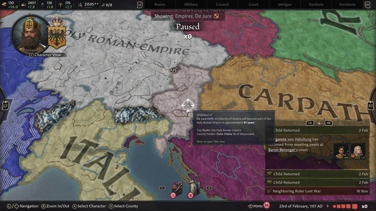

# 블로그 수익화 잡기술에 대해서 알아보자
**Date:** 9시간 전
**Category:** 일기장
**Original URL:** https://blog.naver.com/xpfkwh56/224393688211
---

1. 블로그로 어떻게 돈을 벌어야 되느냐?

​

라는 질문에 **'트래픽 늘리면 됨'**

이라는 답변은 당연하단 듯이 나옴

​

2. 그럼 트래픽 어떻게 늘려야 됨?

​

이라는 말에는 **'잘'** 하라는 말 외에는

사실 이어서 나올 말이 별로 없는데,

​

그 이유는 너무 변수가 많고,

다양하기 때문에 **커버가 안 돼서** 임

​

3. 그럼에도 불구하고 변하지 않거나,

기본적으로 돌아가는 규칙들은 있음

​

수능에 무슨 문제가 나올 줄은 몰라도,

​

그 처음 보는 문제도 **'본질'** 과

연결된 것과 마찬가지 임

​

4. 제일 먼저 알아야 될 것은 **'노출'** 개념임

​

대부분의 사람들이 신앙처럼 알고 있는

1일 1포 개념은 정말 **'아무'** 쓸모가 없음

​

가능한 꾸준히 발행하면 좋은 것이고,

블로그 공백이 있으면 좋지 않다는 것임

​

블로그 사용 공백이 있으면 나쁜 이유는,

​

1) 지속적으로 안정적인 공급을 안 해준다

그러므로 플랫폼 입장에서는 이 공급자에게

노출 기회를 주는 것이 리스크 있단 판단이고,

​

2) 장기 휴먼 블로그의 경우에는

해킹 계정이나 나쁜 용도로 사용해서

운용될 수 있기 때문에 락을 줌

​

그래서, **매일 올려야 된다** 도 틀린 말이고

**드문드문 올려야 된다** 는 말도 틀린 말이 됨

​

동네에 있는 식당이 MZ 사장 이라서

지가 열고 싶을 때 열고 닫고 싶을 때 닫으면

​

손님이 그 업장을 잘 이용하지 않을

**'가능성'** 이 높아진다는 느낌으로 보면 됨

​

만약 그 동네에 그 식당 외에는 대안이 없다,

혹은 **'매우'** 실력이 뛰어나서 압도적이다

​

그러면 상관이 없을거고, 실제로

블로그 바닥에서도 비슷한 일이 **있긴** 함

​

**\* 단, 엄청난 브랜딩 밸류가 있어야 됨**

​

블로그를 하나의 **'업장'** 이라고

생각하고 보는 관점을 갖고 있으면

​

이 게임을 이해하기 아주 쉬워짐

​

5. 노출 이야기로 돌아가서,

​

SEO, 그러니까 검색관점 에서

현재 존재하는 규칙은 다음과 같음

​

먼저 화면에 나오는 탭의 1 단위를

블록 이라고 부르고, 그 블록 단위로

​

알고리즘에 따라 노출 가중치를 바꿈

​

**그게 무슨 말이냐?**

​

검색어 를 **'쿼리'** 라고 부르는데,

​

이 쿼리가 자동완성 이라던가,

사람들의 입말 로 연결된 상태면

​

그 검색자들의 **'의도'** 를 연산해서

제일 **'유가치한'** 정보를 노출한단 것임

​

만약 서울 소공동 롯데리아 위치

라고 검색을 한다고 가정한다면,

​

그 위치에 대한 **'오라클'** 은

소공동 롯데리아 그 자체일 것임

​

**\* 자기들이 말한 정보가 진리**

​

그러므로 1차 출처, 공식 기관과 같은

​

오쏘리티가 좋은 채널들이 대체로

쿼리에 적합할 때, 상위 노출이 됨

​

쉽게 말하면, 공식 사이트 나

명확한 출처, 신뢰할 수 있는 기관

​

이런 곳들이 상단 가점이 높단 것임

​

**\* 글을 잘 쓰고 말고는 노상관**

​

**'누가'** 말한 것이냐 에 따라서

측정할 수 있는 정보가 있는 반면에,

​

그걸 알 수 없는 것들도 있음

​

주관적이거나 벡터가 튀거나,

명확한 수렴값이 없는 경우 등등 은

​

1차 정보가 없기 때문에,

하단에 위치할 블록이 상단으로 감

​

예를 들어, 개인의 경험이나 체험,

인사이트 같은 것과 연결되는 쿼리

​

또는 검색자의 의도 자체를

연산할 수 없는 경우로 들어가면

​

그 출처의 오라클 위치를 바꿔버림

​

6. 결과적으로,

​

검색 엔진은 **'검색자가 원하는 것'** ​을

가능한 정확하게 제공하는 것이 목표고,

​

검색자가 무엇을 **'원하는 것'** 인지,

근본적으로 알 수 없기 때문에,

​

**'원할 것 같은 것'** 을

예측하는 도구란 것 임

​

[개인사업자 폐업 지원금]

이라는 쿼리를 썼다고 치겠음

​

제일 위에는

네이버에서 파는 광고가 나오고,

​

그 밑에는 1차 출처가 나옴, 그리고

그 밑에는 언론사 뉴스가 나오고,

​

웹페이지/카페/지식IN 같은 것이 나오고,

거기에 블로그가 섞임

​

블로그로 1등을 해도 언론사 뉴스 밑이라,

위에서 **'목적'** 을 해결하지 못한 사람들이

내려와서 찾는 구조가 되는 셈인데,

​

이런 글은 100억 개를 신급으로 발행해도

죽어도 상단 노출을 얻을 수 없어서 불리함

​

통검에서 1등으로 나오는 블로그를 봐도,

​

재창업 정부지원사업과 무료상담 광고글이면서

키워드 스탬핑 찍는 저품질 콘텐츠 가 나옴

​

반면에, 블로그 탭으로 들어가면

​

폐업자에게 주는 현금이 아니라 실비의

최대한도라는 점부터 교정하고,

질문자가 겪을 위협들을 제거함

​

때문에, 통검 순위를 가지고

소위 말하는 DIA 판정을 하면 **안 됨**

​

​

통검 1순위는,

누가 이 쿼리의 **'적자'** 인지가 핵심이고

​

크루세이더 킹즈 라는 게임에 나오는,

​

de jure 개념이 통검 상위노출

de facto 개념이 콘텐츠 판별인 것임

​

**7. 결론**

**​**

글을 잘 쓰는 것이 중요한 것이 아니고,

**내가 그 쿼리의 주인이냐?** 여부가 더 중요