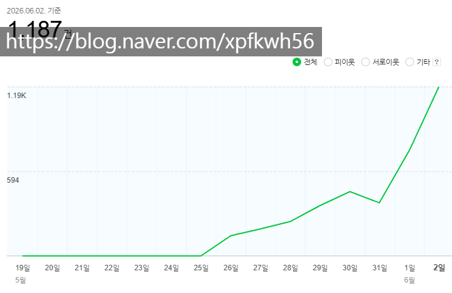
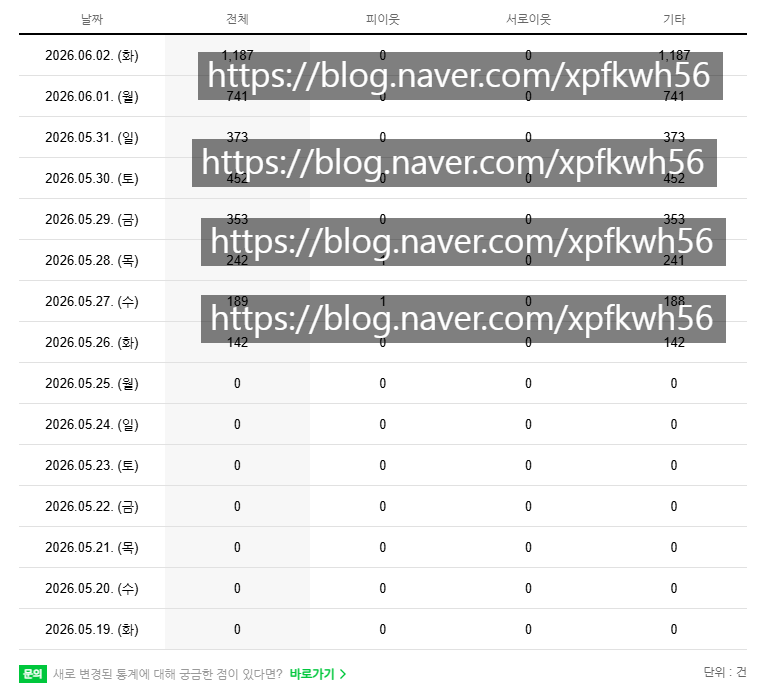
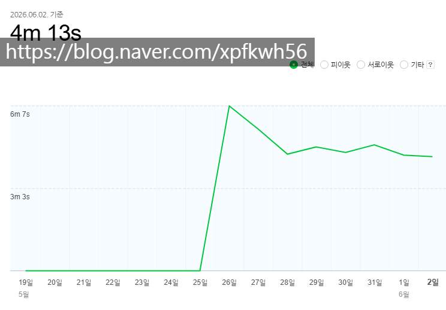
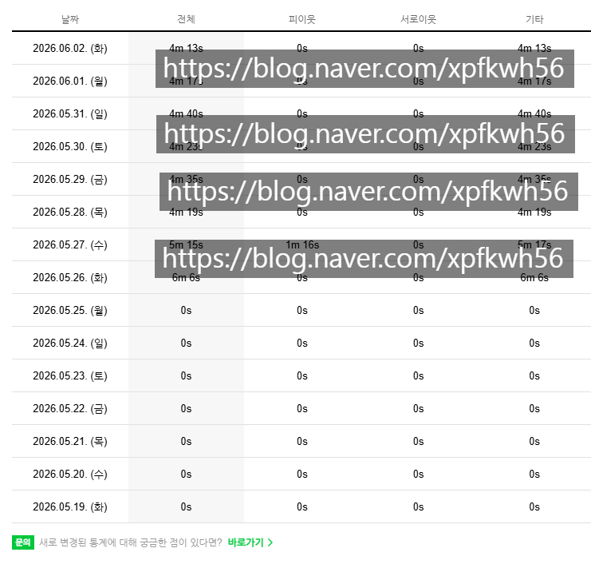
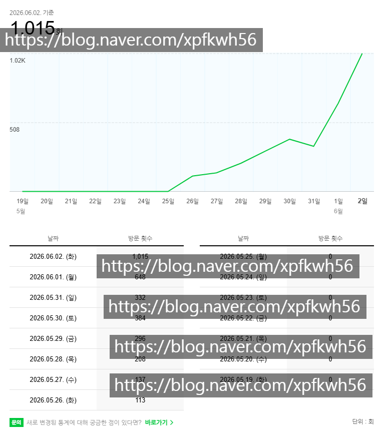
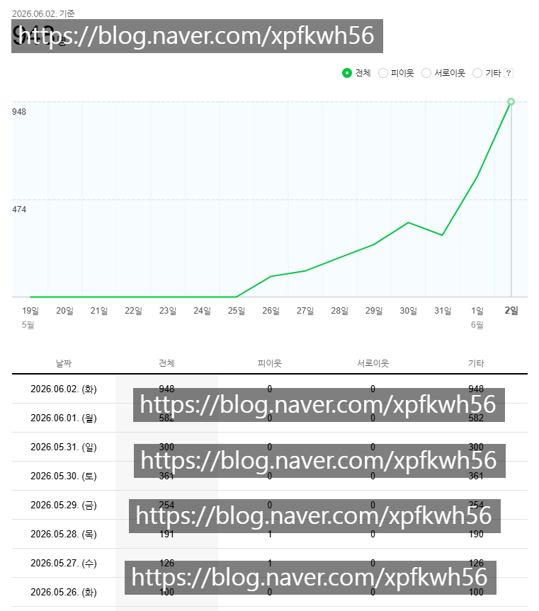

# 알아도 그만 몰라도 그만인 블라그 이야기
**Date:** 9시간 전
**Category:** 다이어리
**Original URL:** https://blog.naver.com/xpfkwh56/224304916378
---

​

**1. 케이크처럼 쉽게 홈판을 가는 블로그 스펙**

​

어지간하게는 검색을 해도

안 나온다는 것을 확인 후,

​

안심하고 올림

​

1일차 조회수 142

순방문자수 100

​

화요일 기준 조회수 1187

순방문자수 약 1천

​

10일 안 걸림 = 10배 성장

​

**신규 계정 = 어뷰징 x 바이럴 x 샤라웃 x**

​

**\* 바이럴이면 저런 증가가 안 나오고,**

**어뷰징이면 체류 시간이 못 나옵니다**

**​**

1일차 체류시간 6분

10일차 체류시간 4분

​

100명에서 1천명으로 증가했을 때, -2분

​

메인 홈판 올라간 횟수 **'많음'**

인플이랑 같이 올라간 적도 있음

​

2. 콘텐츠 미디어 **개고수** 가 있음

​

2년? 이상 추적 했는데 진짜고,

​

본인 능력을 **'가르칠 수 있느냐'** 는

여전히 난 **'전혀'** 공감하지 않지만

​

그 사람이 **'진짜'** 경제적인 측면에서

성공한 사람이냐? 라는 것은 **'확실'** 함

​

얼마를 벌었길래 **성공** 이라고 함?

​

보수적으로 잡아도 본업으로

10억 이상은 확실히 번 사람이고,

​

그 돈을 벌었는데도 실무 잡고 있음

​

아주 디테일하게 들어가면, 일부분은

이야기 할 것이 물론 **'없는 것'** 은 아니나,

​

견해, 가치관 차이 정도로 수긍할 정도 임

​

이 사람이 했던 이야기 중에 이게 있음

​

**\* 물론 광고 PR 멘트 일 수도 있음**

​

온라인에 있는 정보 중에

쓸모 있는 정보는 거의 없다

​

이 부분에 대해서 **'반'** 정도 동의함

​

내가 블라그 지금 시작해보란 이유가 뭐냐면

**'알고리즘'** 이 **'지 맘대로'** 바뀌기 때문 임

​

아무리, 아무도 모르는 콘텐츠 BM 이라지만

몇 가지 정해진 규칙이나 원칙들이 있는데,

​

극단적인 꼬릿값 까지 다 체크해서 찾아보면

그런 경우도 **'어긋나는'** 일이 일어나고 있음

​

즉, **'난세'** 임

​

난세를 대하는 사람들의 태도가 다른데,

근래 고꾸라지는 사람들이 하는 이야기 임

​

선거 시즌이 되면서 노출이 **막.혔.다**

​

나는 5월 26일 첫 계정을 만들었고,

일주일 사이에 이런 퍼포먼스를 띄웠음

​

블로그를 키워보신 분들은 아시겠지만

일주일만에 일 트래픽 1천 찍는 것은

​

그렇게 **흔하게** 일어나는 일은 아님

​

만약 선거 시즌이 되면서, 특정 블라그들의

노출을 막거나 과거의 포스트들만 노출 했으면

​

내가 바로 그 반례에 속한다고 볼 수 있음

​

이어서, **'반'** 정도 동의하지 않음

​

내가 **'이번에'** 블라그를 하게 되면서

알게 된 새로운 정보는 다음과 같음

​

1) 홈판을 하면 좋다

2) 블로그 메커니즘이 바뀌는 중이다

​

딱 2개의 힌트만 들고 시작 했음

​

인터넷에 있는 정보가 쓸모 없는 정보라면

​

**'블로그가 변화하고 있다'** 라는 그 한 줄의

가치도 무익하다고 보아야 할 것 인데,

​

내 경우에는, 그거만으로도 **충분했음**

​

어려운 것은 **'정답'** ​을 내는 작업이 아님

​

**'좋은 질문'** 을 할 수 있는 단서와

**'적절한 과정'** 을 도출해낼 수 있는

​

**'운'** 이 어려움

​

**3. 홈판에 대해서**

**​**

**\* 정확한 정보 아님**

**​**

최근 일주일 사이에 **내가 관찰한 결과** 임

​

블로그에서 글이 나오면,

홈판에 노출이 발생함

​

실제 **'어떤 글'** 이 어떤 방식으로

노출되는 것인지는 **'추측'** 만 가능

​

그러나 실제 계속 홈판을 보고 있으면

​

동일 주제에서 동일한 사람들이

반복해서 나타나는 것이 관찰 됨

​

**내가 그걸 보고 세운 가설은 다음과 같음**

​

1) 이건 인간이 하는 작업이 아니다

2) 네이버측 에서는 **'의지'** 를 전달할 것이다

​

3) 하고 싶은 목적을 정한 다음에,

그걸 구현하는 모델을 짰을 것이다

​

4) 그렇다면 내가 네이버 라고 가정 해보자

도대체 어떤 애들을 노출 시켜야 좋을까?

​

**case1. 벼락스타**

​

글 1개를 보고, 글빨이 좋으면 밀어준다

듣기만 해도 리스크가 너무 높음

​

**case2. 고인물**

​

인플루언서, 라고 부르는 네이버 공무원들만

노출 시켜주면 홈판을 굳이 키울 필요가 없음

​

네이버는 **'제한된 예산'** 으로

**'최대한'** 의 노동력을 쓰고 싶어하고,

​

소수의 인플루언서가 점유하는 시장 보다는

두루두루 뉴비들이 나와서 경쟁하길 원할 것임

​

**\* 그래야 자기들한테 이득이 되니까**

​

**case3. 검증된 루키의 등용문**

​

트랙을 나눠서 접근하려고 할 것 같았음

​

먼저 **'검증된'** 콘텐츠를 작성하는 애들을

대상으로 일정 to 를 할당해서 분배한 다음,

​

알 수 없는 어떤 알고리즘을 통해서,

**'확률적으로'** 접근할 것이라고 추측함

​

즉, 다음과 같은 과정을 할 것 같았음

​

4. 먼저 가장 기본적인 **'결격'** 대상을 뺌

​

자기 글이 보여지길 원하지 않는 사람들,

네이버 메인에 띄웠을 때, 적절하지 않은 글

​

검색 비허용이나, 대놓고 심한 스팸 계정 등을

1차적으로 거른 후, **'기본'** 자격이 있는 그룹에서

​

랜덤이든, 특정 요건이든 블로그 글을 추출하고

​

그걸 **특정 시간대, 특정 환경대, 특정 상황대** 에

노출하면서 데이터를 수집할 것이라고 생각 했음

​

예를 들어, A 라는 블로그가 있다고 가정함

​

A 가 포스팅을 하면, 홈판에 띄움

​

이 때, 노출/클릭 **'최대 할당량'** 을 정해버림

​

**수백, 수천만개의 블로그들 안에서,**

**x번 노출되면 y번 클릭이 발생하더라**

​

라는 데이터가 있으면 그걸 바탕으로,

단계별로 구성하고, **'검증'** 을 할 것 같음

​

평균적으로 블로그가 100번 노출된 다음,

1번 클릭이 발생한다고 가정하겠음

​

그럼 100번의 최대 노출 기회를 제공한 후에

거기서 클릭이 몇 번 발생 했는지 수집을 할 것임

​

여기도 케이스를 분류할 수 있음

​

노출 100회 에서 평균 1회 일 때,

​

case1. 노출 100회 클릭 1회가 발생하거나

​

**'평균값'** 에 부합하면 **'최대 노출'** 할당을

더 많이 제공해서 더 높은 테스트를 하게 함

​

case2. 노출 10회 클릭 5회가 발생할 때,

​

그리고 만약 이례적으로

빠르게 피드백이 오면

​

여러 어뷰징 체크를 하긴 하겠지만

더 긍정적인 신호로 볼 확률이 높을 것 임

​

**\* case2 자체가 필요 자격 조건이**

**더 높은 구간에 형성되었을 수도 있음**

​

100 → 했어?

그럼 1000 → 또 했어?

​

그럼 10000 → 그럼 100000 해봐

​

**이런 식으로 할 것 같다는 것임**

**​**

대체 왜 그렇게 생각을 했는데요?

**롤 MMR 시스템이 이렇게 되기 때문** 임

​

장사를 해보신 분들은 아시겠지만,

큰 회사 일수록 '대단한 무엇' 을 안 함

​

요즘 국룰로 사람들이 많이 하는 것이 뭔데?

검증된 '조건' 이 뭔데? 라는 정답이 나오면

​

그걸 우르르 따라가기 때문에,

​

**'조건'** 이 아니라 **'조건을 보고 움직이는'**

사람을 보면 현상을 더 깊게 이해할 수 있음

​

5. 나는 이 가설을 증명하기 위해

두 가지 실험적인 작업을 했음

​

먼저 내 블로그에 있는 데이터들을 통해서,

전체 홈판 유입량을 체크하고 위치를 찾음

​

홈판으로 유입된 사람이

약 200-300 정도였는데,

​

개별 사례로 확신할 수는 없겠지만

분명 **'유의미한 캡'** 이 존재하는 것 같다

​

라는 예측 정도는 가능할 수 있을 듯 했음

​

그리고 테스트 계정을 몇 개 돌려서,

​

1) 외부 링크와 오가닉 트래픽의 차이

2) 조기에 발생하는 유저 정보 최적화 등을

​

간단히 실험하고, 실전에 들어갔음

​

첨언하면 필요한 것은 네이버측이 갖고 있는

**'막대한 데이터'** 에 비해, 내가 갖고 있는

​

데이터가 **'터무니없게'** 작다는 것 이었는데,

​

할 수 있는 만큼은 최대한 수집해서 처리했고

해결 안 되는 부분은 직관으로 답을 찾아냈음

​

**6. 네이버는 어떤 글을 좋아할까?**

​

질문을 바꿨음

​

**'내가'** 네이버 라면 어떤 글이 좋지?

​

네이버는 국내에서 **'가장 많은'**

한국인 온라인 데이터를 갖고 있음

​

인공지능의 3대 핵심은,

​

**1) 데이터**

**2) 모델링**

**3) 도메인** 임

​

도메인이야, 인터넷 사업주들이 공유하는

대체의 상식으로 휴리스틱 친다고 해도,

​

문제는 **'어떻게 모델링'** 했을까? 임

​

아마, 이렇게 하고 **있는 것 같음**

​

먼저 한 인간**의 '동선'** 자체를 **라벨링** 함

​

**라벨링** 이 뭐임요?

​

김짱구, 이철수, 박유리, ^$#%

​

이렇게 4개의 정보가 있다고 가정함

​

이름인 것 으로 묶으면 짱구, 철수, 유리

이름 아닌 것 으로 묶으면 ^$#%

​

남자, 여자, 그 외 로 묶으면

​

짱/철, 유, ^

​

이렇게 **'구분'** 을 할 수 있어짐

​

7. 네이버에 방금 접속한 어떤 사람이 있음

​

메인 뉴스에 '선거' 관련 이야기가 나옴

그 밑에 '화장품' 관련 이야기가 나옴

​

선거 → 선거 관련 정보 → 선거 관련 행동

화장품 → 화장품 관련 정보 → 화장품 관련 행동

​

이런 식으로 각자 갖고 있는 관심사에 따라서,

그 이후에 있을 특정한 **'행동'** 들이 분명 있음

​

네이버는 이걸 **'맨 땅'** 에서 하지 않고,

​

자기들이 갖고 있는 **'실증'** 기반으로

**'높은 확률'** 에 근거해 추측할 수 있음

​

예전에 **'강아지 구충제'** 가 인기를 끌었음

암 치료에 도움이 된다는 낭설이 퍼져서 임

​

**'예측'** 하는 사람은,

​

강아지 구충제를 구입한다

집에 강아지가 있을 것이다

​

라고 생각하고 판단하겠지만,

​

**'데이터'** 가 있는 사람은,

​

강아지 구충제를 구입한 사람들이

암과 관련된 결정을 많이 했다

​

라는 **'근거'** 를 기반으로 판단함

​

일반인들은 이 **'데이터'** 가 없기 때문에,

**​**

**\* 엄밀히는 네이버만 갖고 있는 것이지만**

​

블랙박스 안에서 저걸 **'추론'** 해야 됨

​

​

정답을 맞추는 것이 아니라,

​

**'오답'** 일 확률과 **'정답'** 일 확률을

계속 개선해 나가는 **'반복'** 이 되는 것 임

​

8. 수학을 잘 해야 된다는데?

영어를 잘 해야 된다는데?

​

이 말을 순진하게, 듣고

수학만, 영어만 하면 바보 임

​

내 귀에 두 가지 과목이 들렸으면

그걸 **'다'** 잘 해야 됨

​

무슨 문제집이 좋다더라,

무슨 선생님이 좋다더라

​

좋고 나쁘고를 구분할 이유가 없음

프로를 할 생각이면 **'다'** 알아야 되니까

​

9. 그래도 장르 좋은 것 없음?

​

**1) 안전빵**

​

뷰티, 아이티

​

**2) 힙스터픽**

​

내가 잘 하는 것