# 제미나이로 시작하는 인공지능 활용하기
**Date:** 9시간 전
**Category:** AI 활용
**Original URL:** https://blog.naver.com/xpfkwh56/224311949398
---

​

1. 내가 인공지능에 관심이 있어도,

​

어느 블라거가 로컬 로컬을 떠들어도

제일 먼저 막히는 분야는 이런 것이다

​

**그래서 내가 지금 뭘? 어쩌라고?**

​

구글은 세계 최고의 검색 엔진이다

​

전 세계 글로벌 시장

점유율 90%를 차지하고 있고

​

쟁쟁한 기업들과 싸워도 늘 이긴다

​

검색 엔진 분야를 놓고 본다면 구글은

최고 였고, 최고 고, 최고 일 것이다

​

국내 최고의 검색 포탈 사이트이자,

​

김리아의 26년 원픽 희망 취업리스트

1위로 꼽힌 네이버와 비교를 해보자

​

네이버는 **'많다'**

​

버튼도 많다

​

이거도 저거도 참 많이 달려있다

보기만 해도 시끄럽게 느껴진다

​

나는 네이버 블로그를 몇 년 넘게 썼는데,

내가 메인을 보는 경우는 딱 둘 뿐이다

​

1) 블로그 들어갈 때

2) 가끔 뉴스

​

번잡한 네이버 메인은 가끔

시장통 호객상인 처럼 보인다

​

지하철 근처에서 전단지를 나눠주는

사람을 보는 것처럼 스쳐갈 뿐이다

​

**이제 구글을 보자**

​

[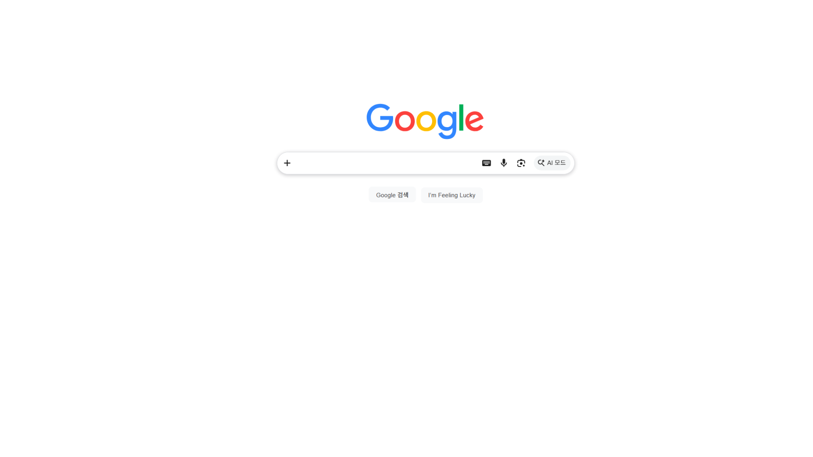](#)

​

지금 이게.

​

하루 100억 건이 넘는 페이지 뷰가

발생하는 **'세계 최고 광고판'** 이다

​

지금 이 순간에도,

​

1초마다 전 세계에서

115, 740명의 사람들이

저런 화면을 보고 있다

​

2. 어린왕자의 작가 생텍쥐베리는

완벽을 다음과 같이 말했다

​

완벽은 더 이상 더할 것이 없을 때가 아니라

더 이상 뺄 것이 없을 때를 말하는 상태 다

​

구글 검색엔진이 처음 개발되었을 때,

​

창업진과 기술자들은 당시 표준에 맞는

충분한 실력을 갖고 있는 상태가 아녔다

​

그래서 다양한 기능을 담을 수 없었고

기본 템플릿으로 정해진 모델을 차용했다

​

구글을 만들고, 사람들에게 보여줬다

​

뜻밖의 결과가 발생한다

​

테스터들은 의도와 달리 검색도 하지 않고,

아무런 행동도 없이 화면만 보고 있었다

​

" 님 뭐 함? "

" 기다림 "

​

​

" 뭘 기다림? "

" 로딩 "

​

" 만약 로딩이 안 끝나면? "

" 기다려야지 "

​

" 내일도? 또 모레도? "

" 그래야겠지 "

​

당시 검색엔진 중심의 포탈 서비스는

초기 화면에 온갖 서비스가 붙는 것이

​

**'시장의 약속'** 이었기 때문에,

이용자들은 익숙한 행동을 했다

​

시간이 지나, 2026년.

​

인공지능에서도 여전히

같은 일이 일어나고 있다

​

할 수 있는 것이 많다고 하지만

먹을 것이 너무 많아 무엇부터 먹어야

좋은 것인지 모르는 뷔페 처럼

​

무한한 자유에 질식 당하고 있다

​

3. 모든 작업의 시작은 **'설명서'** 다

​

진리로 가져가도 좋다

​

1) Raw Data 를 읽는다

2) 설명서를 반드시 본다

​

[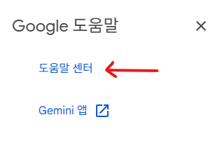](#)

​

[Google 도움말] 메뉴에 있는

[도움말 센터] 를 클릭 하면,

​

[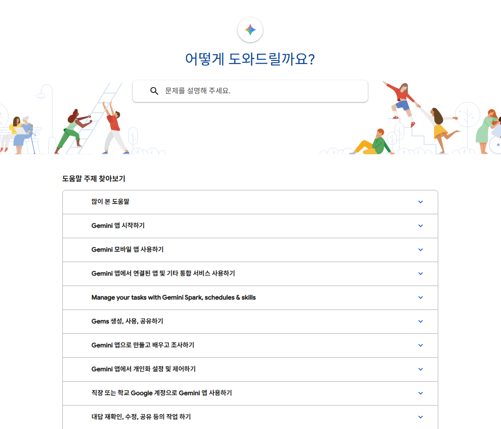](#)

​

**'정답지'** 가 나온다

​

오야, 이걸 몰랐네

저스트 킵 고잉 (x)

​

여기서 이런 지점이 중요하다

​

흔히 말하는 **'전략적 사고'** 라는 것은

행동 보다 생각이 먼저인 것을 말한다

​

[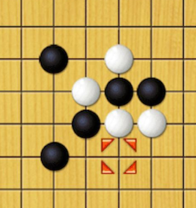](#)

​

똑같은 오목도 누구에게는

추상 전략 보드게임이고,

​

누구에게는 **'슈팅'** 게임이다

​

오목은 빨리 두는 게임이 아니다

​

오목의 목적은?

내 말로 5줄을 만드는 것

​

[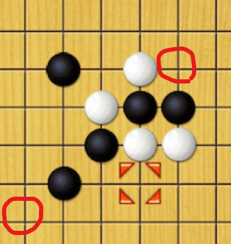](#)

​

흑이라면, 이 자리를 둘 수 있다

​

왜냐면 4개가 되는 순간,

1개의 수로 양측이 열린 흑을

백은 막을 수 없기 때문이다

​

그런데 이 **'관찰'** 이 발생한 시점에,

바로 게임이 다음 **'관찰'** 로 이어진다

​

​

상대가 **'반사'** 라고 말을 했을 때,

**'나도 반사'** 라고 이야기를 할 수 있고,

​

내가 **나도 반사** 라고 했을 때,

​

상대가 **그럼 나도 반사** 라고 할 것을

예측해서, **무한 반사** 를 할 수도 있다

​

그 다음에는 무한 반사를 깨는 무한반사

같은 것을 **'발상'** 할 수 있게 될 것이다

​

최초의 **'반사'** 라는 방아쇠가 없다면

무한에 무한을 깨는 반사 같은 발상은

​

**'해보기 전 까지 알 수가 없다'**

​

반사를 이기는 것이 무지개 반사라 치자,

​

그럼 미리 앞질러, 무지개 반사 보다 높은

더 상단에 있는 것을 먼저 내도 의미가 없다

​

왜냐면 무지개 반사는 **반사 최적화** 일뿐,

​

만약 상대가 새로운 행동을 취할 때는

적합한 수단이 아닐 수 있기 때문이다

​

이와 같이, **'관찰'** 하고

**'생각'** 하는 것을

​

**'전략적'** 사고 라고 한다

​

씨 어게인.

​

도움말 센터 페이지는

이와 같은 구조로 구분된다

​

[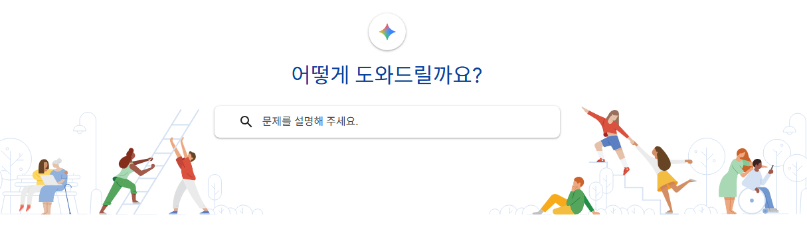](#)

​

상단에는 자유 서술어로 검색할 수 있는

맞춤형 검색 서비스가 있고, 그냥 있으면

​

저 칸이 **'무슨'** 의미를 하는 건지 모르니,

**'문제'** 를 설명해 주세요 라는 말이 있다

​

즉, 이용자가 문제를 저기에 **'설명'** 하면

구글에서 답을 해줄 것을 **'기대'** 할 수 있다

​

**그렇다면 이런 접근도 가능할 것이다**

​

아예 이용자에 대한 막대한 데이터를 갖고,

**'물어보는 행위'** 조차 없게 만들 수 없을까?

​

클릭 이라는 행위가 사라지는 메타,

​

그게 바로 **'제로 클릭'** 메타고

모든 IT 서비스의 핵심 화두다

​

젠슨황이 방문하면

주가 오르는 것 아님?

​

**뭐, 틀린 말도 아니긴 하다**

​

그럼 앞으로는 앞으로고

이런 질문을 해볼 수도 있다

​

**'완벽'** 한가?

​

여기에 어떤 것이 **'없을까?'**

​

[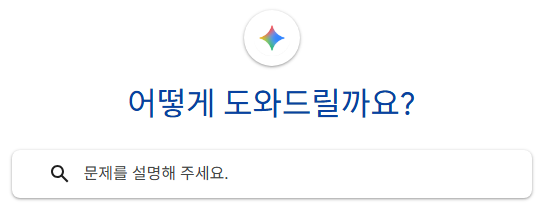](#)

​

클릭 액션을 발생시켰을 때,

나타나는 **'자동완성'** 이 없다

​

그리고 음성 서비스 가 없다

​

도움말 페이지에 들어가자마자

복잡하게 타이밍을 할 필요 없이,

​

말만 해도 문제를 해결한다면,

사용자 편의성이 오를 수도 있다

​

이런 것이 **'디테일'** 이다

​

[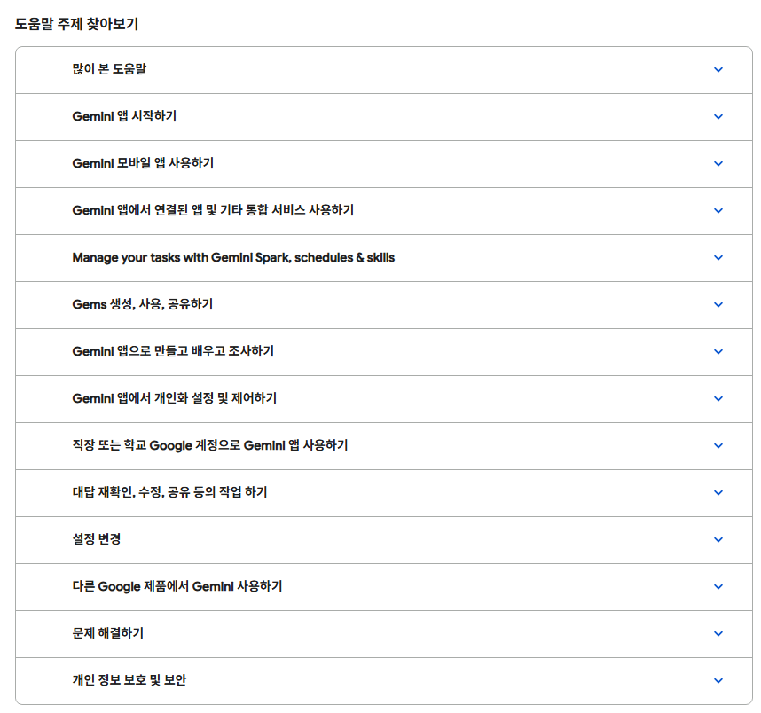](#)

​

다음으로 하단에는 표가 있다

​

위에 검색을 할 수 있고,

하단에 표가 있다는 것은

**​**

**'있는 정보를 찾는 사람 보다'**

​

당장 문제를 묻고자 하는 사람들이

더 많을 수 있다는 **'추론'** 의 근거다

​

만약 둘 중 하나를 골라야 된다면,

​

하단에 있는 서비스 내용을 지우고

상단에 있는 것만 남겨야 **'합리적'** 이다

​

[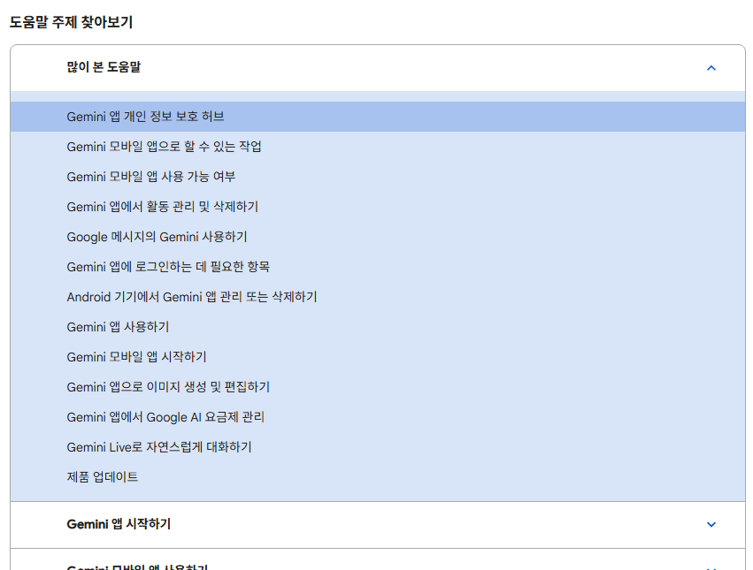](#)

​

그와 마찬가지로, 표 안에서도

우선인 것과 아닌 것이 존재한다

​

제일 위에는 **'많이 본 도움말'** 이 있다

​

파레토 법칙에 의하면 전체 결과의 80%는

대부분 전체 원인의 20%에서 발생한다

​

사람들이 겪는 문제라는 것이

대체로 유사하기 마련인 법이고,

​

이게 **'기본'** 이라는 의미로 알 수 있다

​

[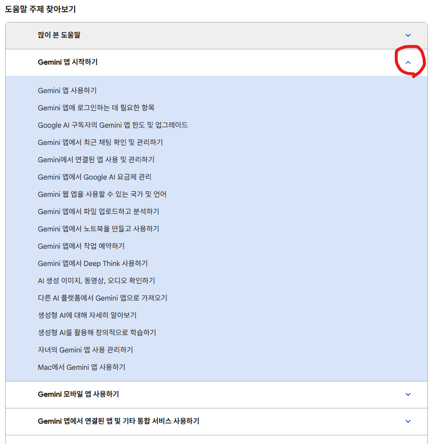](#)

​

[많이 본 도움말] 다음을 눌렀더니,

[Gemini 앱 시작하기] 가 나온다

​

즉, **'작가의 의도'** 를 추측하면

**'기본'** 다음이 **'시작'** 이란 것이고

​

자연스럽게, 시작 ↔ 끝 관계를 유추해

**이 마지막이 어떨 것이다** 를 알 수 있다

​

시작으로 시작했으니까,

그 끝은 끝일 것이다

​

존나 당연한 거다

​

살면서 이런 당연한 것이

​

많아지면 많아질수록

세상을 보는 재미가 생긴다

​

또 연속된 세션을 클릭 하니까,

기존에 있던 세션이 **'사라졌다'**

​

왜 사라졌을까?

안 보이게 만들었으니까

​

그럼 왜 안 보이게 만들었을까?

​

[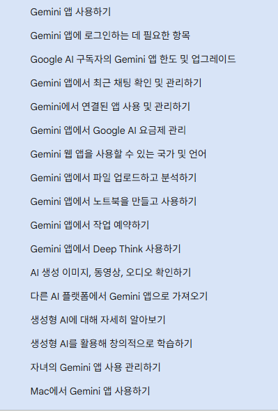](#)

​

**정보가 많으니까**

​

이제 나올 다른 세션들도 대체로

정보가 많을 것을 **'예측'** 할 수 있고,

​

[많이 본 도움말] = 13개

[Gemini 앱 시작하기] = 17개

​

13+17 = 30

30/2 = 15

​

2개 기준, 평균 15개 정도의

정보가 있을 때는 저렇게 묶어서

구성하는 것이 **'좋은 것'** 이구나

​

라는 **'근거'** 를 배워갈 수 있다

​

사고의 흐름에 맞게,

얻은 내용을 정리하면

​

구글 도움말 페이지는 총 14개의 세션이 있고,

​

13+17+12+8+5+4+10+6+2+5+3+5+2+8

= 100

​

100/14 = **'7.14'**

​

휴대폰 번호는 몇 자리?

​

010-**1234-5678**

​

자리수는 7±2 대체로 인간은 5개 에서

많으면 9개 정도의 정보를 담을 수 있다

​

**\* 사실은 9개가 아니라 그 반 정도**

**근데 알아도 그만, 몰라도 그만이긴 함**

**​**

다른 세션도 정보가 많을 것이다 (x)

​

13+17+12+8+5+4+10 = 69개

6+2+5+3+5+2+8 = 31개

​

70%의 정보가 상단에 위치한다

​

가장 높은 것과 가장 낮은 것을 제외하면?

​

13+12+8+5+10 = 48개

6+2+5+3+5+8 = 29개

​

여전히 앞서 제공된 정보값이 무겁다

​

9개가 넘는 정보가 있는 세션을 보자

​

[많이 본 도움말] = 13개

​

[Gemini 앱 시작하기] = 17개

[Gemini 모바일 앱 사용하기] = 12개

[Gemini 앱으로 만들고 배우고 조사하기] = 10개

​

그보다 딱 1개 작은 것도 살펴보자

​

[개인 정보 보호 및 보안] = 8개

[Gemini 앱에서 연결된 앱 및 기타 통합 서비스 사용하기] = 8개

​

결론적으로 지금 이 도움말 센터는,

​

제미나이 앱을 시작하고,

모바일 앱을 사용하고,

​

앱으로 만들고, 배우고, 조사하는

정보를 담고 있는 곳이다 라고

​

**'정의'** 할 수 있다

​

[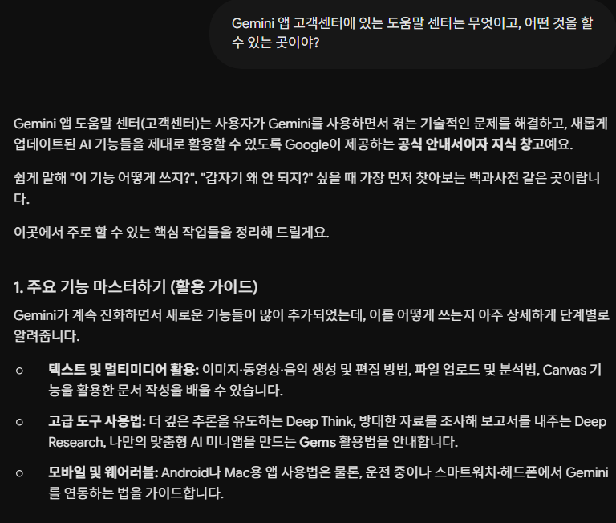](#)

​

방금 우리가 했던

​

[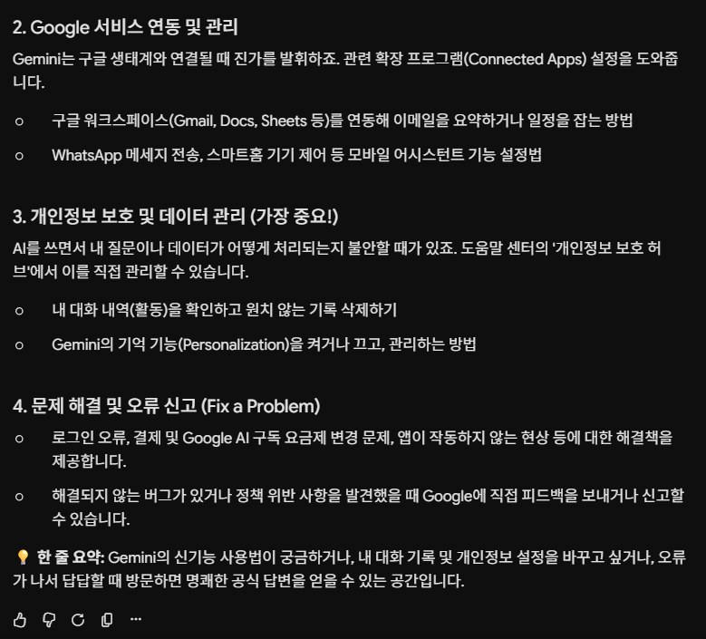](#)

​

이 작업이,

​

많은 사람이 그토록 찾고 다니는

**'인공지능이 못 하는 일'** 이다

​

글자로 굳이 풀어냈을 뿐이지,

​

인간이 갖고 있는 사고 속도는

언어 출력 보다 빠르기 때문에

​

일단 접근하는 네트워크만 형성되면,

금방 금방 넘어가면서 해낼 수 있다

​

그게 **'내 것'** 이라는 전제하에 말이다

​

[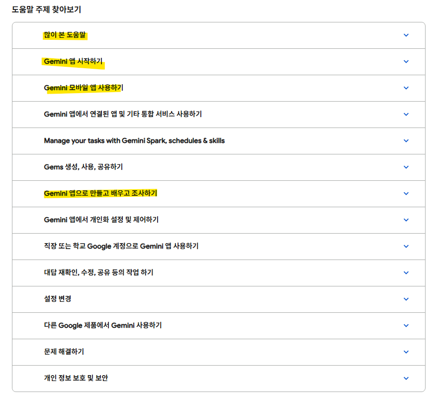](#)

​

4. 그럼 필수적인 4권은 읽어야 하고,

​

나머지는 위치만 기억해놓고 있다가

추후에 필요할 때, 더 자세히 보면 된다

​

[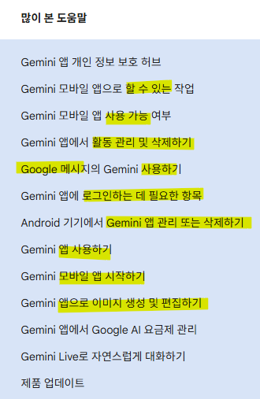](#)

​

방금 했던 작업이니, 빠르게 넘어가자

​

1) 앱으로 뭘 할 수 있지?

2) 모바일 앱이 안 될 수도 있다

​

3) 앱 활동을 관리하거나,

삭제하고 싶은 사람이 존재한다

​

4) 구글 메시지에도 사용할 수 있다

5) 안드로이드 기기 방식은 다르다

6) 앱 쓰는 법이 낯설 수 있다

​

7) 모바일 앱 기반이다

8) 이미지를 생성, 편집할 수 있다

​

아하, 사람들은 이 앱으로 뭘 할 수 있는지,

그리고 왜 안 되는지, 어떻게 관리, 삭제하는지,

​

구글 메시지랑 연동은 어떻게 해야 하는지,

안드로이드에서는 구체적으로 어떻게 하는지,

모바일 앱 기반에서는 어떤 차이가 있는지,

​

그리고 **'이미지'** 서비스가 **'별개'** 구나

​

라는 것을 '1차적' 으로 읽고,

​

**'나는'** 구글 메시지 안 쓰는데?

​

**'한국 사람들 중에'**,

구글 메시지 쓰는 사람이 많나?

​

**\* 줌아웃**

​

우린 카카오톡을 쓰니까, 저건 빼자

​

**\* 도메인 정보 활용**

**​**

근데 **'전 세계 점유율을 조건으로 두면'**,

구글 메시지 사용자가 많을 수 있겠구나

​

라고 파악하고 넘어가면 된다

​

<계속>