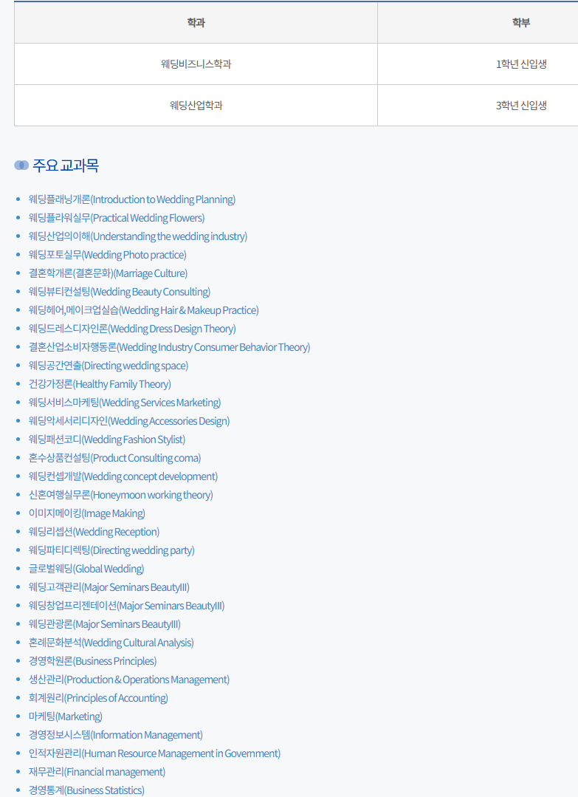
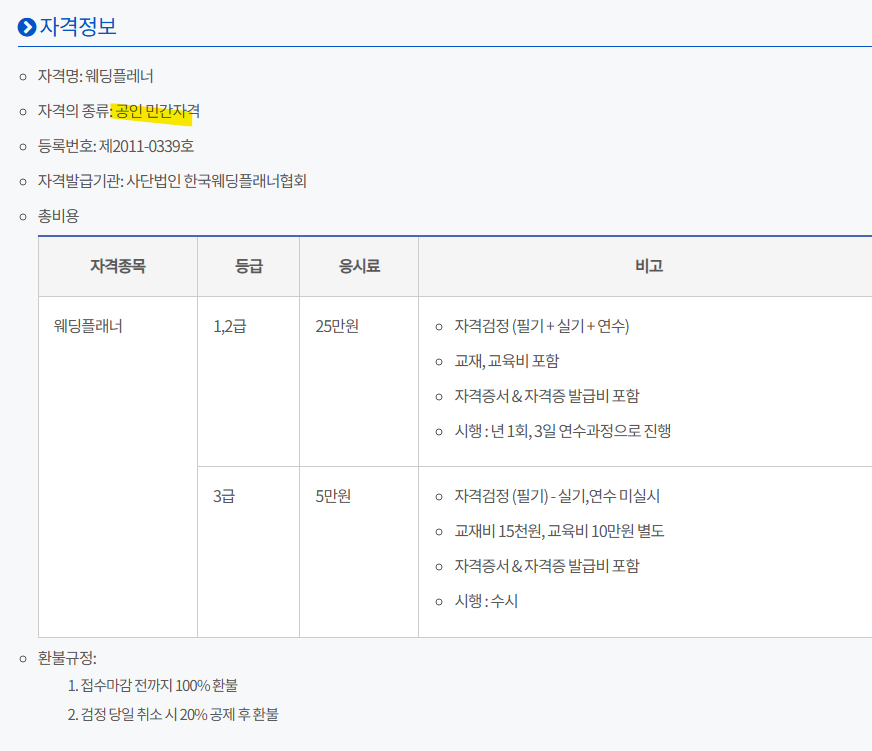
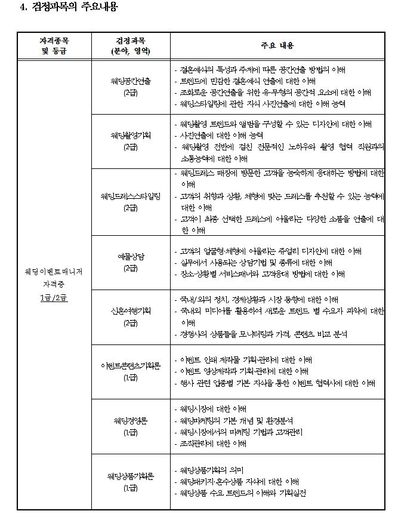

# 해설
**Date:** 9시간 전
**Category:** 다이어리
**Original URL:** https://blog.naver.com/xpfkwh56/224284304824
---

1. 결혼식에 필요한 것이 뭘까?

​

1) 신랑, 신부 = 결혼 당사자들

2) 하객 = 결혼식에 올 사람이 필요

3) 결혼식장 = 결혼할 장소가 필요

​

**\* 무엇이 있어야 결혼식이고,**

**무엇이 없어도 결혼식인가? 자문**

**​**

**2. 점검**

​

신랑 신부가 없는 결혼식 가능?

취향에 따라 다르지만, 통상 불가

​

하객 없는 결혼식 가능?

취향에 따라 다르지만, 통상 불가

​

결혼식장 없는 결혼식 가능?

취향에 따라 다르지만, 통상 불가

​

**3. 전제 확인**

​

신랑, 신부가 정해진 날짜에 있고,

특정한 장소에서 사람들을 초대해서

하는 것을 결혼식 이라고 정의 하자

**​**

**4. 신랑과 신부**

​

수면 바지에 쓰레빠 질질 끌고

결혼하는 것이 가능? 좀 아닌 듯

**​**

**그럼 어떻게 해야 되냐?**

​

신랑이든, 신부든 결혼식 이라는

사회적 관행 문법에 맞게 입어야 됨

​

**그게 뭐냐?**

​

결국 크게 둘로 나뉘는데

​

한복을 입든가, 턱시도/드레스 같은

형태의 예복을 입는다로 구분되겠네

​

한복을 입는다 → 분기 파생

예복을 입는다 → 분기 파생

​

턱시도 종류는? 디자인은?

색깔은? 라펠은? 빌려? 사? 등등

​

**5. 식장은 왜 필요하지?**

​

접싯물 떠놓고 어디 로미오와

줄리엣 마냥 할 생각이 없으니까

​

**그럼 누가 그걸 쓰는데?**

​

초대한 사람

초대한 사람은 어떻게 나뉘는데?

​

매우 가까운 사람,

적당히 가까운 사람,

일단 따라온 사람

​

각자의 니즈는? → 분기 파생

​

**6. 하객**

​

초대장을 액티비티로 만들어서 줄 지,

아니면 문자 돌릴지, 구두 청모를 할지, 등

​

7. **'기본적인'** 뿌리가 잡히면, +a

​

촬영? 없어도 돼

촬영? 있어야지

​

예식장 내부 고도는?

꽃은 가짜? 찐?

​

행사는 도합 몇 시간?

1차 하고 끝? 2차도 있음?

​

이처럼,

​

**상황과 서로 각자 갖고 있는**

**이해 관계를 맞춰서 하면 됨**

​

A, B, C

​

A → a1, a2, a3 ,,,

B → b1, b2, b3 ,,,

C → c1, c2, c3 ,,,

​

**8. 조금 더 쉽게 가는 법**

​

​

네이버에 **'웨딩플래너 되는 법'** 검색

직무, 진로 교육이나 자격증 관련 나옴

​

​

내 생각에는 약간 단순화 해서

**구매대행 서비스직** 이지만,

​

일단 그게 안 닿았다는 전제하에

공인 민간자격 양성 코스가 있음

​

​

내가 박사될 것도 아니고, **달달 외지 말고**

빠르게 스쳐 읽으면서 대충 내용만 담은 후,

​

**\* information asymmetry-induced**

**relational triangulation in high-stakes**

**consumer markets (2026) 같은 짓 금지**

**​**

바로 실무 돌입

​

**\* 무슨 장사든 손님 구하는 것이 제일 어려운데,**

**이거는 내가 손님이니까 훨씬 수월하게 할 수 있음**

​

**9. 그 다음으로 쉽게 가는 법**

​

일단 장사하고 있는 애들을 찾는다,

견적을 **최대한 많이** 받는다

​

생기는 문제들을 **기출별** 로 대응한다

**​**

**기출 케이스**

​

결혼식 준비하다 보면 웨딩플래너/샵/스튜디오

직원들이 신부님 ^^ 하면서 내 편처럼 비위 맞춤

​

이거 계속 당하다 보면, 약간 특유의

**'붕 뜨는'** 느낌을 받으면서 라포 생김

​

**\* 이렇게 돈 펑펑 쓸 기회가 흔치도 않고**

**​**

그럼 그 친절의 이유가 뭘까?

​

**내가 돈이 되니까** 임

​

내 주변에 있는 사람들은 내 입맛대로

듣기 좋은 소리 쌱쌱 공짜로 하고 있음

​

문제는?

​

그걸 지불하는 것이

아주 높은 확률로 **남편** 이고

​

그게 아니더라도 **'우리 돈'** 임

​

그래서 포지션이 이렇게 잡히기 쉬움,

​

**'내 주변에 있는 사람들은 날 도와주고,**

**날 이해하고, 나를 위해 존재하는 사람들'**

**​**

vs

​

**'신랑은 평생에 한 번 밖에 없는**

**결혼인데, 나를 이해 못 해주고**

**결혼식 이라는 숭고하고 중대한 행사를**

**한낱 돈 드는 소꿉놀이 정도로 폄훼'**

​

바로 이 세일즈 포인트가

웨딩 시장의 본질 인데 말임

​

> 신부님 보통 **'자금적인 여력이 안 되는'** 분들은
>
> 저기 있는 x만원짜리 입으시는데 ^^
>
> ​
>
> (공짜로 줘도 안 입게 생김)
>
> ​
>
> 혹시 괜찮으시면 소정의 추가금이 붙긴 하지만
>
> 이런 라인도 있긴 있어요
>
> ​
>
> (존나 말도 안 되게 비싼 것과
>
> 적당히 중간에서 살짝 위 정도를 같이 보여줌)
>
> ​
>
> 그리고 빌려서 입는 분들이 많긴 한데,
>
> 얼마 전에 들어온 이 옷 같은 경우는
>
> ​
>
> **'아직 아무도 안 입은 쌔삥이에요'** ^^
>
> 좋은 분들도 물론 많이 계심니다,
>
> 봉사활동 하는 것도 아니니, 상술이 꼭 나쁜 것도 아니고

​

애초에 디자인이 노답이라, 입을 맛 안 나고

​

에이 그래 뭐 있어, 라고 잡아도

그걸 잡으면 내가 싸구려 된 느낌 받음

​

존-나 비싼 것과 상식 수준에서

살짝 부담스러운 것을 놔두니까

괜히 저게 되게 합리적이게 보임

​

이 시점에, 나는 한 번 **'양보'** 를 했음

​

**\* 그래, 내가 비싼 드레스 안 입었잖아?**

​

그와 동시에, 합리화 회로가 켜짐

​

**'사는 것도 아니고, 잠깐 입는 것인데**

**남이 입어봤던 것 말고 내가 처음으로**

**​**

**입는 새 옷 정도라면 이 정도는 내가**

**나에게 줄 수 있는 작은 선물 아닐까?'**

​

신랑은 이런 컨텍스트 정보가 없음

​

야 한 번 입나, 두 번 입나

그거 차이도 없는데 굳이 해야 돼?

​

하는 순간, 이 새끼는 적그리스도가 됨

​

10. 어떤 정보를 찾아야 할 것인지,

무엇을 무엇과 어떻게 비교를 할지,

​

이걸 시작으로 잡지 마시고,

​

**'그래서 내가 뭘 하고 싶은 것인지'**

정한 다음에 보시면 수월하실 듯 함

​

나는 기왕 하는 예식장 층고 높았음 좋겠어

그럼 층고 높은 예식장 찾아보면 되고,

​

이건 이래서 좋은데, 저건 저래서 나쁘네

나오면 그럼 그걸 최대한 완충할 수 있는

다른 대안이 없는지 타진하고 반복하고 ,,

​

시간 많이 들고 귀찮고 번거로운 일은 맞는데,

특출한 서칭 능력을 요구하는 작업은 아님요

​

무엇보다 기준은 남이

세워주는 것이 아니고,

​

내가 세우는 것 임

​

내가 하고 싶은 결혼식, 내가 하고 싶은 결혼

이게 있으면 거기부터 풀어서 나가면 됨요

​

**\* 결혼식 자체가 하고 싶어서 하는 것 이니까**

​

**'믿어야 될 대상'** 을 고르니까 어려운 것이지,

**'분별할 정보'** 가 있으면 좀 더 쉬울 수 있음

​

나한테 올바른 정보를 줄 사람을 찾지 말고,

내 원하는 목표에 부합하는 **툴** 을 찾아보세요

​

**노동 = 권한** 이 되는 일이 많읍니다